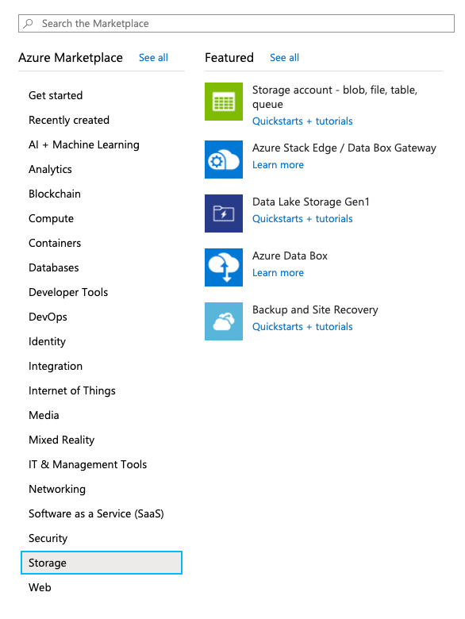
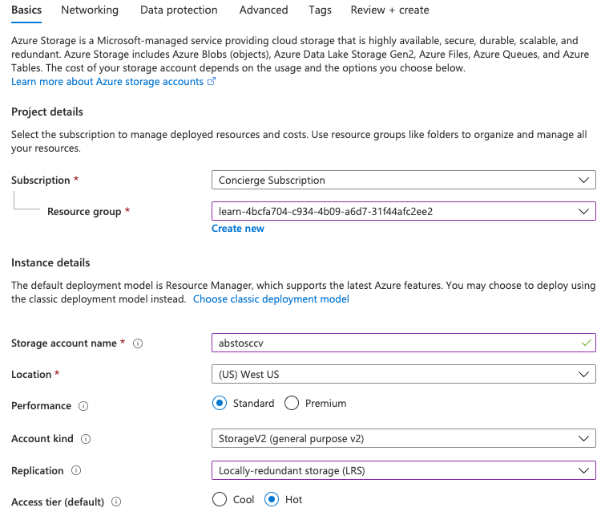
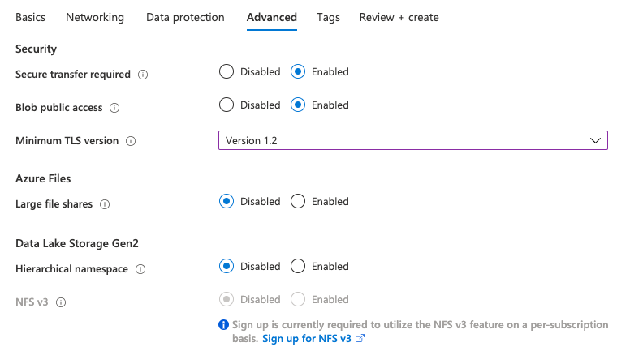

In this unit, you will use the Azure portal to create a storage account that is appropriate for a fictitious southern California surf report web app.

The surf report site lets users upload photos and videos of local beach conditions. Viewers will use the content to help them choose the beach with the best surfing conditions. Your list of design and feature goals is:

- Video content must load quickly.
- The site must handle unexpected spikes in upload volume.
- Outdated content must be removed as surf conditions change so the site always shows current conditions.

To fulfill these requirements, you decide to buffer uploaded content in an Azure Queue for processing and then transfer it to an Azure Blob for persistent storage. You need a storage account that can hold both queues and blobs while delivering low-latency access to your content.

[!include]

## Use the Azure portal to create a storage account

1. Sign into the [Azure portal](https://portal.azure.com/learn.docs.microsoft.com?azure-portal=true) using the same account you activated the sandbox with.

1. In the top left of the Azure Portal, select **Create a resource**.

1. In the selection panel that appears, select **Storage**.

1. On the right side of that pane, select **Storage account - blob, file, table, queue**.

    

### Configure the basic options

[!include]

Under **PROJECT DETAILS**:

1. Select the appropriate **Subscription**.

1. Select the existing Resource Group ("**<rgn>[sandbox resource group name]</rgn>**") from the drop-down list.

    > [!NOTE]
    > This free Resource Group has been provided by Microsoft as part of the learning experience. When you create an account for a real application, you will want to create a new Resource Group in your subscription to hold all the resources for the app.

Under **INSTANCE DETAILS**:

1. Leave the **Deployment model** as _Resource manager_. This is the preferred model for all resource deployments in Azure and allows you to group all the related resources for your app into a _resource group_ for easier management.

1. Enter a **Storage account name**. The name will be used to generate the public URL used to access the data in the account. The name must be unique across all existing storage account names in Azure. Names must be 3 to 24 characters long and can contain only lowercase letters and numbers.

1. Select a **Location** near to you from the list above.

1. Select _Standard_ for the **Performance** option. This decides the type of disk storage used to hold the data in the Storage account. Standard uses traditional hard disks, and Premium uses solid-state drives (SSD) for faster access. However, remember that Premium only supports _page blobs_. You will need _block blobs_ for your videos, and a queue for buffering - both of which are only available with the _Standard_ option.

1. Select _StorageV2 (general purpose v2)_ for the **Account kind**. This provides access to the latest features and pricing. In particular, Blob storage accounts have more options available with this account type. You need a mix of blobs and a queue, so the _Blob storage_ option will not work. For this application, there would be no benefit to choosing a _Storage (general purpose v1)_ account, since that would limit the features you could access and would be unlikely to reduce the cost of your expected workload.

1. Select _Locally-redundant storage (LRS)_ for the **Replication** option. Data in Azure storage accounts are always replicated to ensure high availability - this option lets you choose how far away the replication occurs to match your durability requirements. In our case, the images and videos quickly become out-of-date and are removed from the site. As a result, there is little value to paying extra for global redundancy. If a catastrophic event results in data loss, you can restart the site with fresh content from your users.

1. Set the **Access tier** to _Hot_. This setting is only used for Blob storage. The **Hot Access Tier** is ideal for frequently accessed data, and the **Cool Access Tier** is better for infrequently accessed data. Note that this only sets the _default_ value - when you create a Blob, you can set a different value for the data. In our case, we want the videos to load quickly, so you will use the high-performance option for your blobs.

The following screenshot shows the completed settings for the **Basics** tab. Note that the resource group, subscription, and name will have different values.

### Configure the advanced options

1. Click the **Next: Advanced >** button to move to the **Advanced** tab, or select the **Advanced** tab at the top of the screen.

1. Set **Secure transfer required** to _Enabled_. The **Secure transfer required** setting controls whether **HTTP** can be used for the REST APIs used to access data in the Storage account. Setting this option to _Enabled_ will force all clients to use SSL (**HTTPS**). Most of the time you will want to set this to _Enabled_ as using HTTPS over the network is considered a best practice.

    > [!WARNING]
    > If this option is enabled, it will enforce some additional restrictions. Azure files service connections without encryption will fail, including scenarios using SMB 2.1 or 3.0 on Linux. Because Azure storage doesn’t support SSL for custom domain names, this option cannot be used with a custom domain name.

1. Set the **Virtual networks** option to _All networks_. This option allows you to isolate the storage account on an Azure virtual network. We want to use public Internet access. Our content is public facing and you need to allow access from public clients.

1. Leave the **Data Lake Storage Gen2** option as _Disabled_. This is for big-data applications that aren't relevant to this module.

The following screenshot shows the completed settings for the **Advanced** tab.

### Create

1. You can explore the **Tags** settings if you like. This lets you associate key/value pairs to the account for your categorization and is a feature available to any Azure resource.

1. Click **Review + create** to review the settings. This will do a quick validation of your options to make sure all the required fields are selected. If there are issues, they'll be reported here. Once you've reviewed the settings, click **Create** to provision the storage account.

It will take a few minutes to deploy the account. While Azure is working on that, let's explore the APIs we'll use with this account.

### Verify

1. Select the **Storage accounts** link in the left sidebar.

1. Locate the new storage account in the list to verify that creation succeeded.

<!-- Cleanup sandbox -->
[!include]

When you are working in your own subscription, you can use the following steps in the Azure portal to delete the resource group and all associated resources.

1. Select the **Resource groups** link in the left sidebar.

1. Locate the resource group you created in the list.

1. Right-click on the resource group entry and select **Delete resource group** from the context menu. You can also click the "..." menu element on the right side of the entry to get to the same context menu.

1. Type the resource group name into the confirmation field.

1. Click the **Delete** button. This may take several minutes.

You created a storage account with settings driven by your business requirements. For example, you might have selected a West US datacenter because your customers were primarily located in southern California. This is a typical flow: first analyze your data and goals, and then configure the storage account options to match.