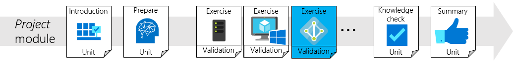
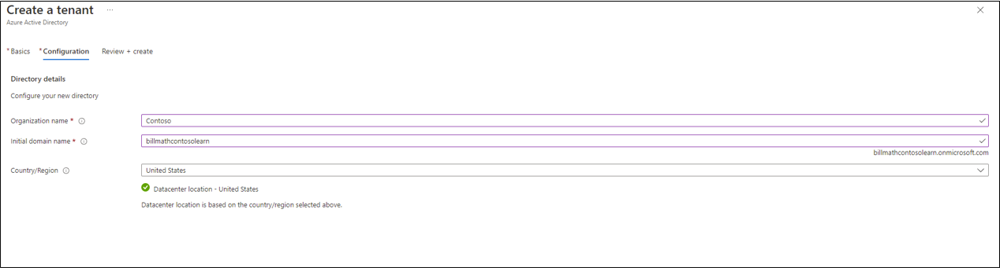

## Create a Microsoft Entra tenant and a global administrator.
In this exercise, you'll create a Microsoft Entra tenant and a global administrator.  This will complete the basic hybrid environment.

## Create a Microsoft Entra tenant
Now you need to create a Microsoft Entra tenant so that you can synchronize our users to the cloud.  To create a new Microsoft Entra tenant, do the following.

1. Browse to the [Screenshot of Microsoft Entra admin center.](https://entra.microsoft.com) and sign in with an account that has an Azure subscription.
2. On the right, click **Microsoft Entra ID** and click **Overview**.
3.  At the top, click **Manage tenants**.
4.  On the tenants screen, click **Create**.
5.  Under select tenant type, choose **Workforce**.  Click **Next: Configuration**.
6.  Enter the **Organization name** and an **Initial domain name** for your tenant.
7.  Choose your **Country/Region**.
 
1.  Click **Review + create**
2. Review the information and click **Create**.

## Create a global administrator in Microsoft Entra ID
Now that we have created a Microsoft Entra tenant, you'll create a global administrator account.  To create the global administrator account, do the following tasks.

1.  On the left, click**Users**, **All Users**.
2.  On the users page, at the top, click **New user**
3.  Provide a name and username for this user. Because this account will be the global admin, for your Microsoft Entra tenant, create an account that you'll remember.
4.  Click **create**
5.  Next, click on the user we created.
6.  On the users page, click **Assigned roles**
7.  On  the **Directory roles**, enter global administrator.
8.  Place a check in the Global administrator box and click add.

## Check your work
You should now have a Microsoft Entra tenant and a global administrator account.

To verify this exercise, do the following tasks.

1. Open a new web browser and sign-in to myapps.microsoft.com using the new global administrator account and the temporary password.
2. Change the password for the global administrator to something that you'll remember.
3.  You've now verified the tenant and the global administrator account.

> [!VIDEO https://msit.microsoftstream.com/embed/video/8e890840-98dc-b478-5c62-f1ecf242bf6c?autoplay=false&amp;showinfo=true]
