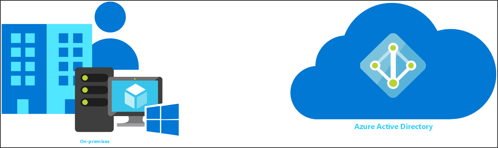

A directory is simply a database. Initially, most computer directories were built around identity management - keeping track of user accounts, groups and other account related data. 

Active directory is no different: its main function in most environments is to manage the users, computers and groups that are created as part of day-to-day network administration.

Active Directory is the directory service in a Windows Server environment. It stores information about network resources and makes them accessible to users and applications. Directory services are important because they provide a consistent way to name, describe, locate, access, manage, and secure information about these resources.

Active Directory first appeared in Windows 2000. It has undergone many revisions. Many of these revisions relate to providing more functionality and storage so that an increasing number of Windows services and other applications use active directory to store their configuration data. Active directory is a mature, trusted and well-supported component.  Most organizations have adopted and use Active Directory.

Then along came cloud computing.  Cloud computing offered many benefits over on-premises computing.  These benefits include setup, maintenance, scalability, and tax implications.  Because of these benefits, many organizations wanted to move to the cloud.

To address this move, Microsoft introduced Azure.  Azure is a cloud platform with over 200 products and cloud services. In order to use these products and cloud services, a service similar to Active Directory was going to be needed.  To tackle this challenge, Microsoft introduced Microsoft Entra ID.  Microsoft Entra ID is a cloud-based identity and access management service. 

Because many organizations had been using Active Directory for so long and had made significant investments in it, just turning it off wasn't an option.  For this reason and many others, moving to the cloud was going to take time and planning.  Thus hybrid identity was born.  Organizations could have a presence both on-premise and in the cloud.

Moving from on-premises to cloud can have a significant impact on an organization.  If things go wrong, it could mean down time or even worse, loss of data.  These reasons make planning and testing crucial.  This module attempts to help you become more familiar with a testing environment that can be used as your organization makes the journey from on-premises to the cloud.

This module will guide you through creating an environment that will be the basis to go deeper into Microsoft identity technologies.  This module will be the starting point for more modules that will demonstrate: 
- how to automatically create users in the cloud based on their on-premises account   
- how to move entirely from on-premises to the cloud
- how to write back from the cloud to on-premises
- how to architect for hybrid scenarios.

## Learning objectives

In this module, you'll practice how to:

 - Install Hyper-V
 - Build a virtual machine using PowerShell
 - Install Active Directory using PowerShell
 - Create a test user in Active Directory using PowerShell
 - Use the Azure portal to create a Microsoft Entra tenant.

## Prerequisites

The following are prerequisites required for completing this module
- An [Azure subscription](https://azure.microsoft.com/free)
- A familiarity with using [PowerShell](/powershell/scripting/overview?view=powershell-7.2)
- A familiarity with using [Hyper-V](/virtualization/hyper-v-on-windows/about/).
- A copy of Windows Server 2019.
- A laptop or computer with at least 32 GB of RAM and 70 GB of free hard drive space.  This will be used as the host machine for our virtual machine.
