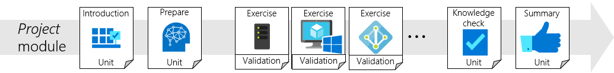

This module will guide you through the creation of the basic environment used in hybrid scenarios.  This module will consist of creating the following environments:
   - an on-premises Active Directory environment
   - a cloud based Microsoft Entra environment

You can use the environment you create in this module, to test various aspects of hybrid identity scenarios.  This environment will also be part of learning paths for identity technologies.

## Project overview 

### Project overview description
As an IT administrator and decision maker you're often tasked with:
   - evaluating cloud solutions
   - advising on moving current infrastructure to the cloud
   - drafting plans and procedures for moving to the cloud

In order to evaluate these solutions and scenarios, you need an environment that mimics your corporate environment.  With this module, you'll build out a small sandbox environment that can be used to do this.  This environment will allow you:
   - to make decisions about cloud solutions and deployments
   - test solutions and scenarios for moving to the cloud
   -  familiarize yourself with various cloud technologies

In order to complete this module you'll need to perform a series of tasks.  The key tasks you'll need to do are:

1. Create the folder structure used in the PowerShell scripts
2. Download the PowerShell scripts
3. Install Hyper-V
4. Create a virtual machine that will be our Active Directory domain controller
5. Install Active Directory
6. Create a test user in Active Directory
7. Create a Microsoft Entra tenant

The first two tasks will be covered in this section.  They'll allow you to prepare for execution of the PowerShell scripts and building the virtual machine that will be used.

### Create folder structure

This module uses PowerShell scripts to accomplish the goals of quickly setting up an on-premises environment.  These scripts have hardcoded paths to specific files.  You'll need to ensure either of the following:
  - change the paths to ones that reflect your environment.  For example:  `$VHDPath = 'D:\VM\DC1\DC1.vhdx'` might become `$VHDPath = 'C:\VM\DC1\DC1.vhdx'` if you move the VM folder to the `C:\` drive.
  - Or you can recreate the folder structure that is used in the scripts using the following table.
   
|Name|Location|Description|
|-----|-----|-----| 
|ISO|` D:\` |Used to store the .iso images used for this module|
|VM|` D:\`|Target location for the creation of the virtual machine used in this module|
|Scripts|` D:\`|Used to store the initial PowerShell script used to create the VM.

### Download the scripts

This module uses PowerShell scripts so that you can create the environment in the quickest amount of time.  Each of the scripts uses variables that are declared at the beginning of the scripts.  These variables will be called out in tables prior to the exercise.  You can change the variables to reflect your environment.

Versions of the PowerShell scripts that are used in this module are available on GitHub under [learn-module-basic-ad-azure-ad-scripts](https://github.com/billmath/learn-module-basic-ad-azure-ad-scripts).  You should download the zip files and the .iso image.

The following table describes each of the PowerShell scripts contained both the .ISO file and the .zip file.

|Script Name|Description|
|-----|-----|
|1_CreateVM_LEARN.ps1|Creates the virtual machine in Hyper-V|
|2_ADPrep_LEARN.ps1|Renames the virtual machine, installs remote server administration tools, and sets the network settings|
|3_InstallAD_LEARN|Install Active Directory on the server and setups the contoso.com domain.|
|4_CreateUser_Learn|Creates a test user that can be used in various scenarios|

Download the .zip file and extract  the contents to the ` D:\Scripts` folder.  Download the .iso image and move it to the ` D:\ISO` folder.

> [!VIDEO https://msit.microsoftstream.com/embed/video/8e890840-98dc-b478-2c31-f1ecf1b0a78a?autoplay=false&amp;showinfo=true]
