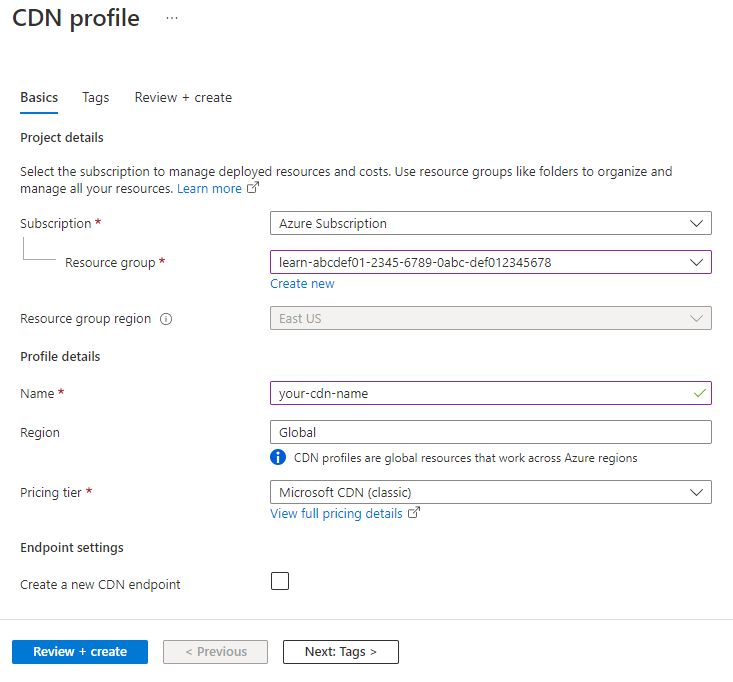
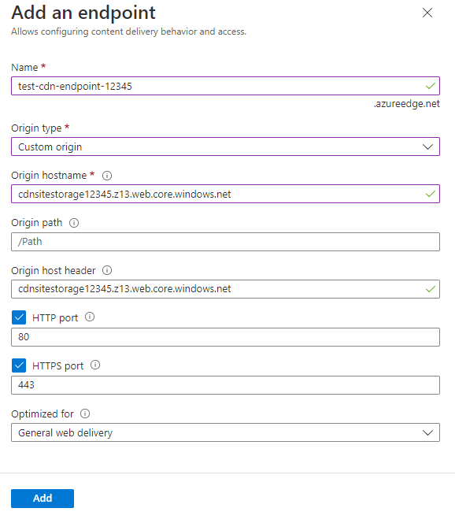

Serving video files to global users will likely benefit from a Content Delivery Networks (CDN). Here you'll learn how to create a CDN endpoint and profile. Then you'll see how to configure the endpoint to cache content from a static website.

## Create a Content Delivery Network

Now, you'll create a CDN and connect that CDN to the website that you've created from your storage account.

[!include]

1. Sign into the [Azure portal](https://portal.azure.com/learn.docs.microsoft.com?azure-portal=true) using the same account you used to activate the sandbox.

1. On the Azure portal menu or from the **Home** page, select **Create a resource**.

1. In the **New** pane, select **Web**.

1. Search for **Front Door and CDN profiles**, then select **Create**.

1. Select the radio button for **Explore other offerings**, then select the radio button for **Azure CDN Standard from Microsoft (classic)**.

1. Select **Continue**.

1. Under **Resource Group**, select the existing Resource Group ("**<rgn>[sandbox resource group name]</rgn>**") from the drop-down list.

1. Give your CDN a name, such as **yourinitials-cdn**.

1. Under **Pricing tier**, select **Microsoft CDN (Classic)**.

1. Ensure that **Create a new CDN endpoint now** isn't selected, select **Review and Create**, then select **Create**.

When you've created the profile, select **Go to resource** to display the CDN profile pane.

## Create a CDN Endpoint

You now need to create a CDN profile that connects to the source web server in the storage account. Take the following steps:

1. In the CDN Profile pane, select **+ Endpoint**.

1. In the **Add an endpoint** pane, enter a name for the endpoint.

1. In the **Origin type** list, select **Custom origin**. 

> [!NOTE]
> **Origin type** specifies what type of hosting service is used. **Custom origin** is used for any other type of publicly accessible origin webserver. This can be a webserver hosted on Azure or elsewhere.

1. In the **Origin hostname** field, enter the URL from when you created the web site. Remove the **https://** and the final trailing slash character.

1. Select **Add** to create the endpoint. Note the message that it can take up to 10 minutes for the settings to reach every CDN POP.

1. After 10 minutes has elapsed, select the **Endpoint hostname** link. The web site should display.

