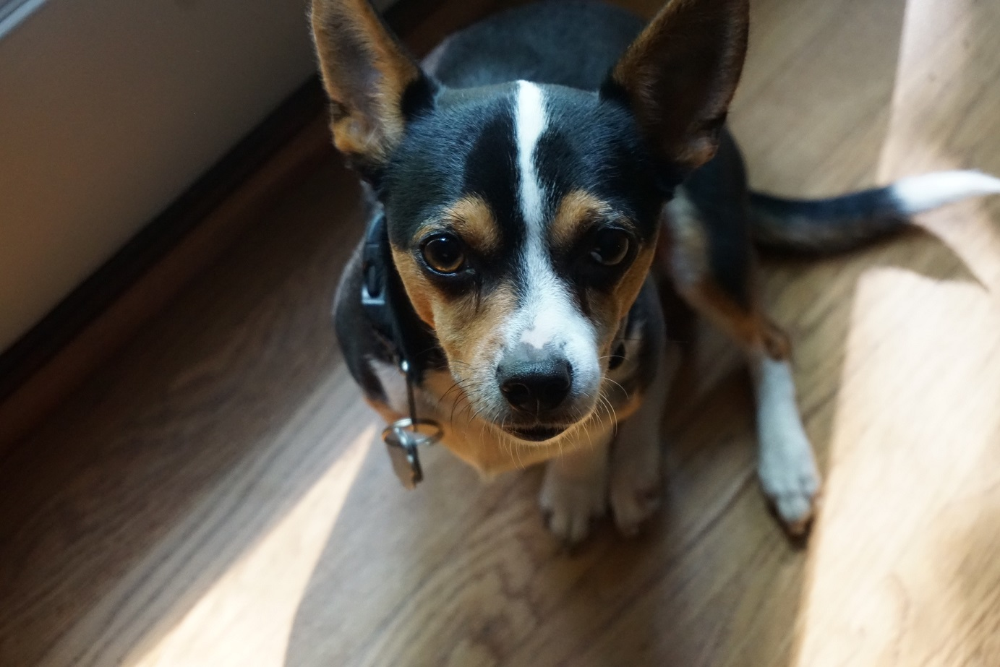

Frontline distributors of your products scan and upload images of store shelves they're restocking. As a lead developer at your company, you are responsible for creating thumbnails of the images. The thumbnails are used in the online reports you create for the sales team. Recently, the sales manager said that the images in the report are blurry and often don't have the product front and center, making it difficult to scan the large report. It's up to you to improve the situation.

You decide to try the thumbnail generation feature of the Computer Vision API. Perhaps it can do a better job than the resizing function you wrote.

Computer Vision first generates a high-quality thumbnail and then analyzes the objects within the image to determine the region of interest (ROI). Computer Vision then crops the image to fit the requirements of the region of interest. The generated thumbnail can be presented using an aspect ratio that is different from the aspect ratio of the original image, depending on your needs. Let's see it in action.

## Calling the Computer Vision API to generate a thumbnail

The `generateThumbnail` operation creates a thumbnail image with the user-specified width and height. By default, the service analyzes the image, identifies the region of interest (ROI), and generates smart cropping coordinates based on the ROI. Smart cropping helps when you specify an aspect ratio that differs from aspect ratio of the input image. The request URL has the following format:

`https://<region>.api.cognitive.microsoft.com/vision/v2.0/generateThumbnail?width=<...>&height=<...>&smartCropping=<...>`

Different parameters can be provided to the API to generate the proper thumbnail for your needs. The `width` and `height` parameters are required. They tell the API which size you need for a specific image. The `smartCropping` parameter generates smarter cropping by analyzing the region of interest in your image to keep it within the thumbnail. As an example, with smart cropping enabled, a cropped profile picture would keep someone's face within the picture frame even when the picture has a different aspect ratio.

[!INCLUDE [get-key-note](./get-key.md)]

## Generate a thumbnail

We'll use the following image in this example, but you're free to try the same command with URLs to other images.



1. Execute the following commands in Azure Cloud Shell. Replace `<region>` in the command with the region of your cognitive services account

```azurecli
curl "https://<region>.api.cognitive.microsoft.com/vision/v2.0/generateThumbnail?width=100&height=100&smartCropping=true" \
-H "Ocp-Apim-Subscription-Key: $key" \
-H "Content-Type: application/json" \
-d "{'url' : 'https://raw.githubusercontent.com/MicrosoftDocs/mslearn-process-images-with-the-computer-vision-service/master/images/dog.png'}" \
-o  thumbnail.jpg
```

In this example, we ask the service to create a thumbnail that is 100x100. Smart cropping is enabled. A successful response contains the thumbnail image binary, which we write to a file called thumbnail.jpg.

> [!CAUTION]
> The `-o` parameter redirects the output to a file. The file is always overwritten, so if you want to keep around  more than one thumbnail while trying this command, change the file name.

## View the generated thumbnail

The generated thumbnail will be found in your Azure Cloud Shell storage account. We named the file **thumbnail.jpg**.

The Cloud Shell in Microsoft Learn doesn't have the ability to download files, but you can follow these instructions to download the thumbnail through the Azure portal.

1. Execute the following commands in Azure Cloud Shell to confirm that the file **thumbnail.jpg** exists in your home folder.

    ```azurecli
    cd ~
    ls -l
    ```


1. Execute the following command to move `thumbnail.jpg` into the clouddrive folder.

    ```azurecli
    mv ~/thumbnail.jpg ~/clouddrive
    ```
1. Sign into the [Azure portal](https://portal.azure.com/learn.docs.microsoft.com?azure-portal=true) using the same account you activated the sandbox with.
1. In the **All resources** panel of the portal dashboard, select the storage account with name beginning with `cloudshell`.
1. In the Storage account panel, select **Storage Explorer**, then **FILE SHARES** and then the file share in that collection with the name beginning with **cloudshellfiles**.
1. Select the *thunbnail.jpg* file and then **Download** from the top menu to see the image.

The `generateThumbnail` operation is a powerful thumbnail generator that is capable of keeping the Region Of Interest (ROI) of an image in the thumbnail.

For more information about the `generateThumbnails` operation, see the [Get Thumbnail](https://westus.dev.cognitive.microsoft.com/docs/services/5adf991815e1060e6355ad44/operations/56f91f2e778daf14a499e1fb) reference documentation.
