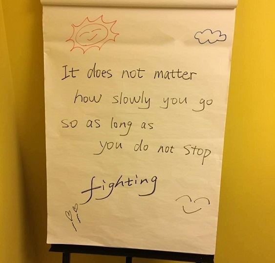

We saw how the Computer Vision API can extract printed text from images. In this exercise, we'll use the service to detect handwritten text.

## Calling the Computer Vision API to extract handwritten text

The `recognizeText` operation detects and extracts handwritten text from notes, letters, essays, whiteboards, forms, and other sources. The request URL has the following format:

`https://<region>.api.cognitive.microsoft.com/vision/v2.0/recognizeText?mode=<...>`

All calls must be made to the region where the account was created.

If present, the `mode` parameter must be set to `Handwritten` or `Printed` and is case-sensitive. If the parameter is set to `Handwritten` or is not specified, handwriting recognition is performed. If the parameter is set to `Printed`, then printed text recognition is performed. The time it takes to get a result from this call depends on the amount of writing in the image.

In this example, we'll:

- Print the response headers to the console using cUrl's `-D` option
- Copy the `Operation-Location` header value from the headers we receive in the response
- After a few seconds, check the URL specified by the `Operation-Location` for the results

[!INCLUDE [get-key-note](./get-key.md)]

## Detect and extract handwritten text from an image

We'll use the following image in this example, but you're free to try the same command with URLs to other images.



1. Execute the following commands in Azure Cloud Shell. Replace `<region>` in the command with the region of your cognitive services account.

```azurecli
curl "https://<region>.api.cognitive.microsoft.com/vision/v2.0/recognizeText?mode=Handwritten" \
-H "Ocp-Apim-Subscription-Key: $key" \
-H "Content-Type: application/json" \
-d "{'url' : 'https://raw.githubusercontent.com/MicrosoftDocs/mslearn-process-images-with-the-computer-vision-service/master/images/handwriting.jpg'}" \
-D - 
```

The above dumps the headers of this operation to the console. Here's an example:

```azurecli
HTTP/1.1 202 Accepted
Cache-Control: no-cache
Pragma: no-cache
Content-Length: 0
Expires: -1
Operation-Location: https://westus2.api.cognitive.microsoft.com/vision/v2.0/textOperations/d0e9b397-4072-471c-ae61-7490bec8f077
X-AspNet-Version: 4.0.30319
X-Powered-By: ASP.NET
apim-request-id: f5663487-03c6-4760-9be7-c9157fac10a1
Strict-Transport-Security: max-age=31536000; includeSubDomains; preload
x-content-type-options: nosniff
Date: Wed, 12 Sep 2018 19:22:00 GMT
```

The `Operation-Location` header is where the results will be posted once complete.

2. Copy the `Operation-Location` header value.
1. Execute the following command in Azure Cloud Shell replacing `"<Operation-Location>"` with the value for the **Operation-Location** header you copied from the preceding step.

```azurecli
curl -H "Ocp-Apim-Subscription-Key: $key" "<Operation-Location>" | jq '.'
```

If the operation has completed, you'll receive a JSON file containing the result of the handwriting recognition request.

For more information about the `recognizeText` operation, see the [Recognize Handwritten Text](https://westus.dev.cognitive.microsoft.com/docs/services/5adf991815e1060e6355ad44/operations/587f2c6a154055056008f200) reference documentation.