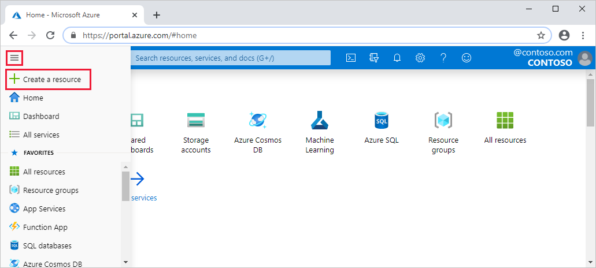
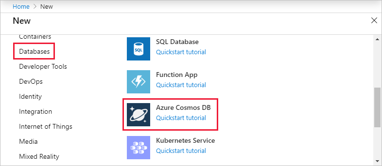
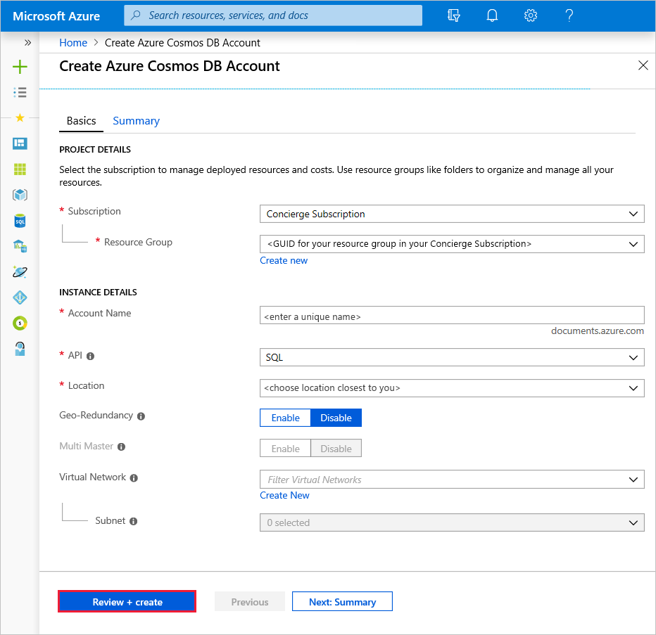
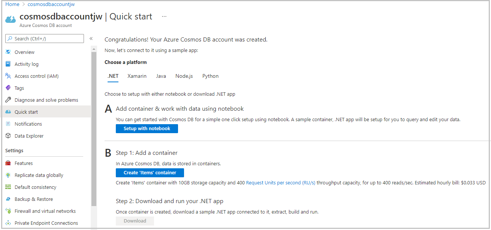

Your company has chosen Azure Cosmos DB to meet the demands of their expanding customer and product base. You have been tasked with creating the database.

The first step is to create an Azure Cosmos DB account.

## What is an Azure Cosmos DB account?

An Azure Cosmos DB account is an Azure resource that acts as an organizational entity for your databases. It connects your usage to your Azure subscription for billing purposes.

Each Azure Cosmos DB account is associated with one of the several data models Azure Cosmos DB supports, and you can create as many accounts as you need.

SQL API is the preferred data model if you are creating a new application. If you're working with graphs or tables, or migrating your MongoDB or Cassandra data to Azure, create additional accounts and select relevant data models.

When creating an account, choose an ID that is meaningful to you; it is how you identify your account. Further, create the account in the Azure region that's closest to your users to minimize latency between the datacenter and your users.

You can optionally set up virtual networks and geo-redundancy during account creation, but you can configure those options later. However, we will not enable those settings in this module.

## Creating an Azure Cosmos DB account in the portal

1. Sign into the [Azure portal for sandbox](https://portal.azure.com/learn.docs.microsoft.com?azure-portal=true) using the same account you activated the sandbox with.

    > [!IMPORTANT]
    > Login to the Azure portal using the link above to ensure you are connected to the sandbox, which provides access to a Concierge Subscription.

1. On the Azure portal menu, select **Create a resource**.

   

1. Select **Databases**, then **Azure Cosmos DB**, and then click **Create**.

   
   
   If you do not see **Azure Cosmos DB** in the list of databases, you can use the search box to search for it.

1. On the **Create Azure Cosmos DB Account** page, enter the settings for the new Azure Cosmos DB account, including the location.

    [!INCLUDE]

    | Setting | Value | Description |
    |---|---|---|
    | **Subscription** | *Concierge Subscription* | Select the Concierge Subscription. If you do not see the Concierge Subscription listed, you have multiple tenants enabled on your subscription, and you need to change tenants. To do so, login again using the following portal link: [Azure portal for sandbox](https://portal.azure.com/learn.docs.microsoft.com?azure-portal=true). |
    | **Resource Group** | *<rgn>[sandbox resource group name]</rgn>* | Here you would either create a new resource group, or select an existing one in your subscription. |
    | **Account Name** | *Enter a unique name* | Enter a unique name to identify this Azure Cosmos DB account. Because *documents.azure.com* is appended to the ID that you provide to create your URI, use a unique but identifiable ID. You will use this ID to complete the exercises later in this module.  The ID can contain only lowercase letters, numbers, and the hyphen (-) character, and it must contain 3 to 31 characters. |
    | **API** | *Core (SQL)* | The API determines the type of account to create. Azure Cosmos DB provides five APIs to suit the needs of your application: SQL (relational database), Gremlin (graph database), MongoDB (document database), Azure Table, and Cassandra, each of which currently requires a separate account.   Select *Core (SQL)* because in this module you are creating a document database that is queryable using SQL syntax and accessible with the SQL API. |
    | **Notebooks** | *Off* | Notebooks are not necessary for this module. |
    | **Location** | *Select the region closest to you from the list above* | Select the location where the database should be located. |
    | **Capacity mode** | *Provisioned throughput* | This is the default, and there is no need to change it. |
    | **Apply Free Tier Discount** | *Do Not Apply* | The free tier is not necessary for this module. |
    | **Account Type** | *Non-Production* | This module is for learning, so your database is not meant for production use. |
    | **Geo-Redundancy** | *Disable* | This setting creates a replicated version of your database in a second (paired) region. Leave this set to disabled for now, as the database can be replicated later. |
    | **Multi-region Writes** | *Enable* | This setting enables you to write to multiple regions at the same time. |

1. Click **Review + Create**.

    

    Prices in images are for example purposes only.

1. After the settings are validated, click **Create** to create the account.

1. The account creation takes a few minutes. Wait for the portal to display the notification that the deployment succeeded and click the notification.

    

1. In the notification window, click **Go to resource**.

    

    The portal displays the **Congratulations! Your Azure Cosmos DB account was created** page.

    

## Summary

You have created an Azure Cosmos DB account, which is the first step in creating an Azure Cosmos DB database. You selected appropriate settings for your data types and set the account location to minimize latency for your users.
