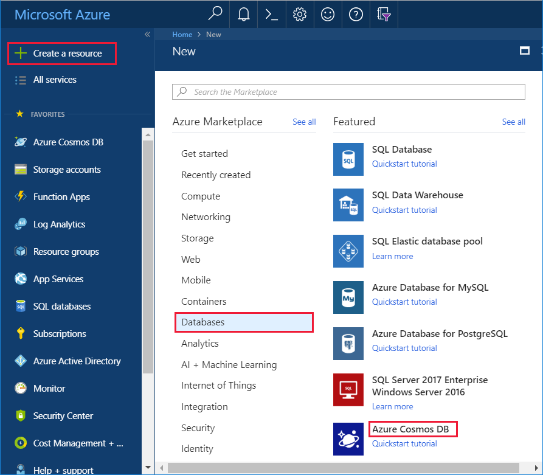
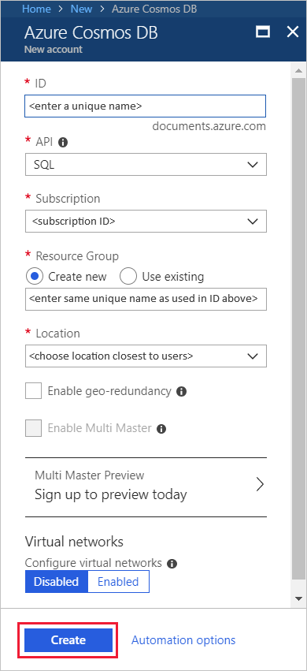
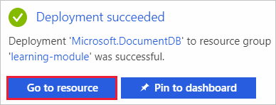
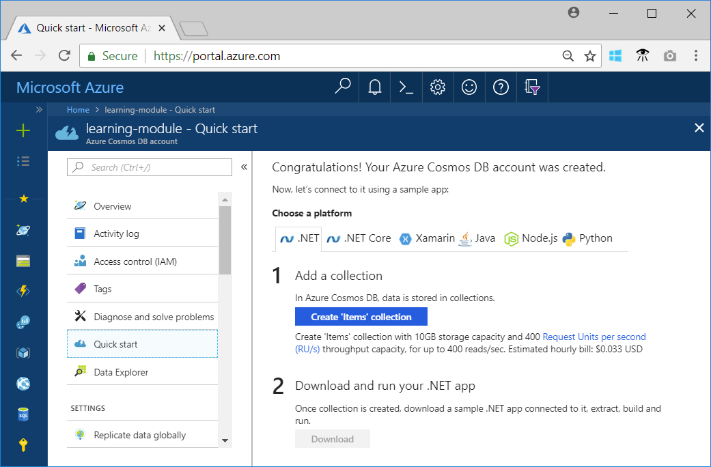

In order to create an Azure Cosmos DB database, you first need to create an Azure Cosmos DB account, which simply acts as an organizational entity for your databases, and connects your usage to your Azure subscription for billing purposes.

Each Azure Cosmos DB account is associated with one of the data models Azure Cosmos DB supports, and you can create as many accounts as you need.

In this section, we'll create one Azure Cosmos DB account, which is a SQL API account, by using the Azure portal. You'll notice in the API drop down that Azure Cosmos DB supports other data models or APIs as well, such as graphs and tables. If you wanted to work with graphs or tables, or migrate your MongoDB or Cassandra data to Azure, you would create additional accounts for those data models, but this module focuses on the SQL API, which is the best choice if your creating a new application from the ground up.

When creating an account, you want to choose an ID that is meaningful to you, as it is how you will identify your account. You also want to create the account in the Azure region that's closest to your users, to minimize the latency between the datacenter and your users.

You can set up virtual networks and geo-redundancy during account creation, but you can also do it later, and in this module we will not enable those settings. Instead we'll dig into those topics in other modules.

<!--TODO: Update portal link with one that routes to free Learning acct-->
1. Sign in to the [Azure portal](https://portal.azure.com/).
2. Click **Create a resource** > **Databases** > **Azure Cosmos DB**.
   
   

3. In the **New account** page, enter the settings for the new Azure Cosmos DB account.
 
    Setting|Value|Description
    ---|---|---
    ID|*Enter a unique name*|Enter a unique name to identify this Azure Cosmos DB account. Because *documents.azure.com* is appended to the ID that you provide to create your URI, use a unique but identifiable ID.  The ID can contain only lowercase letters, numbers, and the hyphen (-) character, and it must contain 3 to 50 characters.
    API|SQL|The API determines the type of account to create. Azure Cosmos DB provides five APIs to suit the needs of your application: SQL (document database), Gremlin (graph database), MongoDB (document database), Azure Table, and Cassandra, each which currently require a separate account.   Select **SQL** because in this module you are creating a document database that is queryable using SQL syntax and accessible with the SQL API.|
    Subscription|*Your subscription*|Select Azure subscription that you want to use for this Azure Cosmos DB account. 
    Resource Group|Create new  *Then enter the same unique name as provided above in ID*|Select **Create New**, then enter a new resource-group name for your account. For simplicity, you can use the same name as your ID. 
    Location|*Select the region closest to your users*|Select geographic location in which to host your Azure Cosmos DB account. Use the location that's closest to your users to give them the fastest access to the data.
    Enable geo-redundancy| Leave blank | This creates a replicated version of your database in a second (paired) region. Leave this blank for now as the database can be replicated later. 
    Virtual networks|Disabled|Leave virtual networks disabled for now, they can be enabled later. 

    Then click **Create**.

    

4. The account creation takes a few minutes. Wait for the portal to display a notification that the deployment succeeded, and click the notification. 

    

5. In the notification window, click **Go to resource**.

    

1. The portal displays the **Congratulations! Your Azure Cosmos DB account was created** page.

    

## Summary

You have created an Azure Cosmos DB account in the location closest to your users to minimize latency, and in this case you created a SQL API account as you'll be storing JSON documents and want to be able to query using the SQL query language. The portal gives you the option to configure geo-replication and a virtual network during account creation, but we will work with those settings in later modules.
