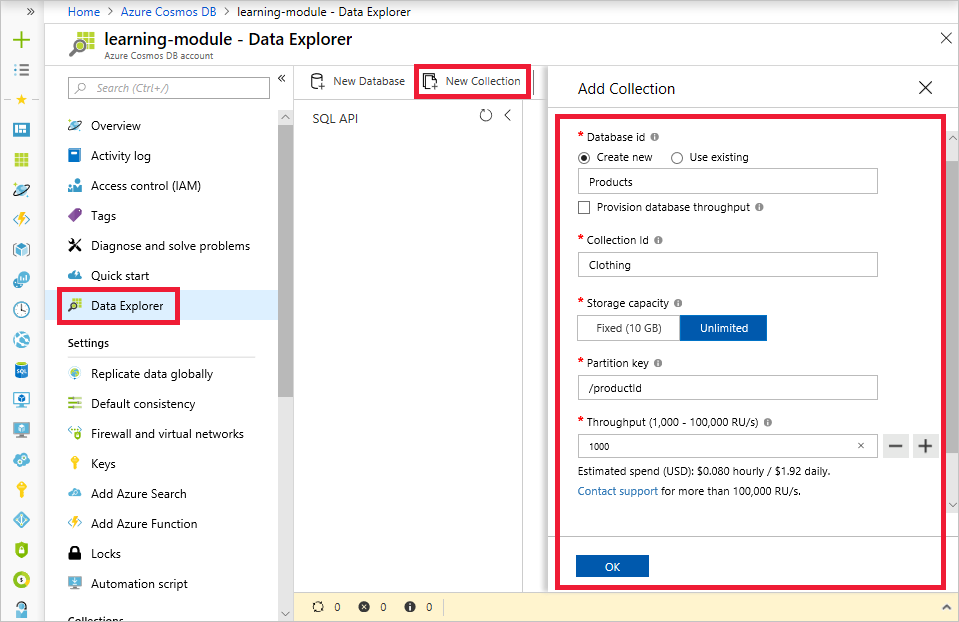
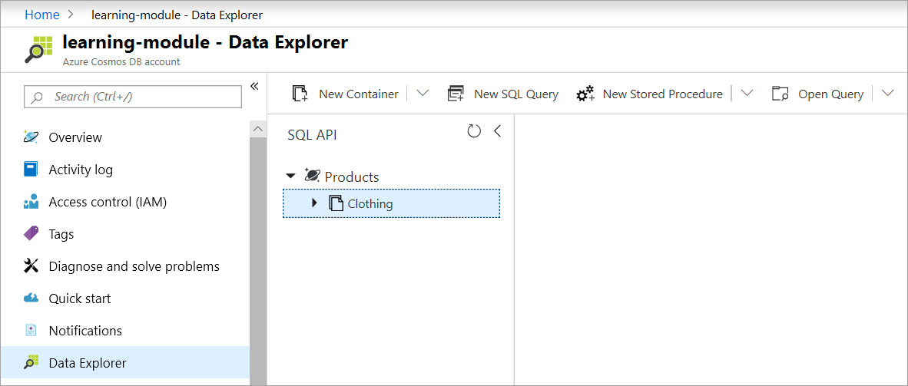

Now that you understand how request units are used to determine database throughput, and how the partition key creates the scale-out strategy for your database, you're ready to create your database and collection. You'll set your partition key and throughput values when you create your collection, so it's recommended that you understand those concepts before you create a database.

## Creating your database and collection

1. In the Azure portal, select **Data Explorer** from your Cosmos DB resource and then click the **New Collection** button in the toolbar.
    
    The **Add Collection** area is displayed on the far right. You may need to scroll right to see it.

    

1. In the **Add collection** page, enter the settings for the new collection.

    Setting | Suggested value | Description
    --------|-----------------|-------------
    Database id    | Products   | Enter *Products* as the name for the new database. Database names must be 1 to 255 characters in length, and must not contain /, \\, #, ?, or a trailing space.
    Collection id  | Clothing   | Enter *Clothing* as the name for your new collection. Collection ids have the same character requirements as database names.
    Partition key  | productId  | productId is a good partition key for an online retail scenario, as so many queries are based around the product ID.
    Throughput     | 1000 RU    | Change the throughput to 1000 request units per second (RU/s). 1000 is the minimum RU/s value you can set to enable automatic scaling.
    
    For now, don't check the **Provision database throughput** option, and don't add any unique keys to the collection.
    
1. Click **OK**. The Data Explorer displays the new database and collection.

    

## Summary

In this unit, you used your knowledge of partition keys and request units to create a database and collection with throughput and scaling settings appropriate for your business needs.