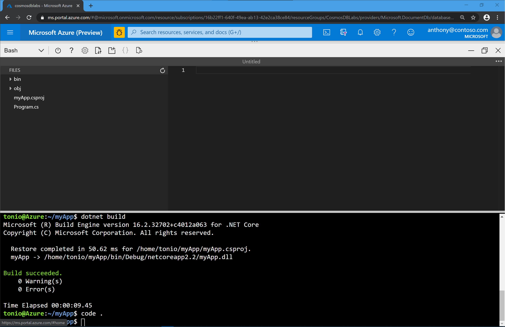

You now understand how request units are used to determine database throughput. You also know how to use partition keys to create a scale-out strategy for your database. 
Now you're ready to create your database and container. In this exercise, you'll create an Azure Cosmos DB Database and Container and set your partition key and throughput values.

::: zone pivot="portal"
## Creating your database and container

1. In the Azure portal, select **Data Explorer** from your Cosmos DB resource and then click the **New Container** button in the toolbar.
    
    The **Add Container** area is displayed on the far right. You may need to scroll right to see it.

    

1. In the **Add Container** page, enter the settings for the new container.

    Setting | Suggested value | Description
    --------|-----------------|-------------
    Database id    | Products   | Enter *Products* as the name for the new database. Database names must be 1 to 255 characters in length, and must not contain /, \\, #, ?, or a trailing space.
    Container id  | Clothing   | Enter *Clothing* as the name for your new container. Container ids have the same character requirements as database names.
    Partition key  | productId  | productId is a good partition key for an online retail scenario, as so many queries are based around the product ID.
    Throughput     | 1000 RU    | Change the throughput to 1000 request units per second (RU/s). 
    
    For now, don't check the **Provision database throughput** option, and don't add any unique keys to the container.
    
1. Click **OK**. The Data Explorer displays the new database **Products** and the container **Clothing**.

    
::: zone-end

::: zone pivot="csharp"
## Creating your database and container using C# and the .NET SDK

In this exercise, you'll create an Azure Cosmos DB  database, and container using the C# and the .NET SDK for Azure Cosmos DB. 

1. In the Azure portal, inside your Cosmos DB resource, select **Keys** . Copy the URI and PRIMARY KEY as you will use these values later.

2. Open the Azure Cloud Shell Bash shell and create a new .Net Console application

    ```bash
    dotnet new console --output myApp
    ``` 

3. A new folder call myApp and a new console based C# app will be created. Change your default directory to the new app directory

    ```bash
    cd myApp
    ``` 

4. Add the Microsoft.Azure.Cosmos NuGet package as a project dependency

    ```bash
    dotnet add package Microsoft.Azure.Cosmos --version 3.0.0
    ``` 

5. Restore all packages specified as dependencies in the project and compile the project

    ```bash
    dotnet restore
    dotnet build
    ```

6. Use the Shell Code Editor to make changes to update your project configuration.

    ```bash
    code .
    ```

    The Bash shell screen splits into two sections, showing you the coding interface at the top. You can maximize the screen to have more space to edit your files
     > [!div class="mx-imgBorder"]
    > 

7. Click on the myApp.csproj file. It will open on the right side of the editor. We will now add a new PropertyGroup XML element to the project configuration within the Project element. To add a new PropertyGroup, insert the following lines of code under the line that reads:

    ```xml
    <PropertyGroup>
        <LangVersion>latest</LangVersion>
    </PropertyGroup>
    ```

8. Your new XML file should look like this:

    ```xml
    <Project Sdk="Microsoft.NET.Sdk">
        <PropertyGroup>
            <LangVersion>latest</LangVersion>
        </PropertyGroup>
        <PropertyGroup>
            <OutputType>Exe</OutputType>
            <TargetFramework>netcoreapp2.2</TargetFramework>
        </PropertyGroup>
        <ItemGroup>
            <PackageReference Include="Microsoft.Azure.Cosmos" Version="3.0.0" />
        </ItemGroup>
    </Project>
    ```
    Save your changes by typing Ctrl+S or selecting the Save option from the Editor menu on the upper right corner.

9. Double-click the Program.cs link in the Explorer pane to open the file in the editor. Within the Program.cs editor tab, Add the following using blocks to the top of the editor:

    ```csharp
    using System.Collections.Generic;
    using System.Collections.ObjectModel;
    using System.Linq;
    using System.Threading.Tasks;
    using Microsoft.Azure.Cosmos;
    ```

10. We will now create a CosmosClient instance. This is the main "entry point" to using the SQL API in Azure Cosmos DB. Locate the Program class and replace it with the following class:

    ```csharp
    public class Program
    {
        public static async Task Main(string[] args)
        {         
        }
    }
    ```
11. Within the Program class, add the following lines of code to create variables for your connection information:

    ```csharp
    private static readonly string _endpointUri = "YOUR_URI";
    private static readonly string _primaryKey = "YOUR_KEY";
    ```

    Replace the values YOUR_URI and YOUR_KEY with the values you obtained from your Cosmos DB resource on Step #1.

12. Locate the **Main** method and add the following lines of code to creates a CosmosClient instance

    ```csharp
    using (CosmosClient client = new CosmosClient(_endpointUri, _primaryKey))
    {        
    }
    ```

13. Add the following code to the method to create a new Database instance if one does not already exist:

    ```csharp
    DatabaseResponse databaseResponse = await client.CreateDatabaseIfNotExistsAsync("EntertainmentDatabase");
    Database targetDatabase = databaseResponse.Database;
    ```

    This code will check to see if a database exists in your Azure Cosmos DB account that meets the specified parameters. If a database that matches does not exist, it will create a new database

14. Finally, add the following code to print out the ID of the database. The targetDatabase variable will have metadata about the database whether a new database is created or an existing one is read.

    ```csharp
    await Console.Out.WriteLineAsync($"Database Id:\t{targetDatabase.Id}");
    ```
15. Your final Program.cs code should look like this:

    ```csharp
    using System;
    using System.Collections.Generic;
    using System.Collections.ObjectModel;
    using System.Linq;
    using System.Threading.Tasks;
    using Microsoft.Azure.Cosmos;
    
    namespace myApp
    {
        public class Program
        {
            private static readonly string _endpointUri = "YOUR_URI";
            private static readonly string _primaryKey = "YOUR_KEY";
            public static async Task Main(string[] args)
            {         
                using (CosmosClient client = new CosmosClient(_endpointUri, _primaryKey))
                {        
                    DatabaseResponse databaseResponse = await client.CreateDatabaseIfNotExistsAsync("EntertainmentDatabase");
                    Database targetDatabase = databaseResponse.Database;
                    await Console.Out.WriteLineAsync($"Database Id:\t{targetDatabase.Id}");
                }
            }
        }
    }
    ```

    Notice you will have different values for YOUR_URI and YOUR_KEY.

16. Close your Bash Code Editor by typing Ctrl+Q or selecting Close from the Editor menu in the upper right.

17. On the Bash Shell terminal, compile and run the .NET Core app.

    ```bash
    dotnet build
    dotnet run
    ```
18. After running your application, you should see this output in your console:

    ```bash
    Database Id:    EntertainmentDatabase
    ```

19. Now that your Database was created, you are ready to create a Container to store your documents. Locate the **using** block within the Main method and add the following code to create a new IndexingPolicy instance with a custom indexing policy configured:

    ```csharp
    IndexingPolicy indexingPolicy = new IndexingPolicy
    {
        IndexingMode = IndexingMode.Consistent,
        Automatic = true,
        IncludedPaths =
        {
            new IncludedPath
            {
                Path = "/*"
            }
        }
    };
    var containerProperties = new ContainerProperties("CustomCollection", "/type")
    {
        IndexingPolicy = indexingPolicy
    };
    ```
20. Add the following lines of code to create a new Container instance if one does not already exist within your database. Specify the previously created settings and a value for throughput:

    ```csharp
    var containerResponse = await targetDatabase.CreateContainerIfNotExistsAsync(containerProperties, 10000);
    var customContainer = containerResponse.Container;
    ```
    
    This code will check to see if a container exists in your database that meets all of the specified parameters. If a container that matches does not exist, it will create a new container. Here is where we can specify the RU/s allocated for a newly created container. If this is not specified, the SDK has a default value for RU/s assigned to a container

21. Add the following code to print out the ID of the container:

    ```csharp
    await Console.Out.WriteLineAsync($"Custom Container Id:\t{customContainer.Id}");
    ```

22. Save your code. Your final Program.cs file should look like this:

    ```csharp
    using System;
    using System.Collections.Generic;
    using System.Collections.ObjectModel;
    using System.Linq;
    using System.Threading.Tasks;
    using Microsoft.Azure.Cosmos;
    
    namespace myApp
    {
        public class Program
        {
            private static readonly string _endpointUri = "https://cosmosdblabs.documents.azure.com:443/";
            private static readonly string _primaryKey = "N5M1lz1C1719MQf3muXiL3F8cbf4Hx9j2Oflo6GfnSlOqMb2shMkAjPi0kCqwnGEvrd8Bazx8xNKfsSXvvRrSw==";
            public static async Task Main(string[] args)
            {         
                using (CosmosClient client = new CosmosClient(_endpointUri, _primaryKey))
                {        
                    DatabaseResponse databaseResponse = await client.CreateDatabaseIfNotExistsAsync("EntertainmentDatabase");
                    Database targetDatabase = databaseResponse.Database;
                    await Console.Out.WriteLineAsync($"Database Id:\t{targetDatabase.Id}");
                    IndexingPolicy indexingPolicy = new IndexingPolicy
                    {
                        IndexingMode = IndexingMode.Consistent,
                        Automatic = true,
                        IncludedPaths =
                        {
                            new IncludedPath
                            {
                                Path = "/*"
                            }
                        }
                    };
                    var containerProperties = new ContainerProperties("CustomCollection", "/type")
                    {
                        IndexingPolicy = indexingPolicy
                    };
                    var containerResponse = await targetDatabase.CreateContainerIfNotExistsAsync(containerProperties, 10000);
                    var customContainer = containerResponse.Container;
                    await Console.Out.WriteLineAsync($"Custom Container Id:\t{customContainer.Id}");
                }
            }
        }
    }
    ```

    Notice you will have different values for YOUR_URI and YOUR_KEY.

23. Close your Bash Code Editor by typing Ctrl+Q or selecting Close from the Editor menu in the upper right.

24. On the Bash Shell terminal, compile and run the .NET Core app.

    ```bash
    dotnet build
    dotnet run
    ```
25. After running your application, you should see this output in your console:

    ```bash
    Database Id:    EntertainmentDatabase
    Custom Container Id:    CustomCollection
    ```
::: zone-end

::: zone pivot="java"


::: zone-end

## Summary

In this unit, you used your knowledge of partition keys and request units to create a database and container with throughput and scaling settings appropriate for your business needs.
