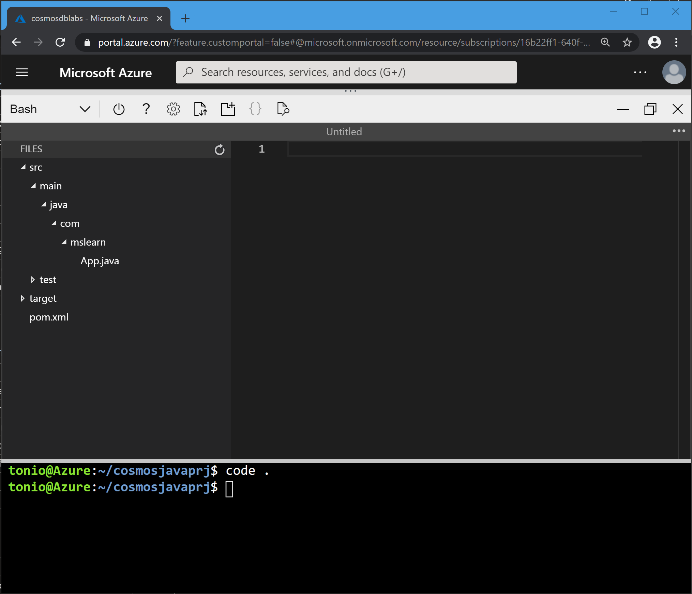

In this exercise, you'll learn how to create an Azure Cosmos DB database and container programmatically. Following the example from the previous exercise, you'll create a database named **"Products"** and a container named **"Clothing"**, and specify your partition key and throughput values.

::: zone pivot="csharp"

## Creating a database and container using C# and the .NET SDK

In this exercise, you'll create an Azure Cosmos DB  database, and container using the C# and the .NET SDK for Azure Cosmos DB.

### Create a new .NET app and database using C#

1. Sign into the [Azure portal](https://portal.azure.com/learn.docs.microsoft.com?azure-portal=true) using the account you activated the sandbox with.

    1. Locate your Cosmos DB resource, and select **Keys**.
    
    1. Copy the **URI** and **PRIMARY KEY** values, which you'll need later.

1. In the Cloud Shell, use the following command to create a new .Net Console application:

    ```bash
    dotnet new console --output myApp
    ```

    ASP.NET Core creates a new directory called *myApp*, which contains your new console C# app.

1. Change to your new app's directory:

    ```bash
    cd myApp
    ``` 

1. Add the `Microsoft.Azure.Cosmos` NuGet package as a project dependency:

    ```bash
    dotnet add package Microsoft.Azure.Cosmos --version 3.0.0
    ``` 

1. Restore all packages specified as dependencies in the project and compile the project:

    ```bash
    dotnet restore
    dotnet build
    ```

1. Open the Cloud Shell Code Editor to make changes to your project:

    ```bash
    code .
    ```

    The Bash shell screen splits into two sections, showing you the coding interface at the top. You can maximize the screen to have more space to edit your files.

    

1. Click *myApp.csproj* in the Explorer pane to open the file in the code editor.

    1. Add a new `<PropertyGroup>` XML element to the project configuration within the Project element. To do so, locate the existing `<PropertyGroup>` element, and add the following lines beneath it:

        ```xml
        <PropertyGroup>
            <LangVersion>latest</LangVersion>
        </PropertyGroup>
        ```

        Your XML file should resemble the following example:

        ```xml
        <Project Sdk="Microsoft.NET.Sdk">
            <PropertyGroup>
                <OutputType>Exe</OutputType>
                <TargetFramework>netcoreapp2.2</TargetFramework>
            </PropertyGroup>
            <PropertyGroup>
                <LangVersion>latest</LangVersion>
            </PropertyGroup>
            <ItemGroup>
                <PackageReference Include="Microsoft.Azure.Cosmos" Version="3.0.0" />
            </ItemGroup>
        </Project>
        ```

    1. Save your changes by typing <kbd>Ctrl+S</kbd>, or by selecting the **Save** option from the Editor menu on the upper right corner.

1. Click *Program.cs* in the Explorer pane to open the file in the editor.

    1. Add the following `using` statements to the top of the editor:

        ```csharp
        using System.Collections.Generic;
        using System.Collections.ObjectModel;
        using System.Linq;
        using System.Threading.Tasks;
        using Microsoft.Azure.Cosmos;
        ```

    1. Create a `CosmosClient` instance, which is the main "entry point" to using the SQL API in Azure Cosmos DB. To do so, locate the `Program` class and replace it with the following class:

        ```csharp
        public class Program
        {
            public static async Task Main(string[] args)
            {         
            }
        }
        ```

    1. Within the `Program` class, add the following lines of code to create variables for your connection information:

        ```csharp
        private static readonly string _endpointUri = "YOUR_URI";
        private static readonly string _primaryKey = "YOUR_KEY";
        ```

        Replace the values `YOUR_URI` and `YOUR_KEY` with the values that you obtained from your Cosmos DB resource in the Azure portal earlier.

    1. Locate the `Main` method, and add the following lines of code to create a `CosmosClient` instance:

        ```csharp
        using (CosmosClient client = new CosmosClient(_endpointUri, _primaryKey))
        {        
        }
        ```

    1. Add the following code within the `CosmosClient` creation block to create a new `Database` instance name **Products**:

        ```csharp
        DatabaseResponse databaseResponse = await client.CreateDatabaseIfNotExistsAsync("Products");
        Database targetDatabase = databaseResponse.Database;
        ```

        This code checks if a database with the specified parameters exists in your Azure Cosmos DB account. If a database that matches doesn't exist, it will create a new database.

    1. As a final step, add the following code below the `Database` instance to print out the ID of the database that you  created:

        ```csharp
        await Console.Out.WriteLineAsync($"Database Id:\t{targetDatabase.Id}");
        ```

        The `targetDatabase` variable contains metadata about the database, whether a new database is created or an existing one is read.

        Your final Program.cs code should resemble the following example:

        ```csharp
        using System;
        using System.Collections.Generic;
        using System.Collections.ObjectModel;
        using System.Linq;
        using System.Threading.Tasks;
        using Microsoft.Azure.Cosmos;
    
        namespace myApp
        {
            public class Program
            {
                private static readonly string _endpointUri = "YOUR_URI";
                private static readonly string _primaryKey = "YOUR_KEY";
                public static async Task Main(string[] args)
                {         
                    using (CosmosClient client = new CosmosClient(_endpointUri, _primaryKey))
                    {        
                        DatabaseResponse databaseResponse = await client.CreateDatabaseIfNotExistsAsync("Products");
                        Database targetDatabase = databaseResponse.Database;
                        await Console.Out.WriteLineAsync($"Database Id:\t{targetDatabase.Id}");
                    }
                }
            }
        }
        ```

        Notice you'll have different values for `YOUR_URI` and `YOUR_KEY`.

    1. Save your changes by typing <kbd>Ctrl+S</kbd>, or by selecting the **Save** option from the Editor menu on the upper right corner.
    
    1. Close the Code Editor by typing <kbd>Ctrl+Q</kbd>, or selecting **Close** from the Editor menu in the upper right.

1. On the Bash Shell terminal, compile and run your .NET Core app:

    ```bash
    dotnet build
    dotnet run
    ```

    After running your application, you should see the following output in your console:

    ```bash
    Database Id:    Products
    ```

### Add a new container to your database using C#

Now that you have created your database, you're ready to create a container to store your documents.

1. Open the *Program.cs* file in the Code Editor to make changes to your app:

    ```bash
    code Program.cs
    ```

    1. Locate the `await Console.Out.WriteLineAsync(...)` method within the `Main` method.
    
    1. Add the following code below the `WriteLineAsync()` method to create a new `IndexingPolicy` instance with a custom indexing policy:

        ```csharp
        IndexingPolicy indexingPolicy = new IndexingPolicy
        {
            IndexingMode = IndexingMode.Consistent,
            Automatic = true,
            IncludedPaths =
            {
                new IncludedPath
                {
                    Path = "/*"
                }
            }
        };
        var containerProperties = new ContainerProperties("Clothing", "/type")
        {
            IndexingPolicy = indexingPolicy
        };
        ```

    1. Add the following lines of code after your previous additions to create a new `Container` instance:

        ```csharp
        var containerResponse = await targetDatabase.CreateContainerIfNotExistsAsync(containerProperties, 10000);
        var customContainer = containerResponse.Container;
        ```
    
        This code checks to see if a container with the specified parameters exists in your database, and it creates a new container if there is no match. You can also specify the RU/s allocated for the container that you create. When you do not specify the RU/s, the SDK has a default value for RU/s assigned to a container.

    1. Add the following code to print out the ID of the container:

        ```csharp
        await Console.Out.WriteLineAsync($"Custom Container Id:\t{customContainer.Id}");
        ```

        Your final Program.cs file should look like this:

        ```csharp
        using System;
        using System.Collections.Generic;
        using System.Collections.ObjectModel;
        using System.Linq;
        using System.Threading.Tasks;
        using Microsoft.Azure.Cosmos;
    
        namespace myApp
        {
            public class Program
            {
                private static readonly string _endpointUri = "YOUR_URI";
                private static readonly string _primaryKey = "YOUR_KEY";
                public static async Task Main(string[] args)
                {         
                    using (CosmosClient client = new CosmosClient(_endpointUri, _primaryKey))
                    {        
                        DatabaseResponse databaseResponse = await client.CreateDatabaseIfNotExistsAsync("Products");
                        Database targetDatabase = databaseResponse.Database;
                        await Console.Out.WriteLineAsync($"Database Id:\t{targetDatabase.Id}");
                        IndexingPolicy indexingPolicy = new IndexingPolicy
                        {
                            IndexingMode = IndexingMode.Consistent,
                            Automatic = true,
                            IncludedPaths =
                            {
                                new IncludedPath
                                {
                                    Path = "/*"
                                }
                            }
                        };
                        var containerProperties = new ContainerProperties("Clothing", "/type")
                        {
                            IndexingPolicy = indexingPolicy
                        };
                        var containerResponse = await targetDatabase.CreateContainerIfNotExistsAsync(containerProperties, 10000);
                        var customContainer = containerResponse.Container;
                        await Console.Out.WriteLineAsync($"Custom Container Id:\t{customContainer.Id}");
                    }
                }
            }
        }
        ```

        Remember that you'll have different values for `YOUR_URI` and `YOUR_KEY`.

    1. Save your changes by typing <kbd>Ctrl+S</kbd>, or by selecting the **Save** option from the Editor menu on the upper right corner.

    1. Close the Code Editor by typing <kbd>Ctrl+Q</kbd>, or by selecting **Close** from the Editor menu in the upper right.

1. On the Bash Shell terminal, compile and run the .NET Core app:

    ```bash
    dotnet build
    dotnet run
    ```
1. After running your application, you should see this output in your console:

    ```bash
    Database Id:    Products
    Custom Container Id:    Clothing
    ```

::: zone-end

::: zone pivot="java"

## Creating your database and container using the Java SDK

In this exercise, you'll create an Azure Cosmos DB  database, and container using the Java SDK for Azure Cosmos DB. 

### Create a new app using Maven and database using Java

1. Sign into the [Azure portal](https://portal.azure.com/learn.docs.microsoft.com?azure-portal=true) using the account you activated the sandbox with.

    1. Locate your Cosmos DB resource, and select **Keys**.
    
    1. Copy the **URI** and **PRIMARY KEY** values, which you'll need later.

1. Open the Azure Cloud Shell Bash shell and create a new Java application using **Maven** and the *maven-archetype-quickstart*:

    ```bash
    mvn archetype:generate -DgroupId=com.mslearn -DartifactId=cosmosjavaprj -DarchetypeArtifactId=maven-archetype-quickstart -DinteractiveMode=false
    ```

    Maven creates a project called *cosmosjavaprj*, and provides a sample App to get you started.

1. Change to your new app's directory:

    ```bash
    cd cosmosjavaprj
    ```

1. Open the Cloud Shell Code Editor to make changes to your project:

    ```bash
    code .
    ```

    The Bash shell screen splits into two sections, showing you the coding interface at the top. You can maximize the screen to have more space to edit your files.

    

1. Click *pom.xml* in the Explorer pane to open the file in the code editor.

    1. To add the Maven project dependencies required to work with Cosmos DB, add the following entry within the dependencies section:

        ```xml
        <dependency>
          <groupId>com.microsoft.azure</groupId>
          <artifactId>azure-cosmosdb</artifactId>
          <version>2.4.3</version>
        </dependency>
        ```
    
    1. You'll also need to change the source and target compiler versions to Java 1.8. The code uses lambda syntax supported only on Java 8 onwards. Add the following code to below the `<dependencies>` section:

        ```xml
        <properties>
            <project.build.sourceEncoding>UTF-8</project.build.sourceEncoding>
            <maven.compiler.source>1.8</maven.compiler.source>
            <maven.compiler.target>1.8</maven.compiler.target>
        </properties>
        ```

    1. Save your changes by typing <kbd>Ctrl+S</kbd>, or by selecting the **Save** option from the Editor menu on the upper right corner.

1. In the Explorer pane of the Code Editor, expand the nodes in the tree to *src\main\java\com\mslearn*, then click *App.java* to open the file in the editor.

    

    1.  Below the **package com.mslearn** line, add the following imports:

        ```java
        import java.util.ArrayList;
        import java.util.Collection;
        import java.util.List;
        import java.util.concurrent.CountDownLatch;
        import java.util.concurrent.ExecutorService;
        import java.util.concurrent.Executors;
        import com.microsoft.azure.cosmosdb.ConnectionPolicy;
        import com.microsoft.azure.cosmosdb.ConsistencyLevel;
        import com.microsoft.azure.cosmosdb.DataType;
        import com.microsoft.azure.cosmosdb.Database;
        import com.microsoft.azure.cosmosdb.DocumentClientException;
        import com.microsoft.azure.cosmosdb.DocumentCollection;
        import com.microsoft.azure.cosmosdb.IncludedPath;
        import com.microsoft.azure.cosmosdb.Index;
        import com.microsoft.azure.cosmosdb.IndexingPolicy;
        import com.microsoft.azure.cosmosdb.PartitionKeyDefinition;
        import com.microsoft.azure.cosmosdb.RequestOptions;
        import com.microsoft.azure.cosmosdb.ResourceResponse;
        import com.microsoft.azure.cosmosdb.rx.AsyncDocumentClient;
        import rx.Observable;
        import rx.Scheduler;
        import rx.schedulers.Schedulers;
        ```

    1. Add the following class variables:

        ```java
        private static final String databaseName = "Products";
        private static ExecutorService executorService;
        private static Scheduler scheduler;
        private static AsyncDocumentClient client;
        ```

    1. Replace the default code inside the `main` method with the following code:

        ```java
        executorService = Executors.newFixedThreadPool(100);
        scheduler = Schedulers.from(executorService);
        client = new AsyncDocumentClient.Builder().withServiceEndpoint("YOUR_URI")
            .withMasterKeyOrResourceToken("YOUR_KEY")
            .withConnectionPolicy(ConnectionPolicy.GetDefault()).withConsistencyLevel(ConsistencyLevel.Eventual)
            .build();
        ```

        The code will create a scheduler used to switch to a user app thread, which is required for async IO operations) and also the `AsyncDocumentClient`. Replace the values `YOUR_URI` and `YOUR_KEY` with the values that you obtained from your Cosmos DB resource in the Azure portal earlier.

    1. Below the `main` method in the `App` class, add the following methods for creating a database, and closing down the `AsyncDocumentClient`:

        ```java
        private static void createDatabase() throws Exception {
            String databaseLink = String.format("/dbs/%s", databaseName);
            Observable<ResourceResponse<Database>> databaseReadObs = client.readDatabase(databaseLink, null);
            Observable<ResourceResponse<Database>> databaseExistenceObs = databaseReadObs.doOnNext(x -> {
                System.out.println("database " + databaseName + " already exists.");
            }).onErrorResumeNext(e -> {
                if (e instanceof DocumentClientException) {
                    DocumentClientException de = (DocumentClientException) e;
                    if (de.getStatusCode() == 404) {
                        System.out.println("database " + databaseName + " doesn't exist," + " creating it...");
                        Database dbDefinition = new Database();
                        dbDefinition.setId(databaseName);
                        return client.createDatabase(dbDefinition, null);
                    }
                }
                System.err.println("Reading database " + databaseName + " failed.");
                return Observable.error(e);
            });
            databaseExistenceObs.toCompletable().await();
            System.out.println("Checking database " + databaseName + " completed!\n");
        }
    
        public static void close() {
            executorService.shutdown();
            client.close();
        }
        ```

    1. Within the `main` method, add the following lines of code to create and dispose of the `AsyncDocumentClient` instance:

        ```java
        try {
            p.createDatabase();
            System.out.println(String.format("Database created, please hold while resources are released"));
        } catch (Exception e) {
            System.err.println(String.format("Cosmos DB GetStarted failed with %s", e));
        } finally {
            System.out.println("close the client");
            p.close();
        }
        System.exit(0);
        ```

        Your final App.java file should resemble the following example:

        ```java
        package com.mslearn;
        import java.util.ArrayList;
        import java.util.Collection;
        import java.util.List;
        import java.util.concurrent.CountDownLatch;
        import java.util.concurrent.ExecutorService;
        import java.util.concurrent.Executors;
        import com.microsoft.azure.cosmosdb.ConnectionPolicy;
        import com.microsoft.azure.cosmosdb.ConsistencyLevel;
        import com.microsoft.azure.cosmosdb.DataType;
        import com.microsoft.azure.cosmosdb.Database;
        import com.microsoft.azure.cosmosdb.DocumentClientException;
        import com.microsoft.azure.cosmosdb.DocumentCollection;
        import com.microsoft.azure.cosmosdb.IncludedPath;
        import com.microsoft.azure.cosmosdb.Index;
        import com.microsoft.azure.cosmosdb.IndexingPolicy;
        import com.microsoft.azure.cosmosdb.PartitionKeyDefinition;
        import com.microsoft.azure.cosmosdb.RequestOptions;
        import com.microsoft.azure.cosmosdb.ResourceResponse;
        import com.microsoft.azure.cosmosdb.rx.AsyncDocumentClient;
        import rx.Observable;
        import rx.Scheduler;
        import rx.schedulers.Schedulers;
    
        public class App 
        {
            private static final String databaseName = "Products";
            private static ExecutorService executorService;
            private static Scheduler scheduler;
            private static AsyncDocumentClient client;
    
            public static void main( String[] args )
            {
                executorService = Executors.newFixedThreadPool(100);
                scheduler = Schedulers.from(executorService);
                client = new AsyncDocumentClient.Builder().withServiceEndpoint("YOUR_URI")
                    .withMasterKeyOrResourceToken("YOUR_KEY")
                    .withConnectionPolicy(ConnectionPolicy.GetDefault()).withConsistencyLevel(ConsistencyLevel.Eventual)
                    .build();
                try {
                    createDatabase();
                    System.out.println(String.format("Database created, please hold while resources are released"));
                } catch (Exception e) {
                    System.err.println(String.format("Cosmos DB GetStarted failed with %s", e));
                } finally {
                    System.out.println("close the client");
                    close();
                }
                System.exit(0);
            }
    
            private static void createDatabase() throws Exception {
                String databaseLink = String.format("/dbs/%s", databaseName);
                Observable<ResourceResponse<Database>> databaseReadObs = client.readDatabase(databaseLink, null);
                Observable<ResourceResponse<Database>> databaseExistenceObs = databaseReadObs.doOnNext(x -> {
                    System.out.println("database " + databaseName + " already exists.");
                }).onErrorResumeNext(e -> {
                    if (e instanceof DocumentClientException) {
                        DocumentClientException de = (DocumentClientException) e;
                        if (de.getStatusCode() == 404) {
                            System.out.println("database " + databaseName + " doesn't exist," + " creating it...");
                            Database dbDefinition = new Database();
                            dbDefinition.setId(databaseName);
                            return client.createDatabase(dbDefinition, null);
                        }
                    }
                    System.err.println("Reading database " + databaseName + " failed.");
                    return Observable.error(e);
                });
                databaseExistenceObs.toCompletable().await();
                System.out.println("Checking database " + databaseName + " completed!\n");
            }
    
            public static void close() {
                executorService.shutdown();
                client.close();
            }
        }
        ```

        Make sure you use the correct values for `YOUR_URI` and `YOUR_KEY`.

    1. Save your changes by typing <kbd>Ctrl+S</kbd>, or by selecting the **Save** option from the Editor menu on the upper right corner.
    
    1. Close the Code Editor by typing <kbd>Ctrl+Q</kbd>, or selecting **Close** from the Editor menu in the upper right.

1. On the Bash Shell terminal, compile and run your Java application:

    ```bash
    mvn compile
    mvn exec:java -Dexec.mainClass=com.mslearn.App
    ```

    Your Application will create a new database. The console will show this output:

    ```bash
    SLF4J: See http://www.slf4j.org/codes.html#StaticLoggerBinder for further details.
    database Products doesn't exist, creating it...
    Checking database Products completed!
    
    Database created, please hold while resources are released
    close the client
    ```

### Add a new container to your database using Java

Now that you have created your database, you're ready to create a container to store your documents.

1. Open the Cloud Shell Code Editor to make changes to your project:

    ```bash
    code .
    ```

1. In the Explorer pane of the Code Editor, expand the nodes in the tree to *src\main\java\com\mslearn*, then click *App.java* to open the file in the editor.

    1. Below the `class` declaration, add the following variables:

        ```java
        private static final String collectionId = "Clothing";
        private static final String partitionKeyPath = "/type";
        private static final int throughPut = 400;
        ```

        Your class should now have seven class variables. The new name of the collection is defined by `collectionId`, and `partitionKeyPath` indicates the partition key.

    1. Add a new `DocumentCollection()` method below the `createDatabase()` method. This method defines the multi-partition parameters, which will set the indexing policy for your collection, and include the partition key and collection id:

        ```java
        private static DocumentCollection getMultiPartitionCollectionDefinition() {
            DocumentCollection collectionDefinition = new DocumentCollection();
            collectionDefinition.setId(collectionId);
    
            PartitionKeyDefinition partitionKeyDefinition = new PartitionKeyDefinition();
            List<String> paths = new ArrayList<>();
            paths.add(partitionKeyPath);
            partitionKeyDefinition.setPaths(paths);
            collectionDefinition.setPartitionKey(partitionKeyDefinition);
    
            // Set indexing policy to be range for string and number
            IndexingPolicy indexingPolicy = new IndexingPolicy();
            Collection<IncludedPath> includedPaths = new ArrayList<>();
            IncludedPath includedPath = new IncludedPath();
            includedPath.setPath("/*");
            Collection<Index> indexes = new ArrayList<>();
            Index stringIndex = Index.Range(DataType.String);
            stringIndex.set("precision", -1);
            indexes.add(stringIndex);
    
            Index numberIndex = Index.Range(DataType.Number);
            numberIndex.set("precision", -1);
            indexes.add(numberIndex);
            includedPath.setIndexes(indexes);
            includedPaths.add(includedPath);
            indexingPolicy.setIncludedPaths(includedPaths);
            collectionDefinition.setIndexingPolicy(indexingPolicy);
    
            return collectionDefinition;
        }
        ```

    1. Add a new `createMultiPartitionCollection()` method below the previous method. This method will create the multi partition collection and also set the throughput value:

        ```java
        public static void createMultiPartitionCollection() throws Exception {
            RequestOptions multiPartitionRequestOptions = new RequestOptions();
            multiPartitionRequestOptions.setOfferThroughput(throughPut);
            String databaseLink = String.format("/dbs/%s", databaseName);
    
            Observable<ResourceResponse<DocumentCollection>> createCollectionObservable = client.createCollection(
                databaseLink, getMultiPartitionCollectionDefinition(), multiPartitionRequestOptions);
    
            final CountDownLatch countDownLatch = new CountDownLatch(1);
    
            createCollectionObservable.single() // there is only single result
                    .subscribe(collectionResourceResponse -> {
                        System.out.println(collectionResourceResponse.getActivityId());
                        countDownLatch.countDown();
                    }, error -> {
                        System.err.println(
                                "an error occurred while creating the collection: actual cause: " + error.getMessage());
                        countDownLatch.countDown();
                    });
            System.out.println("creating collection...");
            countDownLatch.await();
        }
        ```

    1. Finally, update the try/catch block of your `main()` method to add a call to the new `createMultiPartitionCollection()` method:

        ```java
        try {
            createDatabase();
            System.out.println(String.format("Database created, please hold while resources are released"));
            createMultiPartitionCollection();
        } catch (Exception e) {
            System.err.println(String.format("Cosmos DB GetStarted failed with %s", e));
        } finally {
            System.out.println("close the client");
            close();
        }
        System.exit(0);
        ```

    1. Save your changes by typing <kbd>Ctrl+S</kbd>, or by selecting the **Save** option from the Editor menu on the upper right corner.
    
    1. Close the Code Editor by typing <kbd>Ctrl+Q</kbd>, or selecting **Close** from the Editor menu in the upper right.

1. On the Bash Shell terminal, compile and run your Java application:

    ```bash
    mvn compile
    mvn exec:java -Dexec.mainClass=com.mslearn.App
    ```

    You now have a new collection on your database.  The console will show this output:

    ```bash
    SLF4J: See http://www.slf4j.org/codes.html#StaticLoggerBinder for further details.
    database Products already exists.
    Checking database Products completed!
    
    Database created, please hold while resources are released
    creating collection...
    21f90092-5c5c-46f2-afc8-5177971a70c7
    close the client
    ```

::: zone-end

::: zone pivot="cli"

## Create an Azure Cosmos DB account + database with the Azure CLI

1. Sign into the [Azure portal](https://portal.azure.com/learn.docs.microsoft.com?azure-portal=true) using the account you activated the sandbox with.  Locate your Cosmos DB resource, and save the name of it.

1. Paste the following command into the Cloud Shell on the right to create to store the name of the Azure Cosmos DB account name in an environment variable to use later. Make sure to replace `COSMOS_NAME` with the name of the Cosmos DB account that you specified when you created your account in the first exercise of this module:

    ```bash
    export NAME=COSMOS_NAME
    ```

    > [!NOTE]
    > 
    > This exercise uses Bash for the shell. However, if you were using PowerShell instead of Bash with your personal Azure account, you would need to use the following command to set the value for the `$NAME` environment variable that you'll use later:
    >
    > ```powershell
    > $NAME = "COSMOS_NAME"
    > ```
    >
    > In addition, you would need to replace the backslash line continuation characters from Bash with the corresponding backtick characters for PowerShell, or remove them entirely.

1. Use the following command into the Cloud Shell on the right to create a new Azure Cosmos DB account with your specified name:

    ```azurecli
    az cosmosdb create \
        --name $NAME \
        --kind GlobalDocumentDB \
        --resource-group <rgn>[sandbox resource group name]</rgn>
    ```

    [!include[](../../../includes/azure-cloudshell-copy-paste-tip.md)]

    The command takes a few minutes to complete. When the command has finished, it displays the settings as a JSON object for the new account, which may resemble the following example:

    ```json
    {
      "capabilities": [],
      "consistencyPolicy": {
        ...
      },
      "databaseAccountOfferType": "Standard",
      "documentEndpoint": "https://cosmos123456.documents.azure.com:443/",
      "enableAutomaticFailover": false,
      "enableMultipleWriteLocations": false,
      "failoverPolicies": [
        ...
      ],
      "id": "/subscriptions/00000000-0000-0000-0000-000000000000/resourceGroups/<rgn>[sandbox resource group name]</rgn>/providers/Microsoft.DocumentDB/databaseAccounts/cosmos123456",
      "ipRangeFilter": "",
      "isVirtualNetworkFilterEnabled": false,
      "keyVaultKeyUri": null,
      "kind": "GlobalDocumentDB",
      ...
    }
    ```

1. Create the `Products` database in the account using the `cosmosdb database create` command. It takes a `db-name` parameter that you'll set to **"Products"** since this database will hold the inventory data:

    ```azurecli
    az cosmosdb sql database create \
        --account-name $NAME \
        --name "Products" \
        --resource-group <rgn>[sandbox resource group name]</rgn>
    ```

    This command displays a JSON object when it has finished, which may resemble the following excerpt:

    ```json
    {
      "id": "/subscriptions/00000000-0000-0000-0000-000000000000/resourceGroups/<rgn>[sandbox resource group name]</rgn>/providers/Microsoft.DocumentDB/databaseAccounts/cosmos123456/sqlDatabases/Products",
      "location": null,
      "name": "Products",
      "resource": {
        ...
      },
      "resourceGroup": "<rgn>[sandbox resource group name]</rgn>",
      "tags": null,
      "type": "Microsoft.DocumentDB/databaseAccounts/sqlDatabases"
    }
    ```

1. Finally, create the `Clothing` container with the `cosmosdb collection create` command in the Cloud Shell, where you will specify your partition key and throughput values:

    ```azurecli
    az cosmosdb sql container create \
        --account-name $NAME \
        --database-name "Products" \
        --name "Clothing" \
        --partition-key-path "/productId" \
        --throughput 1000 \
        --resource-group <rgn>[sandbox resource group name]</rgn>
    ```

    This command displays a JSON object when it has finished, which may resemble the following excerpt:

    ```json
    {
      "id": "/subscriptions/00000000-0000-0000-0000-000000000000/resourceGroups/<rgn>[sandbox resource group name]</rgn>/providers/Microsoft.DocumentDB/databaseAccounts/cosmos123456/sqlDatabases/Products/containers/Clothing",
      "location": null,
      "name": "Clothing",
      "resource": {
        ...
      },
      "resourceGroup": "<rgn>[sandbox resource group name]</rgn>",
      "tags": null,
      "type": "Microsoft.DocumentDB/databaseAccounts/sqlDatabases/containers"
    }
    ```

::: zone-end

## Summary

In this unit, you programmatically created a database and container with throughput and scaling settings that are appropriate for your business needs.
