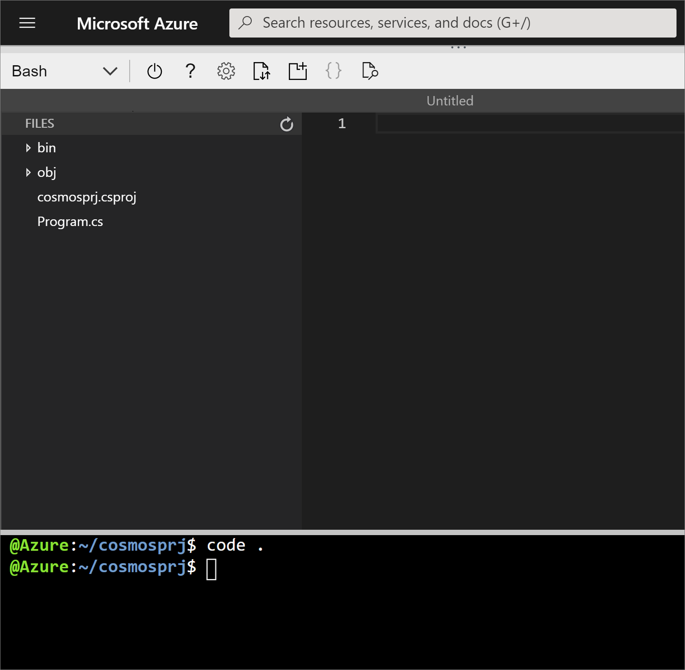
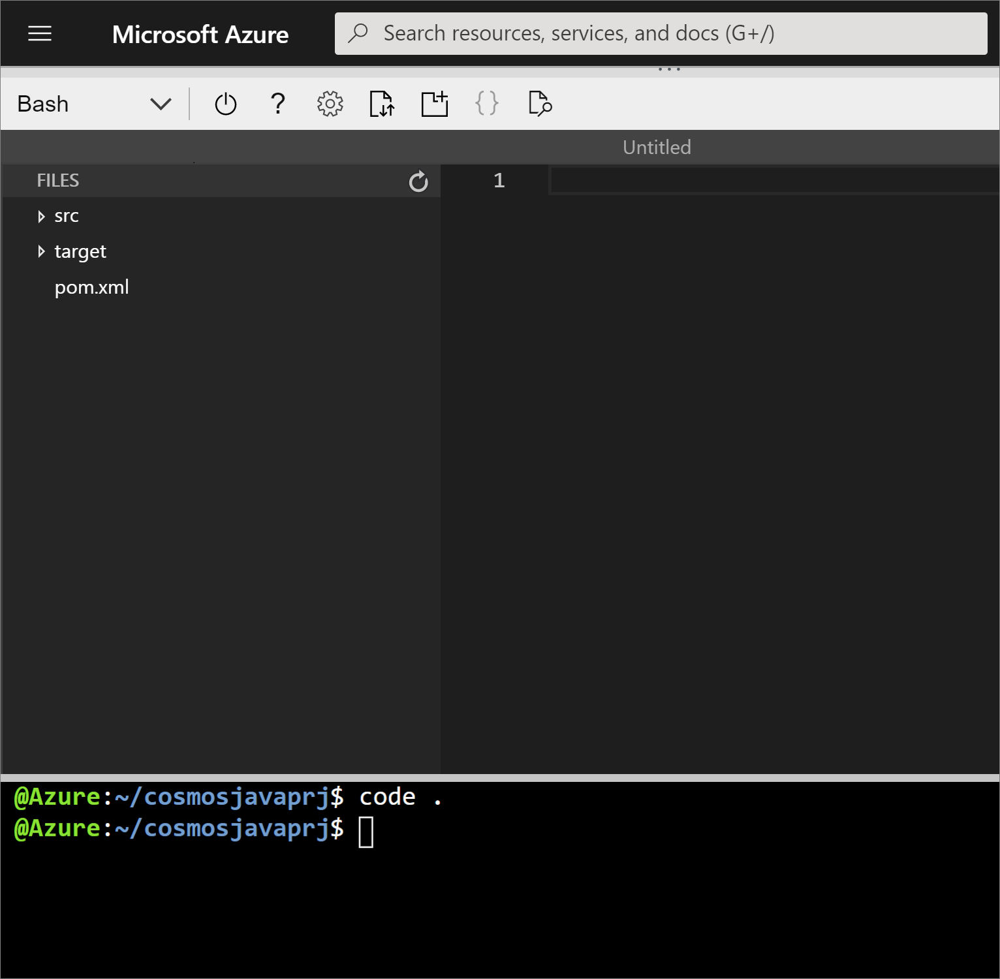

In this exercise, you'll learn how to create an Azure Cosmos DB database and container programmatically. Following the example from the previous exercise, you'll create a database named **"Products"** and a container named **"Clothing"**, and specify your partition key and throughput values.

::: zone pivot="csharp"

## Creating a database and container using C# and the .NET SDK

In this exercise, you'll create an Azure Cosmos DB  database, and container using the C# and the .NET SDK for Azure Cosmos DB.

### Create a new .NET app, database, and container using C#

1. Sign into the [Azure portal](https://portal.azure.com/learn.docs.microsoft.com?azure-portal=true) using the account you activated the sandbox with.

    1. Locate your Cosmos DB resource, and select **Keys**.

    1. Copy the **URI** and **PRIMARY KEY** values, which you'll need later.

1. In the Cloud Shell, use the following command to create a new .NET Console application:

    ```bash
    dotnet new console --output myApp
    ```

    ASP.NET Core creates a new directory called *myApp*, which contains your new console C# app.

1. Change to your new app's directory:

    ```bash
    cd myApp
    ``` 

1. Add the `Microsoft.Azure.Cosmos` NuGet package as a project dependency:

    ```bash
    dotnet add package Microsoft.Azure.Cosmos --version 3.0.0
    ``` 

1. Restore all packages specified as dependencies in the project and compile the project:

    ```bash
    dotnet restore
    dotnet build
    ```

1. Open the Cloud Shell Code Editor to make changes to your project:

    ```bash
    code .
    ```

    The Bash shell screen splits into two sections, showing you the coding interface at the top. You can maximize the screen to have more space to edit your files.

    

1. Select *myApp.csproj* in the Explorer pane to open the file in the code editor.

    1. Add a new `<PropertyGroup>` XML element to the project configuration within the Project element. To do so, locate the existing `<PropertyGroup>` element, and add the following lines beneath it:

        ```xml
        <PropertyGroup>
            <LangVersion>latest</LangVersion>
        </PropertyGroup>
        ```

        Your XML file should resemble the following example:

        ```xml
        <Project Sdk="Microsoft.NET.Sdk">
            <PropertyGroup>
                <OutputType>Exe</OutputType>
                <TargetFramework>netcoreapp3.1</TargetFramework>
            </PropertyGroup>
            <PropertyGroup>
                <LangVersion>latest</LangVersion>
            </PropertyGroup>
            <ItemGroup>
                <PackageReference Include="Microsoft.Azure.Cosmos" Version="3.0.0" />
            </ItemGroup>
        </Project>
        ```

    1. Save your changes by typing <kbd>Ctrl+S</kbd>, or by selecting the **Save** option from the Editor menu on the upper right corner.

1. Select *Program.cs* in the Explorer pane to open the file in the editor.

    1. Add the following `using` statements to the top of the editor:

        ```csharp
        using System.Collections.Generic;
        using System.Collections.ObjectModel;
        using System.Linq;
        using System.Threading.Tasks;
        using Microsoft.Azure.Cosmos;
        ```

    1. Locate the `Program` class and replace it with the following class:

        ```csharp
        public class Program
        {
            public static async Task Main(string[] args)
            {         
            }
        }
        ```

    1. Within the `Program` class, add the following lines of code to create variables for your connection information:

        ```csharp
        private static readonly string _endpointUri = "YOUR_URI";
        private static readonly string _primaryKey = "YOUR_KEY";
        ```

        Replace the values `YOUR_URI` and `YOUR_KEY` with the values that you obtained from your Cosmos DB resource in the Azure portal earlier.

    1. Locate the `Main` method, and add the following lines of code to create a `CosmosClient` instance, which is the primary entry point to use the SQL API in Azure Cosmos DB:

        ```csharp
        using (CosmosClient client = new CosmosClient(_endpointUri, _primaryKey))
        {        
        }
        ```

    1. Add the following code within the `CosmosClient` creation block to create a new `Database` instance name **Products**:

        ```csharp
        DatabaseResponse databaseResponse = await client.CreateDatabaseIfNotExistsAsync("Products");
        Database targetDatabase = databaseResponse.Database;
        ```

        This code checks if a database with the specified parameters exists in your Azure Cosmos DB account. If a database that matches doesn't exist, it will create a new database.

    1. As a final step, add the following code below the `Database` instance to print out the ID of the database that you  created:

        ```csharp
        await Console.Out.WriteLineAsync($"Database Id:\t{targetDatabase.Id}");
        ```

        The `targetDatabase` variable contains metadata about the database, whether a new database is created or an existing one is read.

        Your final Program.cs code should resemble the following example:

        ```csharp
        using System;
        using System.Collections.Generic;
        using System.Collections.ObjectModel;
        using System.Linq;
        using System.Threading.Tasks;
        using Microsoft.Azure.Cosmos;
    
        namespace myApp
        {
            public class Program
            {
                private static readonly string _endpointUri = "YOUR_URI";
                private static readonly string _primaryKey = "YOUR_KEY";
                public static async Task Main(string[] args)
                {         
                    using (CosmosClient client = new CosmosClient(_endpointUri, _primaryKey))
                    {        
                        DatabaseResponse databaseResponse = await client.CreateDatabaseIfNotExistsAsync("Products");
                        Database targetDatabase = databaseResponse.Database;
                        await Console.Out.WriteLineAsync($"Database Id:\t{targetDatabase.Id}");
                    }
                }
            }
        }
        ```

        Notice you'll have different values for `YOUR_URI` and `YOUR_KEY`.

    1. Save your changes by typing <kbd>Ctrl+S</kbd>, or by selecting the **Save** option from the Editor menu on the upper right corner.

    1. Close the Code Editor by typing <kbd>Ctrl+Q</kbd>, or selecting **Close** from the Editor menu in the upper right.

1. On the Bash Shell terminal, compile and run your .NET Core app:

    ```bash
    dotnet build
    dotnet run
    ```

    After running your application, you should see the following output in your console:

    ```output
    Database Id:    Products
    ```

### Create a partitioned container using C#

Now that you've created your database, you're ready to create a container to store your documents.

1. Open the *Program.cs* file in the Code Editor to make changes to your app:

    ```bash
    code Program.cs
    ```

    1. Locate the `await Console.Out.WriteLineAsync(...)` method within the `Main` method.

    1. Add the following code below the `WriteLineAsync()` method to create a new `IndexingPolicy` instance with a custom indexing policy:

        ```csharp
        IndexingPolicy indexingPolicy = new IndexingPolicy
        {
            IndexingMode = IndexingMode.Consistent,
            Automatic = true,
            IncludedPaths =
            {
                new IncludedPath
                {
                    Path = "/*"
                }
            }
        };
        var containerProperties = new ContainerProperties("Clothing", "/productId")
        {
            IndexingPolicy = indexingPolicy
        };
        ```

    1. Add the following lines of code after your previous additions to create a new `Container` instance:

        ```csharp
        var containerResponse = await targetDatabase.CreateContainerIfNotExistsAsync(containerProperties, 10000);
        var customContainer = containerResponse.Container;
        ```

        This code checks to see if a container with the specified parameters exists in your database, and it creates a new container if there's no match. You can also specify the RU/s allocated for the container that you create. When you don't specify the RU/s, the SDK has a default value for RU/s assigned to a container.

    1. Add the following code to print out the ID of the container:

        ```csharp
        await Console.Out.WriteLineAsync($"Custom Container Id:\t{customContainer.Id}");
        ```

        Your final Program.cs file should look like this:

        ```csharp
        using System;
        using System.Collections.Generic;
        using System.Collections.ObjectModel;
        using System.Linq;
        using System.Threading.Tasks;
        using Microsoft.Azure.Cosmos;
    
        namespace myApp
        {
            public class Program
            {
                private static readonly string _endpointUri = "YOUR_URI";
                private static readonly string _primaryKey = "YOUR_KEY";
                public static async Task Main(string[] args)
                {         
                    using (CosmosClient client = new CosmosClient(_endpointUri, _primaryKey))
                    {        
                        DatabaseResponse databaseResponse = await client.CreateDatabaseIfNotExistsAsync("Products");
                        Database targetDatabase = databaseResponse.Database;
                        await Console.Out.WriteLineAsync($"Database Id:\t{targetDatabase.Id}");
                        IndexingPolicy indexingPolicy = new IndexingPolicy
                        {
                            IndexingMode = IndexingMode.Consistent,
                            Automatic = true,
                            IncludedPaths =
                            {
                                new IncludedPath
                                {
                                    Path = "/*"
                                }
                            }
                        };
                        var containerProperties = new ContainerProperties("Clothing", "/productId")
                        {
                            IndexingPolicy = indexingPolicy
                        };
                        var containerResponse = await targetDatabase.CreateContainerIfNotExistsAsync(containerProperties, 10000);
                        var customContainer = containerResponse.Container;
                        await Console.Out.WriteLineAsync($"Custom Container Id:\t{customContainer.Id}");
                    }
                }
            }
        }
        ```

        Remember that you'll have different values for `YOUR_URI` and `YOUR_KEY`.

    1. Save your changes by typing <kbd>Ctrl+S</kbd>, or by selecting the **Save** option from the Editor menu on the upper right corner.

    1. Close the Code Editor by typing <kbd>Ctrl+Q</kbd>, or by selecting **Close** from the Editor menu in the upper right.

1. On the Bash Shell terminal, compile and run the .NET Core app:

    ```bash
    dotnet build
    dotnet run
    ```

1. After running your application, you should see this output in your console:

    ```output
    Database Id:    Products
    Custom Container Id:    Clothing
    ```

::: zone-end

::: zone pivot="java"

## Creating a database and container using the Java SDK

In this exercise, you'll create an Azure Cosmos DB  database, and container using the Java SDK for Azure Cosmos DB. 

### Create a new Java app, database, and container using Java

1. Sign into the [Azure portal](https://portal.azure.com/learn.docs.microsoft.com?azure-portal=true) using the account you activated the sandbox with.

    1. Locate your Cosmos DB resource.

    1. Select **Overview**, and copy the **Write Locations** value, which you'll need later.

    1. Select **Keys**, and copy the **URI** and **PRIMARY KEY** values, which you'll need later.

1. Open the Azure Cloud Shell Bash shell and create a new Java application using **Maven** and the *maven-archetype-quickstart*:

    ```bash
    mvn archetype:generate -DgroupId=com.mslearn -DartifactId=cosmosjavaprj -DarchetypeArtifactId=maven-archetype-quickstart -DinteractiveMode=false
    ```

    Maven creates a project called *cosmosjavaprj*, and provides a sample App to get you started.

1. Change to your new app's directory:

    ```bash
    cd cosmosjavaprj
    ```

1. Open the Cloud Shell Code Editor to make changes to your project:

    ```bash
    code .
    ```

    The Bash shell screen splits into two sections, showing you the coding interface at the top. You can maximize the screen to have more space to edit your files.

    

1. Select *pom.xml* in the Explorer pane to open the file in the code editor. Replace the entire file with the following code:

    ```xml
    <?xml version="1.0" encoding="UTF-8"?>
    <project xmlns="http://maven.apache.org/POM/4.0.0"
             xmlns:xsi="http://www.w3.org/2001/XMLSchema-instance"
             xsi:schemaLocation="http://maven.apache.org/POM/4.0.0 http://maven.apache.org/xsd/maven-4.0.0.xsd">
        <modelVersion>4.0.0</modelVersion>
     
        <groupId>com.azure</groupId>
        <artifactId>azure-cosmos-java-sql-api-samples</artifactId>
        <version>1.0-SNAPSHOT</version>
        <name>Get Started With Sync / Async Java SDK for SQL API of Azure Cosmos DB Database Service
        </name>
        <properties>
            <project.build.sourceEncoding>UTF-8</project.build.sourceEncoding>
        </properties>
     
        <build>
            <plugins>
                <plugin>
                    <artifactId>maven-compiler-plugin</artifactId>
                    <version>3.1</version>
                    <configuration>
                        <source>1.8</source>
                        <target>1.8</target>
                    </configuration>
                </plugin>
                <plugin>
                    <groupId>org.codehaus.mojo</groupId>
                    <artifactId>exec-maven-plugin</artifactId>
                    <version>1.6.0</version>
                </plugin>
                <plugin>
                    <groupId>org.apache.maven.plugins</groupId>
                    <artifactId>maven-eclipse-plugin</artifactId>
                    <version>2.8</version>
                    <configuration>
                        <classpathContainers>
                            <classpathContainer>
                                org.eclipse.jdt.launching.JRE_CONTAINER/org.eclipse.jdt.internal.debug.ui.launcher.StandardVMType/JavaSE-1.8
                            </classpathContainer>
                        </classpathContainers>
                    </configuration>
                </plugin>
            </plugins>
        </build>
        <dependencies>
            <dependency>
                <groupId>com.azure</groupId>
                <artifactId>azure-cosmos</artifactId>
                <version>4.0.1-beta.1</version>
            </dependency>
            <dependency>
                <groupId>com.github.javafaker</groupId>
                <artifactId>javafaker</artifactId>
                <version>1.0.2</version>
            </dependency>
        </dependencies>
    </project>
    ```

1. Save your changes by typing <kbd>Ctrl+S</kbd>, or by selecting the **Save** option from the Editor menu on the upper right corner.

1. In the Explorer pane of the Code Editor, expand the nodes in the tree to *src\main\java\com\mslearn*, then select *App.java* to open the file in the editor.

    

1. Below the `package com.mslearn` line, add the following imports:

    ```java
    import com.azure.cosmos.ConnectionPolicy;
    import com.azure.cosmos.ConsistencyLevel;
    import com.azure.cosmos.CosmosAsyncClient;
    import com.azure.cosmos.CosmosAsyncDatabase;
    import com.azure.cosmos.CosmosAsyncContainer;
    import com.azure.cosmos.CosmosClientBuilder;
    import com.azure.cosmos.models.CosmosAsyncItemResponse;
    import com.azure.cosmos.models.CosmosContainerProperties;
    import com.azure.cosmos.models.CosmosItemResponse;
    import com.azure.cosmos.models.IndexingMode;
    import com.azure.cosmos.models.IndexingPolicy;
    import com.azure.cosmos.models.IncludedPath;
    import reactor.core.publisher.Flux;
    import reactor.core.publisher.Mono;
    import java.util.ArrayList;
    import java.util.List;
    import java.util.UUID;
    import java.util.concurrent.atomic.AtomicBoolean;
    import com.google.common.collect.Lists;
    ```

1. Within the App.java class, add the following lines of code to create variables for your connection information, and for your database and container instances:

    ```java
    private static String endpointUri = "YOUR_URI";
    private static String primaryKey = "YOUR_KEY";
    private static String writeLocation = "YOUR_LOCATION";

    private static CosmosAsyncDatabase targetDatabase;
    private static CosmosAsyncContainer customContainer;
    private static AtomicBoolean resourcesCreated = new AtomicBoolean(false);
    ```

    Replace the placeholder values for the `endpointUri`, `primaryKey`, and `writeLocation` variables with the respective  **URI**, **PRIMARY KEY**, and **Write Locations** values from your Azure Cosmos DB account.

1. Locate the `main()` method and delete the `System.out` line:

    ```java
    public static void main( String[] args )
    {
        System.out.println( "Hello World!" );
    }
    ```

1. Within the `main()` method, add the following lines of code to create a `CosmosAsyncClient` instance:

    ```java
    ConnectionPolicy defaultPolicy = ConnectionPolicy.getDefaultPolicy();
    defaultPolicy.setPreferredLocations(Lists.newArrayList(writeLocation));
    
    CosmosAsyncClient client = new CosmosClientBuilder()
            .setEndpoint(endpointUri)
            .setKey(primaryKey)
            .setConnectionPolicy(defaultPolicy)
            .setConsistencyLevel(ConsistencyLevel.EVENTUAL)
            .buildAsyncClient();
    ```

1. Add the following code after the `CosmosClientBuilder()` call to create a new `CosmosAsyncDatabase` instance if it doesn't already exist:

    ```java
    client.createDatabaseIfNotExists("Products").flatMap(databaseResponse -> {
        targetDatabase = databaseResponse.getDatabase();
        return Mono.empty();
    }).subscribe(voidItem -> {}, err -> {}, () -> {
        resourcesCreated.set(true);
    });
    
    while (!resourcesCreated.get());
    ```

    This code will check to see if a database already exists in your Azure Cosmos DB account, and it will create the database if it doesn't exist.

1. After the `while` loop, add the following code to print out the ID of the database:

    ```java
    System.out.println(String.format("Database Id:\t%s",targetDatabase.getId()));
    ```

1. Now add a line at the end of the `main()` method to close the client:

    ```java
    client.close();
    ```

1. Your final App.java file should resemble the following example:

    ```java
    package com.mslearn;

    import com.azure.cosmos.ConnectionPolicy;
    import com.azure.cosmos.ConsistencyLevel;
    import com.azure.cosmos.CosmosAsyncClient;
    import com.azure.cosmos.CosmosAsyncDatabase;
    import com.azure.cosmos.CosmosAsyncContainer;
    import com.azure.cosmos.CosmosClientBuilder;
    import com.azure.cosmos.models.CosmosAsyncItemResponse;
    import com.azure.cosmos.models.CosmosContainerProperties;
    import com.azure.cosmos.models.CosmosItemResponse;
    import com.azure.cosmos.models.IndexingMode;
    import com.azure.cosmos.models.IndexingPolicy;
    import com.azure.cosmos.models.IncludedPath;
    import reactor.core.publisher.Flux;
    import reactor.core.publisher.Mono;
    import java.util.ArrayList;
    import java.util.List;
    import java.util.UUID;
    import java.util.concurrent.atomic.AtomicBoolean;
    import com.google.common.collect.Lists;
    
    /**
     * Hello world!
     *
     */
    public class App 
    {
        private static String endpointUri = "YOUR_URI";
        private static String primaryKey = "YOUR_KEY";
        private static String writeLocation = "YOUR_LOCATION";

        private static CosmosAsyncDatabase targetDatabase;
        private static CosmosAsyncContainer customContainer;
        private static AtomicBoolean resourcesCreated = new AtomicBoolean(false);
    
        public static void main( String[] args )
        {
            ConnectionPolicy defaultPolicy = ConnectionPolicy.getDefaultPolicy();
            defaultPolicy.setPreferredLocations(Lists.newArrayList(writeLocation));
            
            CosmosAsyncClient client = new CosmosClientBuilder()
                    .setEndpoint(endpointUri)
                    .setKey(primaryKey)
                    .setConnectionPolicy(defaultPolicy)
                    .setConsistencyLevel(ConsistencyLevel.EVENTUAL)
                    .buildAsyncClient();

            client.createDatabaseIfNotExists("Products").flatMap(databaseResponse -> {
                targetDatabase = databaseResponse.getDatabase();
                return Mono.empty();
            }).subscribe(voidItem -> {}, err -> {}, () -> {
                resourcesCreated.set(true);
            });
            
            while (!resourcesCreated.get());
            
            System.out.println(String.format("Database Id:\t%s",targetDatabase.getId()));

            client.close();   
    
        }
    }
    ```

    Make sure you replace the placeholder values for `YOUR_URI`, `YOUR_KEY`, and `YOUR_LOCATION`.

1. Save your changes by typing <kbd>Ctrl+S</kbd>, or by selecting the **Save** option from the Editor menu on the upper right corner.

1. Close the Code Editor by typing <kbd>Ctrl+Q</kbd>, or selecting **Close** from the Editor menu in the upper right.

1. On the Bash Shell terminal, compile and run your Java application:

```bash
mvn compile
mvn exec:java -Dexec.mainClass=com.mslearn.App -Dexec.cleanupDaemonThreads=false
```

Your Application will create a new database inside your Azure Cosmos DB account. You'll see the name on the output console:

```output
Database Id:    Products
[INFO] ------------------------------------------------------------------------
[INFO] BUILD SUCCESS
[INFO] ------------------------------------------------------------------------
```

### Create a partitioned container using Java

To create a container, you must specify a name and a partition key path. You'll specify those values when creating a container in this task. A partition key is a logical hint for distributing data onto a scaled out underlying set of physical partitions and for efficiently routing queries to the appropriate underlying partition.

1. In the previous section of this exercise, you used the following code to create a database:

    ```java
    client.createDatabaseIfNotExists("Products").flatMap(databaseResponse -> {
        targetDatabase = databaseResponse.getDatabase();
        return Mono.empty();
    }).subscribe(voidItem -> {}, err -> {}, () -> {
        resourcesCreated.set(true);
    });
    ```

1. Add a few empty lines before the `return Mono.empty();` statement, this is where you'll add code to create an indexing policy and container instance in the following steps:

    ```java
    client.createDatabaseIfNotExists("Products").flatMap(databaseResponse -> {
        targetDatabase = databaseResponse.getDatabase();

        /* ADD NEW CODE HERE */

        return Mono.empty();
    }).subscribe(voidItem -> {}, err -> {}, () -> {
        resourcesCreated.set(true);
    });
    ```

1. In the empty space, create a new `IndexingPolicy` instance with a custom indexing policy configured:

    ```java
    IndexingPolicy indexingPolicy = new IndexingPolicy();
    indexingPolicy.setIndexingMode(IndexingMode.CONSISTENT);
    indexingPolicy.setAutomatic(true);
    List<IncludedPath> includedPaths = new ArrayList<>();
    IncludedPath includedPath = new IncludedPath();
    includedPath.setPath("/*");
    includedPaths.add(includedPath);
    indexingPolicy.setIncludedPaths(includedPaths); 
    ```

1. After the code that creates your `IndexingPolicy` instance, add the following lines to create your container:

    ```java
    CosmosContainerProperties containerProperties = 
        new CosmosContainerProperties("Clothing", "/productId");
        containerProperties.setIndexingPolicy(indexingPolicy);
        return targetDatabase.createContainerIfNotExists(containerProperties, 10000);
    }).flatMap(containerResponse -> {
        customContainer = containerResponse.getContainer();
    ```

1. After the existing `System.out.println()` statement that prints the name of your database, add another `System.out.println()` statement that prints the name of your container:

    ```java
    System.out.println(String.format("Database Id:\t%s",targetDatabase.getId()));
    System.out.println(String.format("Container Id:\t%s",customContainer.getId()));
    ```

1. Your final code will look like this:

    ```java
    package com.mslearn;
    
    import com.azure.cosmos.ConnectionPolicy;
    import com.azure.cosmos.ConsistencyLevel;
    import com.azure.cosmos.CosmosAsyncClient;
    import com.azure.cosmos.CosmosAsyncDatabase;
    import com.azure.cosmos.CosmosAsyncContainer;
    import com.azure.cosmos.CosmosClientBuilder;
    import com.azure.cosmos.models.CosmosAsyncItemResponse;
    import com.azure.cosmos.models.CosmosContainerProperties;
    import com.azure.cosmos.models.CosmosItemResponse;
    import com.azure.cosmos.models.IndexingMode;
    import com.azure.cosmos.models.IndexingPolicy;
    import com.azure.cosmos.models.IncludedPath;
    import reactor.core.publisher.Flux;
    import reactor.core.publisher.Mono;
    import java.util.ArrayList;
    import java.util.List;
    import java.util.UUID;
    import java.util.concurrent.atomic.AtomicBoolean;
    import com.google.common.collect.Lists;
    
    /**
     * Hello world!
     *
     */
    public class App 
    {
        private static String endpointUri = "YOUR_URI";
        private static String primaryKey = "YOUR_KEY";
        private static String writeLocation = "YOUR_LOCATION";

        private static CosmosAsyncDatabase targetDatabase;
        private static CosmosAsyncContainer customContainer;
        private static AtomicBoolean resourcesCreated = new AtomicBoolean(false);
    
        public static void main( String[] args )
        {
            ConnectionPolicy defaultPolicy = ConnectionPolicy.getDefaultPolicy();
            defaultPolicy.setPreferredLocations(Lists.newArrayList(writeLocation));
            
            CosmosAsyncClient client = new CosmosClientBuilder()
                    .setEndpoint(endpointUri)
                    .setKey(primaryKey)
                    .setConnectionPolicy(defaultPolicy)
                    .setConsistencyLevel(ConsistencyLevel.EVENTUAL)
                    .buildAsyncClient();

            client.createDatabaseIfNotExists("Products").flatMap(databaseResponse -> {
                targetDatabase = databaseResponse.getDatabase();
                IndexingPolicy indexingPolicy = new IndexingPolicy();
                indexingPolicy.setIndexingMode(IndexingMode.CONSISTENT);
                indexingPolicy.setAutomatic(true);
                List<IncludedPath> includedPaths = new ArrayList<>();
                IncludedPath includedPath = new IncludedPath();
                includedPath.setPath("/*");
                includedPaths.add(includedPath);
                indexingPolicy.setIncludedPaths(includedPaths);  
                CosmosContainerProperties containerProperties = 
                    new CosmosContainerProperties("Clothing", "/productId");
                containerProperties.setIndexingPolicy(indexingPolicy);
                return targetDatabase.createContainerIfNotExists(containerProperties, 10000); 
            }).flatMap(containerResponse -> {
                customContainer = containerResponse.getContainer();
                return Mono.empty();
            }).subscribe(voidItem -> {}, err -> {}, () -> {
                resourcesCreated.set(true);
            });
            
            while (!resourcesCreated.get());
    
            System.out.println(String.format("Database Id:\t%s",targetDatabase.getId()));
            System.out.println(String.format("Container Id:\t%s",customContainer.getId()));
    
            client.close();   
        }
    }
    ```

    Make sure you replace the placeholder values for `YOUR_URI`, `YOUR_KEY`, and `YOUR_LOCATION`.

1. Save your changes by typing <kbd>Ctrl+S</kbd>, or by selecting the **Save** option from the Editor menu on the upper right corner.

1. Close the Code Editor by typing <kbd>Ctrl+Q</kbd>, or selecting **Close** from the Editor menu in the upper right.

1. On the Bash Shell terminal, compile and run your Java application:

    ```bash
    mvn compile
    mvn exec:java -Dexec.mainClass=com.mslearn.App -Dexec.cleanupDaemonThreads=false
    ```

Your application creates a new database with a partitioned container inside your Azure Cosmos DB account. You'll see the names on the output console:

```output
Database Id:    Products
Container Id:   Clothing
[INFO] ------------------------------------------------------------------------
[INFO] BUILD SUCCESS
[INFO] ------------------------------------------------------------------------
```

::: zone-end

::: zone pivot="cli"

## Create an Azure Cosmos DB account + database with the Azure CLI

1. Sign into the [Azure portal](https://portal.azure.com/learn.docs.microsoft.com?azure-portal=true) using the account you activated the sandbox with.  Locate your Cosmos DB resource, and save the name of it.

1. Paste the following command into the Cloud Shell on the right to create to store the name of the Azure Cosmos DB account name in an environment variable to use later. Make sure to replace **COSMOS_NAME** with the name of your account:

    ```bash
    export NAME=COSMOS_NAME
    ```

    > [!NOTE]
    > 
    > This exercise uses Bash for the shell. However, if you were using PowerShell instead of Bash with your personal Azure account, you would need to use the following commands to set the value for the `$NAME` environment variable that you'll use later:
    >
    > ```powershell
    > $NAME = "COSMOS_NAME"
    > ```
    >
    > In addition, you would need to replace the backslash line continuation characters from Bash with the corresponding backtick characters for PowerShell, or remove them entirely.

1. Use the following command into the Cloud Shell on the right to create a new Azure Cosmos DB account with your specified name:

    ```azurecli
    az cosmosdb create \
        --name $NAME \
        --kind GlobalDocumentDB \
        --resource-group <rgn>[sandbox resource group name]</rgn>
    ```

    [!include[](../../../includes/azure-cloudshell-copy-paste-tip.md)]

    The command takes a few minutes to complete. When the command has finished, it displays the settings as a JSON object for the new account, which may resemble the following example:

    ```json
    {
      "capabilities": [],
      "consistencyPolicy": {
        ...
      },
      "databaseAccountOfferType": "Standard",
      "documentEndpoint": "https://cosmos123456.documents.azure.com:443/",
      "enableAutomaticFailover": false,
      "enableMultipleWriteLocations": false,
      "failoverPolicies": [
        ...
      ],
      "id": "/subscriptions/00000000-0000-0000-0000-000000000000/resourceGroups/<rgn>[sandbox resource group name]</rgn>/providers/Microsoft.DocumentDB/databaseAccounts/cosmos123456",
      "ipRangeFilter": "",
      "isVirtualNetworkFilterEnabled": false,
      "keyVaultKeyUri": null,
      "kind": "GlobalDocumentDB",
      ...
    }
    ```

1. Create the `Products` database in the account using the `cosmosdb database create` command. It takes a `db-name` parameter that you'll set to **"Products"** since this database will hold the inventory data:

    ```azurecli
    az cosmosdb sql database create \
        --account-name $NAME \
        --name "Products" \
        --resource-group <rgn>[sandbox resource group name]</rgn>
    ```

    This command displays a JSON object when it has finished, which may resemble the following excerpt:

    ```json
    {
      "id": "/subscriptions/00000000-0000-0000-0000-000000000000/resourceGroups/<rgn>[sandbox resource group name]</rgn>/providers/Microsoft.DocumentDB/databaseAccounts/cosmos123456/sqlDatabases/Products",
      "location": null,
      "name": "Products",
      "resource": {
        ...
      },
      "resourceGroup": "<rgn>[sandbox resource group name]</rgn>",
      "tags": null,
      "type": "Microsoft.DocumentDB/databaseAccounts/sqlDatabases"
    }
    ```

1. Finally, create the `Clothing` container with the `cosmosdb sql container create` command in the Cloud Shell, where you'll specify your partition key and throughput values:

    ```azurecli
    az cosmosdb sql container create \
        --account-name $NAME \
        --database-name "Products" \
        --name "Clothing" \
        --partition-key-path "/productId" \
        --throughput 1000 \
        --resource-group <rgn>[sandbox resource group name]</rgn>
    ```

    This command displays a JSON object when it has finished, which may resemble the following excerpt:

    ```json
    {
      "id": "/subscriptions/00000000-0000-0000-0000-000000000000/resourceGroups/<rgn>[sandbox resource group name]</rgn>/providers/Microsoft.DocumentDB/databaseAccounts/cosmos123456/sqlDatabases/Products/containers/Clothing",
      "location": null,
      "name": "Clothing",
      "resource": {
        ...
      },
      "resourceGroup": "<rgn>[sandbox resource group name]</rgn>",
      "tags": null,
      "type": "Microsoft.DocumentDB/databaseAccounts/sqlDatabases/containers"
    }
    ```

::: zone-end

## Summary

In this unit, you programmatically created a database and container with throughput and scaling settings that are appropriate for your business needs.
