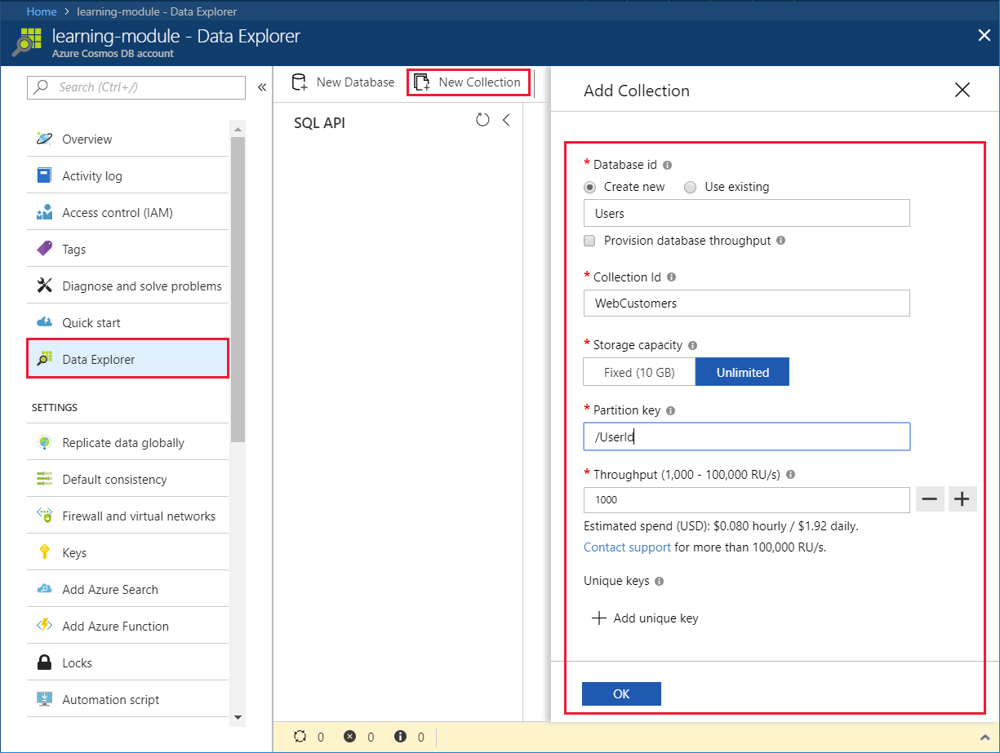
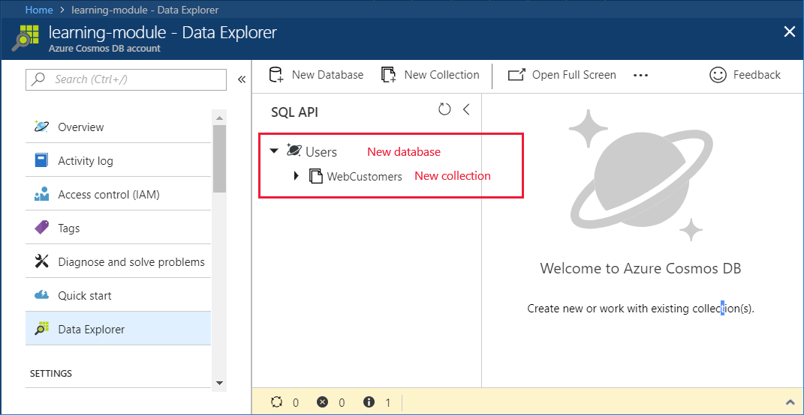

## Motivation
Now that you understand how request units are used to determine database throughput, and how the partition key creates the scale-out strategy for your database, you're ready to create your database and collection.

## Creating your database and collection

1. In the Azure portal, click **Data Explorer** > **New Collection**.
    
    The **Add Collection** area is displayed on the far right, you may need to scroll right to see it.

    

2. In the **Add collection** page, enter the settings for the new collection.

    Setting|Suggested value|Description
    ---|---|---
    Database id|Users|Enter *Users* as the name for the new database. Database names must contain from 1 through 255 characters, and they cannot contain /, \\, #, ?, or a trailing space.
    Collection id|WebCustomers|Enter *WebCustomers* as the name for your new collection. Collection ids have the same character requirements as database names.
    Storage capacity| Unlimited |Use the default value of **Unlimited**. This value is the storage capacity of the database, and enables your database to scale out as needed.
    Partition key|/UserId|UserID is a good partition key for an online retail scenario as so many queries are based around the customers ID.
    Throughput|1000 RU|Change the throughput to 1000 request units per second (RU/s). 1000 is the minimum RU/s value you can set to enable automatic scaling.
    
    For now, don't check the Provision database throughput option and don't add any unique keys to the collection. 
    
3. Click **OK**.

    Data Explorer displays the new database and collection.

    

## Summary

In this unit, you used you knowledge of partition keys and request units to create your database and collection.