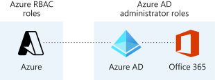
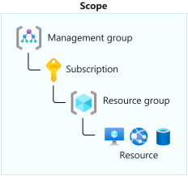

Sometimes, built-in roles don't grant the precise level of access you need. Custom roles allow you to define roles that meet the specific needs of your organization. You can assign the Azure custom roles you create to users, groups, and service principals at the scope of subscription, resource group, or resource.

In this unit, you'll learn about custom roles in Azure role-based access control (RBAC).

## Azure Active Directory and Azure roles

Azure Active Directory (Azure AD) roles and Azure roles are often confused when you first work with Azure. Azure AD roles provide the mechanism for managing permissions to AD resources, like user accounts and passwords. Azure roles provide a wealth of capabilities for managing Azure resources like virtual machines (VMs) at a granular level.



The following table shows the subtle differences between how you can set up and manage the two:

Azure roles | Azure AD roles
| --- | --- |
| Manage access to Azure resources like VMs, storage, networks, and more | Manage access to Azure Active Directory resources like user accounts and passwords|
|Multiple scope levels (management group, subscription, resource group, resource) | Scope only at tenant level|
|Role information accessible through Azure portal, Azure CLI, Azure PowerShell, Azure Resource Manager templates, REST API | Role information accessible in Azure admin portal, Microsoft 365 admin center, Microsoft Graph, Azure AD PowerShell|

For our scenario, we need a custom role to manage Azure VMs at the subscription scope, so we need to use custom roles in Azure RBAC.

## Assignment and scope of custom roles

Users with the User Access Administrator or Owner roles can create or assign custom roles in Azure RBAC.

You can assign custom roles to:

Security principal | Summary
--- | ---
**User** | An individual who has a profile in Azure Active Directory
**Group** | A set of users created in Azure Active Directory
**Service principals** | A security identity used by applications or services to access specific Azure resources
**Managed identity** | An identity in Azure Active Directory that is automatically managed by Azure

You can scope the assignment and related permissions to different levels within Azure. The different scopes are:

- Subscription
- Resource group
- Individual resource



## Role definition and structure

A custom role definition breaks down into a collection of different permissions. Each definition details the operations that are allowed, such as read, write, and delete. The definition is formed using these structures:

```JSON
{
  "Name": "",
  "IsCustom": true,
  "Description": "",
  "Actions": [],
  "NotActions": [],
  "DataActions": [],
  "NotDataActions": [],
  "AssignableScopes": [
    "/subscriptions/{subscriptionId1}"
  ]
}
```

The following example shows the role definition for the *Contributor* role:

```azurecli
{
  "Name": "Contributor",
  "Id": "b24988ac-6180-42a0-ab88-20f7382dd24c",
  "IsCustom": false,
  "Description": "Lets you manage everything except access to resources.",
  "Actions": [
    "*"
  ],
  "NotActions": [
    "Microsoft.Authorization/*/Delete",
    "Microsoft.Authorization/*/Write",
    "Microsoft.Authorization/elevateAccess/Action",
    "Microsoft.Blueprint/blueprintAssignments/write",
    "Microsoft.Blueprint/blueprintAssignments/delete"
  ],
  "DataActions": [],
  "NotDataActions": [],
  "AssignableScopes": [
    "/"
  ]
}
```

Any role definition is declared using the following format:

`{Company}.{ProviderName}/{resourceType}/{action}`

The action portion is typically one of the following actions:

- \*
- read
- write
- action
- delete

## Define custom role to manage VMs

To help you identify what permissions to include in a role definition, use the Azure Resource Manager resource provider operations list and look at built-in Azure roles that have permissions similar to what you need.

### Review built-in roles

For our scenario, the Virtual Machine Contributor built-in role has more permissions than the employee needs, and Virtual Machine Administrator Login doesn't have enough.

The following Azure CLI command returns the permissions for the built-in role Virtual Machine Contributor:

```azurecli
az role definition list --name "Virtual Machine Contributor" --output json | jq '.[] | .permissions[0].actions'
```

The following list displays the permissions for the built-in role Virtual Machine Contributor:

```JSON
[
  "Microsoft.Authorization/*/read",
  "Microsoft.Compute/availabilitySets/*",
  "Microsoft.Compute/locations/*",
  "Microsoft.Compute/virtualMachines/*",
  "Microsoft.Compute/virtualMachineScaleSets/*",
  "Microsoft.DevTestLab/schedules/*",
  "Microsoft.Insights/alertRules/*",
  "Microsoft.Network/applicationGateways/backendAddressPools/join/action",
  "Microsoft.Network/loadBalancers/backendAddressPools/join/action",
  "Microsoft.Network/loadBalancers/inboundNatPools/join/action",
  "Microsoft.Network/loadBalancers/inboundNatRules/join/action",
  "Microsoft.Network/loadBalancers/probes/join/action",
  "Microsoft.Network/loadBalancers/read",
  "Microsoft.Network/locations/*",
  "Microsoft.Network/networkInterfaces/*",
  "Microsoft.Network/networkSecurityGroups/join/action",
  "Microsoft.Network/networkSecurityGroups/read",
  "Microsoft.Network/publicIPAddresses/join/action",
  "Microsoft.Network/publicIPAddresses/read",
  "Microsoft.Network/virtualNetworks/read",
  "Microsoft.Network/virtualNetworks/subnets/join/action",
  "Microsoft.RecoveryServices/locations/*",
  "Microsoft.RecoveryServices/Vaults/backupFabrics/backupProtectionIntent/write",
  "Microsoft.RecoveryServices/Vaults/backupFabrics/protectionContainers/protectedItems/*/read",
  "Microsoft.RecoveryServices/Vaults/backupFabrics/protectionContainers/protectedItems/read",
  "Microsoft.RecoveryServices/Vaults/backupFabrics/protectionContainers/protectedItems/write",
  "Microsoft.RecoveryServices/Vaults/backupPolicies/read",
  "Microsoft.RecoveryServices/Vaults/backupPolicies/write",
  "Microsoft.RecoveryServices/Vaults/read",
  "Microsoft.RecoveryServices/Vaults/usages/read",
  "Microsoft.RecoveryServices/Vaults/write",
  "Microsoft.ResourceHealth/availabilityStatuses/read",
  "Microsoft.Resources/deployments/*",
  "Microsoft.Resources/subscriptions/resourceGroups/read",
  "Microsoft.SqlVirtualMachine/*",
  "Microsoft.Storage/storageAccounts/listKeys/action",
  "Microsoft.Storage/storageAccounts/read",
  "Microsoft.Support/*"
]
```

To get this list in PowerShell, you'd run the following command:

```PowerShell
Get-AzRoleDefinition -Name "Virtual Machine Contributor" | Select Actions | ConvertTo-Json
```

For our scenario, we want a custom role that allows you to monitor and restart virtual machines for a specific subscription, so we want to include the following actions scoped at the subscription level:

- Read access to the compute, network, and storage resources
- Ability to start and restart virtual machines
- Access to the resource groups in the subscription
- Access to monitoring resources

There are some operations in the Virtual Machine Contributor role definition we can use, like `"Microsoft.Insights/alertRules/*"` for monitoring, but restart and some others aren't listed as actions in that role definition.

### Find resource provider operations

We can find the VM restart action in the Azure Resource Manager resource provider operations list or by running the following PowerShell command to return operations for VMs:

  ```PowerShell
 Get-AzProviderOperation */virtualMachines/*
 ```

The following operation for restart is returned in the list:

```PowerShell
Operation         : Microsoft.Compute/virtualMachines/restart/action
OperationName     : Restart Virtual Machine
ProviderNamespace : Microsoft Compute
ResourceName      : Virtual Machines
Description       : Restarts the virtual machine
IsDataAction      : False
```

You can use the Azure PowerShell `Get-AzProviderOperation` cmdlet to get the most current list of resource provider operations. In Azure CLI, use the `az provider operation show` command. You can find a published list of resource providers and operations in the [Azure RBAC](/azure/role-based-access-control/) content on Docs.

### Create VM Operator role definition

Let's assume we've picked out what we need by looking at the related built-in role definitions and the resource provider operations list. We end up with the following role definition for our custom role. We'll use this role definition for our custom role.

```JSON
   {
   "Name": "Virtual Machine Operator",
   "Id": "88888888-8888-8888-8888-888888888888",
   "IsCustom": true,
   "Description": "Can monitor and restart virtual machines.",
   "Actions": [
     "Microsoft.Storage/*/read",
     "Microsoft.Network/*/read",
     "Microsoft.Compute/*/read",
     "Microsoft.Compute/virtualMachines/start/action",
     "Microsoft.Compute/virtualMachines/restart/action",
     "Microsoft.Authorization/*/read",
     "Microsoft.ResourceHealth/availabilityStatuses/read",
     "Microsoft.Resources/subscriptions/resourceGroups/read",
     "Microsoft.Insights/alertRules/*",
     "Microsoft.Support/*"
   ],
   "NotActions": [],
   "DataActions": [],
   "NotDataActions": [],
   "AssignableScopes": [
      "/subscriptions/{subscriptionId1}" 
   ]
   }
   ```
