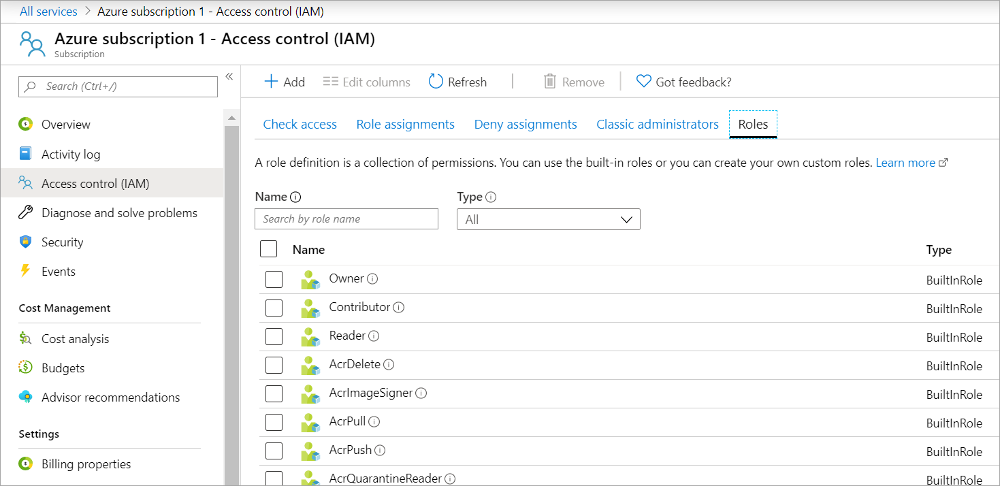
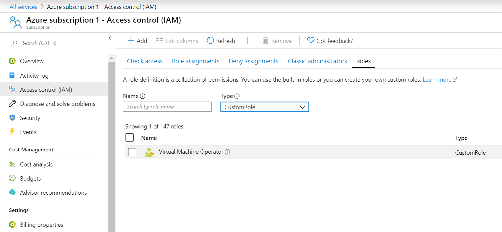

In this unit, you'll view, update, and delete the Azure custom role you created in the previous exercise.

## View custom roles within the portal

Let's use the Azure portal to see the custom roles in your subscription.

1. Sign into the [Azure portal](https://portal.azure.com?azure-portal=true) with the same account you used for the previous exercise.
1. Search for and select **Subscriptions** from the top of the Azure portal.
1. Select the subscription to which you associated your custom role.
1. Select **Access control (IAM)** > **Roles**.

    

1. Select **Type** > **CustomRole**.

    

    You'll get a list of all the custom roles in your organization.

## Update the custom role

We need to update the Virtual Machine Operator role to add permissions for a monitoring operation. We'll update that custom role to include the action `Microsoft.Insights/diagnosticSettings/`.

1. Select **Cloud Shell** from the top right-hand side of the Azure portal.
1. Type **code** into the Cloud Shell.
1. Paste the definition below into the editor.


    ```JSON
   {
     "Name": "Virtual Machine Operator",
     "IsCustom": true,
     "Description": "Can monitor and restart virtual machines.",
     "Actions": [
       "Microsoft.Storage/*/read",
       "Microsoft.Network/*/read",
       "Microsoft.Compute/*/read",
       "Microsoft.Compute/virtualMachines/start/action",
       "Microsoft.Compute/virtualMachines/restart/action",
       "Microsoft.Authorization/*/read",
       "Microsoft.ResourceHealth/availabilityStatuses/read",
       "Microsoft.Resources/subscriptions/resourceGroups/read",
       "Microsoft.Insights/alertRules/*",
       "Microsoft.Insights/diagnosticSettings/*",
       "Microsoft.Support/*"
     ],
    "NotActions": [],
    "DataActions": [],
    "NotDataActions": [],
    "AssignableScopes": [
       "/subscriptions/subscriptionId1"
     ]
   }
    ```

1. In the `AssignableScopes` section, replace **subscriptionId1** with your subscription ID. If you didn't save that value from the previous exercise, run the following command to get it:

   ```azurecli
    az account list  --output json | jq '.[] | .id, .name'
   ```

1. Select **Save** from the three-dot menu on the top right-hand side of the Cloud Shell pane (or press <kbd>CTRL + S</kbd> in Windows or <kbd>CMD + S</kbd> in macOS).
1. Enter **vm-operator-role-new.json** as the filename, then select **Save**.
1. Select **Close Editor** from the three-dot menu on the top right-hand side of the Cloud Shell pane (or press <kbd>CTRL + Q</kbd> in Windows or <kbd>CMD + Q</kbd> in macOS).
1. Run the following command to update the Virtual Machine Operator custom role:

   ```azurecli
   az role definition update --role-definition vm-operator-role-new.json
   ```

1. Run the following command to verify the role definition is updated:

   ```azurecli
   az role definition list --name "Virtual Machine Operator" --output json | jq '.[] | .permissions[0].actions'
   ```

## Delete the custom role

If you decide you no longer need the custom role, you need to remove the role assignments before you can delete the role.

1. Run the following command to remove the role assignments for the custom role:

   ```azurecli
   az role assignment delete --role "Virtual Machine Operator"
   ```

1. Run the following command to delete the custom role definition:

   ```azurecli
   az role definition delete --name "Virtual Machine Operator"
   ```

1. Run the following command to verify the role is gone. If the role is still listed, wait a minute and run the command again:

   ```azurecli
   az role definition list --custom-role-only true
   ```
