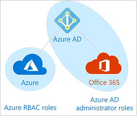
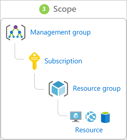
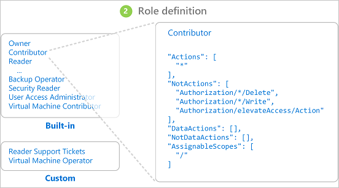

Sometimes, the roles built into Azure don't grant the precise level of access you need.

Suppose you want to assign permissions in Azure for your new employee, who's responsible for managing VMs within the subscription. You want to understand whether to use Azure Active Directory (Azure AD) roles or Role-Based Access Control (RBAC) for these permissions.

In this unit, you learn about RBAC roles and how to create and assign them.

## Active Directory and RBAC

These role types are often confused when you first work with Azure. Active Directory roles provide the mechanism for managing permissions to AD resources only. RBAC provides a wealth of capabilities for managing every resource in Azure at a granular level.



The subtle differences between how the two can be set up and managed are listed below:

Azure RBAC roles | Azure AD administrator roles
--- | ---
Manage access to Azure resources | Manage access to Azure Active Directory resources
Allows custom roles | Allows custom roles
Multiple scope levels (management group, subscription, resource group, resource) | Scope only at tenant level
Role information accessible through Azure portal, Azure CLI, Azure PowerShell, Azure Resource Manager templates, REST API | Role information can be accessed in Azure admin portal, Microsoft 365 admin center, Microsoft Graph, AzureAD PowerShell

## Assigning custom roles

To add or remove custom roles, you must have role permissions such as:

`Microsoft.Authorization/roleAssignments/write` and `Microsoft.Authorization/roleAssignments/delete`.

These role permissions are given to User access administrators and owners. Custom roles can be assigned to:

Security principal | Summary
--- | ---
**User** | An individual who has a profile in Azure Active Directory
**Group** | A set of users created in Azure Active Directory
**Service principals** | A security identity used by applications or services to access specific Azure resources
**Managed identity** | An identity in Azure Active Directory that is automatically managed by Azure

This assignment and related permissions can be scoped to different levels within Azure. In the example, the new employee could be assigned a custom role at the subscription level (assuming the VMs are contained within your subscription). The different scopes are:

- Management group
- Subscription
- Resource group
- Individual resource



## Role definition and structure

A custom role definition breaks down into a collection of different permissions. Each definition details the operations that are allowed, such as read, write, and delete. The definition is formed using these structures:

```JSON
{
  "Name": "",
  "IsCustom": true,
  "Description": "",
  "Actions": [],
  "NotActions": [],
  "DataActions": [],
  "NotDataActions": [],
  "AssignableScopes": [
    "/subscriptions/{subscriptionId1}"
  ]
}
```

<!--Image taken from https://docs.microsoft.com/en-us/azure/role-based-access-control/overview - Can the '3 Role Definition' be removed please-->
The following example shows the role definition for the Contributor role. 


Any role definition is declared using the following format:

`{Company}.{ProviderName}/{resourceType}/{action}`

The parameter can be one of the following actions:

- \*
- read
- write
- action
- delete

## Define custom role to manage VMs

To help you identify what permissions to include in a role definition, look at built-in roles that have permissions similar to what you need. For example, for our scenario, the Virtual Machine Contributor built-in role has more permissions than the employee needs and Virtual Machine Administrator Login doesn't have enough.

The following command returns the permissions for Virtual Machine Contributor.

```azurecli
az role definition list --name "Virtual Machine Contributor" --output json | jq '.[] | .permissions[0].actions'
```

The following list is the permissions for 
Virtual Machine Contributor.

```JSON
[
  "Microsoft.Authorization/*/read",
  "Microsoft.Compute/availabilitySets/*",
  "Microsoft.Compute/locations/*",
  "Microsoft.Compute/virtualMachines/*",
  "Microsoft.Compute/virtualMachineScaleSets/*",
  "Microsoft.DevTestLab/schedules/*",
  "Microsoft.Insights/alertRules/*",
  "Microsoft.Network/applicationGateways/backendAddressPools/join/action",
  "Microsoft.Network/loadBalancers/backendAddressPools/join/action",
  "Microsoft.Network/loadBalancers/inboundNatPools/join/action",
  "Microsoft.Network/loadBalancers/inboundNatRules/join/action",
  "Microsoft.Network/loadBalancers/probes/join/action",
  "Microsoft.Network/loadBalancers/read",
  "Microsoft.Network/locations/*",
  "Microsoft.Network/networkInterfaces/*",
  "Microsoft.Network/networkSecurityGroups/join/action",
  "Microsoft.Network/networkSecurityGroups/read",
  "Microsoft.Network/publicIPAddresses/join/action",
  "Microsoft.Network/publicIPAddresses/read",
  "Microsoft.Network/virtualNetworks/read",
  "Microsoft.Network/virtualNetworks/subnets/join/action",
  "Microsoft.RecoveryServices/locations/*",
  "Microsoft.RecoveryServices/Vaults/backupFabrics/backupProtectionIntent/write",
  "Microsoft.RecoveryServices/Vaults/backupFabrics/protectionContainers/protectedItems/*/read",
  "Microsoft.RecoveryServices/Vaults/backupFabrics/protectionContainers/protectedItems/read",
  "Microsoft.RecoveryServices/Vaults/backupFabrics/protectionContainers/protectedItems/write",
  "Microsoft.RecoveryServices/Vaults/backupPolicies/read",
  "Microsoft.RecoveryServices/Vaults/backupPolicies/write",
  "Microsoft.RecoveryServices/Vaults/read",
  "Microsoft.RecoveryServices/Vaults/usages/read",
  "Microsoft.RecoveryServices/Vaults/write",
  "Microsoft.ResourceHealth/availabilityStatuses/read",
  "Microsoft.Resources/deployments/*",
  "Microsoft.Resources/subscriptions/resourceGroups/read",
  "Microsoft.SqlVirtualMachine/*",
  "Microsoft.Storage/storageAccounts/listKeys/action",
  "Microsoft.Storage/storageAccounts/read",
  "Microsoft.Support/*"
]
```

For our scenario, we want a custom role that can be used for monitoring and restarting virtual machines for a specific subscription. So we want to include the following actions scoped at the subscription level: 
- Read access to the compute, network, and storage resources
- Ability to start and restart virtual machines
- Access to the resource groups in the subscription
- Access to monitoring resources

We end up with the following role definition for our custom role.  

```JSON
   {
   "Name": "Virtual Machine Operator",
   "Id": "88888888-8888-8888-8888-888888888888",
   "IsCustom": true,
   "Description": "Can monitor and restart virtual machines.",
   "Actions": [
     "Microsoft.Storage/*/read",
     "Microsoft.Network/*/read",
     "Microsoft.Compute/*/read",
     "Microsoft.Compute/virtualMachines/start/action",
     "Microsoft.Compute/virtualMachines/restart/action",
     "Microsoft.Authorization/*/read",
     "Microsoft.ResourceHealth/availabilityStatuses/read",
     "Microsoft.Resources/subscriptions/resourceGroups/read",
     "Microsoft.Insights/alertRules/*",
     "Microsoft.Insights/diagnosticSettings/*",
     "Microsoft.Support/*"
   ],
   "NotActions": [],
   "DataActions": [],
   "NotDataActions": [],
   "AssignableScopes": [
      "/subscriptions/{subscriptionId1}" 
   ]
   }
    ```