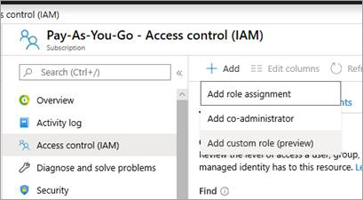

In this unit, you'll learn who can manage custom roles and how.

## Who can manage Azure RBAC custom roles?

Generally, administrators with the Owner or User Access Administrator roles have permissions to create and manage custom roles. By default, those roles have the Microsoft.Authorization/roleDefinitions/write permission on all role assignment scopes. That permission is required to create, delete, or update custom roles.

The role assignment scopes are defined in the custom role definition under **AssignableScopes**. As discussed in unit 2, the **AssignableScopes**  could be one or more management groups, subscriptions, resource groups, or resources.

The following table lists the permission you'd need to create, delete, update, or view custom roles. To manage custom roles, you'd need to be assigned to a role that has the related **Actions** and **AssignableScopes** in the role definition.

Task | Actions | Description
--- | --- | ---
**Create/Delete** | `Microsoft.Authorization/roleDefinitions/write` | Users can create or delete custom roles for use in scopes. For example, Owners and User Access Administrators of subscriptions, resource groups, and resources.
**Update** | `Microsoft.Authorization/roleDefinitions/write` | Users can update custom roles in scopes. For example, Owners and User Access Administrators of subscriptions, resource groups, and resources.
**View** | `Microsoft.Authorization/roleDefinitions/read` | Users can view the custom roles available for assignment at a scope. All built-in roles allow custom roles to be available for assignment.

## Create custom roles

In unit 3, you created an Azure RBAC custom role by using Azure CLI. You can also create a customer role by using the Azure portal or Azure PowerShell.


In the Azure portal, you'd go to the management group, subscription, resource group, or resource you want the custom role scope to apply to. Then go to **Access control (IAM)** and select **Add** > **Add custom role (preview)**.



You can choose to clone an existing role or start from scratch.


With either selection, you're able to edit the permissions, scopes, and the resulting JSON.

The steps involved to create a role by using Azure PowerShell are similar to what we covered in unit 2 and 3. After you defined the custom role in a JSON file, you used the following command in Azure CLI to create the custom role:

```azurecli
az role definition create --role-definition vm-operator-role.json
```

To create the role in Azure PowerShell, you run the following command: 

  ```PowerShell
 New-AzRoleDefinition -InputFile "vm-operator-role.json"
 ```

## Delete custom roles

You need the custom role you created in unit 3 for the exercises in the next unit. So don't delete your custom role just yet. Let's first talk about how you can delete an Azure RBAC custom role.

As you'd expect, you can delete a custom role by using the Azure portal, Azure CLI, or Azure PowerShell.

In the Azure portal, you'd go to the management group, subscription, resource group, or resource you the custom role scope to applies to. Then go to **Access control (IAM)** > **Roles**. To find the role, select **Type** > **CustomRole**. 


Select the role and **Remove**.

In the next unit, you use the following command to delete the custom role by using Azure CLI.

```azurecli
az role definition delete --name "Virtual Machine Operator"
 ```

In PowerShell, you'd use the following command to delete the Virtual Machine Operator role.

```PowerShell
Get-AzRoleDefinition "Virtual Machine Operator" | Remove-AzRoleDefinition
 ```


## Update custom roles

To update a Azure RBAC custom role, you use Azure CLI or Azure Powershell. After you update the JSON file with your changes, run one of the following commands.

To update the custom role by using Azure CLI, run the following command with the path to the JSON file that has your updates.

```azurecli
az role definition update --role-definition "<<path-to-json-file>>"
```

In Azure PowerShell, you run the following command with the path to the updated JSON file.

  ```PowerShell
Set-AzRoleDefinition -InputFile "<<path-to-json-file>>"
 ```

## View custom roles

In the next unit, you'll see how to view custom roles in the Azure portal. You can also get a list of custom roles by using the Azure CLI or PowerShell.

To list all the custom roles by using Azure CLI, use the following command.

```azurecli
az role definition list --custom-role-only true --output json | jq '.[] | {"roleName":.roleName, "roleType":.roleType}'
```

Notice how the command only asks for role name and role type. This makes it easier to view lots of roles.

To list all the custom roles by using Azure PowerShell, use the following command. This command list the custom roles that are available for assignment in the subscription. If the subscription isn't in the AssignableScopes of the role, the custom role won't be listed.

```PowerShell
Get-AzRoleDefinition | ? {$_.IsCustom -eq $true} | FT Name, IsCustom

```

## View role definition

To see the full definition for a specific role,  use the following Azure CLI command.

```azurecli
az role definition list --name "Virtual Machine Operator"
```

To see the definition in PowerShell, use the following command.

```PowerShell
Get-AzRoleDefinition "Virtual Machine Operator" 
```

## See custom role assignment

The following command allows you to see who's assigned to the custom role you've created in Azure CLI:

```azurecli
az role assignment list --role "Virtual Machine Operator"
```

For PowerShell, use the following command:
```PowerShell
Get-AzRoleAssignment -RoleDefinitionName "Virtual Machine Operator"
```
