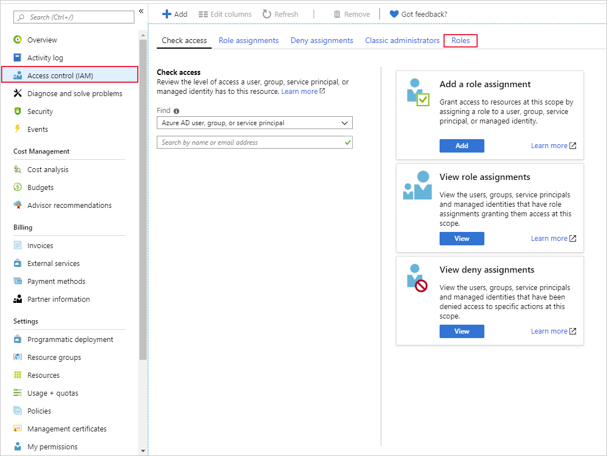
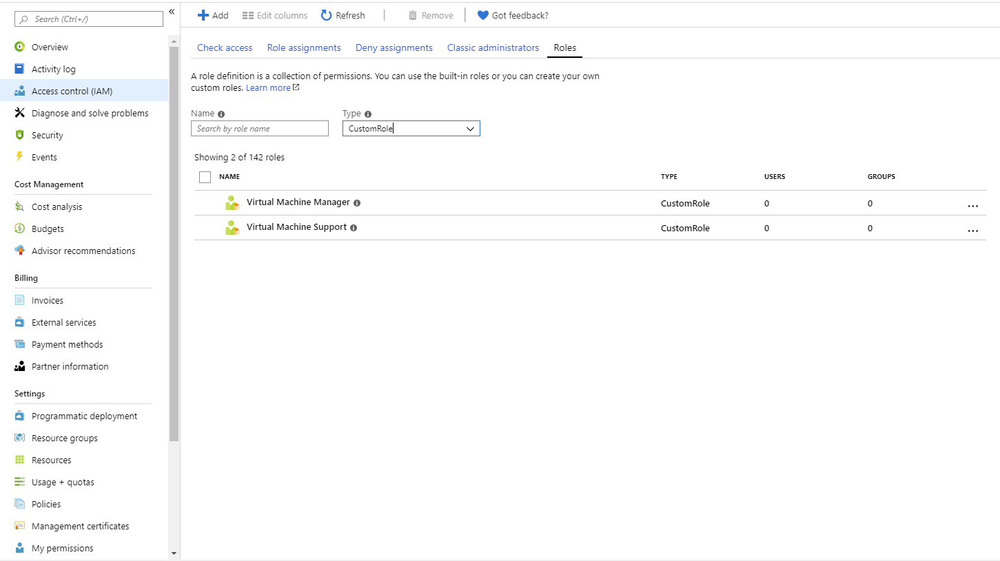

As the owner of the subscription in the scenario, you want to manage the roles that have been created and assigned. You'll then control the governance of the subscription.

## View custom roles within the portal

Let's use the Azure portal to find out about the custom roles in your subscription:

1. Sign into the [Azure portal](https://portal.azure.com/learn.docs.microsoft.com?azure-portal=true) using the same account with which you activated the sandbox.
1. In the search bar, type **Subscription** and select the subscription option.
1. Select the subscription from the list.
1. Select **Access Control** from the left menu.

    

1. Select **Roles** and select **custom roles** type.

    

    This action shows all the custom roles in your organization.

## Update a custom role

Custom roles can easily be updated through the Azure CLI:

1. Type **Code** into the cloud shell.
1. Paste the definition below into the editor, then select **Save** from the three-dot menu using the **VM-Support-Role-New.json** filename.

    ```JSON
         {   
            "name": "Virtual Machine Support",
            "description": "Lets you manage virtual machines",
            "IsCustom": true,
          "Actions": [
           "Microsoft.Authorization/*/read",
                  "Microsoft.Compute/availabilitySets/*",
                  "Microsoft.Compute/locations/*",
                  "Microsoft.Compute/virtualMachines/*",
                  "Microsoft.Compute/virtualMachineScaleSets/*",
                  "Microsoft.DevTestLab/schedules/*",
                  "Microsoft.Insights/alertRules/*",
                  "Microsoft.Network/applicationGateways/backendAddressPools/join/action",
                  "Microsoft.Network/loadBalancers/backendAddressPools/join/action",
                  "Microsoft.Network/loadBalancers/inboundNatPools/join/action",
                  "Microsoft.Network/loadBalancers/inboundNatRules/join/action",
                  "Microsoft.Network/loadBalancers/probes/join/action",
                  "Microsoft.Network/loadBalancers/read",
                  "Microsoft.Network/locations/*",
                  "Microsoft.Network/networkInterfaces/*",
                  "Microsoft.Network/networkSecurityGroups/join/action",
                  "Microsoft.Network/networkSecurityGroups/read",
                  "Microsoft.Network/publicIPAddresses/join/action",
                  "Microsoft.Network/publicIPAddresses/read",
                  "Microsoft.Network/virtualNetworks/read",
                  "Microsoft.Network/virtualNetworks/subnets/join/action",
                  "Microsoft.RecoveryServices/locations/*",
                  "Microsoft.RecoveryServices/Vaults/backupFabrics/backupProtectionIntent/write",
                  "Microsoft.RecoveryServices/Vaults/backupFabrics/protectionContainers/protectedItems/*/read",
                  "Microsoft.RecoveryServices/Vaults/backupFabrics/protectionContainers/protectedItems/read",
                  "Microsoft.RecoveryServices/Vaults/backupFabrics/protectionContainers/protectedItems/write",
                  "Microsoft.RecoveryServices/Vaults/backupPolicies/read",
                  "Microsoft.RecoveryServices/Vaults/backupPolicies/write",
                  "Microsoft.RecoveryServices/Vaults/read",
                  "Microsoft.RecoveryServices/Vaults/usages/read",
                  "Microsoft.RecoveryServices/Vaults/write",
                  "Microsoft.ResourceHealth/availabilityStatuses/read",
                  "Microsoft.Resources/deployments/*",
                  "Microsoft.Resources/subscriptions/resourceGroups/read",
                  "Microsoft.SqlVirtualMachine/*",
                  "Microsoft.Storage/storageAccounts/listKeys/action",
                  "Microsoft.Storage/storageAccounts/read",
                  "Microsoft.Support/*",
                  "Microsoft.Compute/virtualMachines/start/action",
                  "Microsoft.Compute/virtualMachines/restart/action"
          ],
          "NotActions": [],
          "DataActions": [],
          "NotDataActions": [],
         "assignableScopes": [
              "/subscriptions/{subscriptionId}"
            ]
          }
        ```

1. Finally, you use this file to update the role you created in section 2, by typing the following command into the cloud shell:

   ```Azure CLI
   az role definition update --role-definition VM-Support-Role-New.json
   ```

## Delete a custom role

Deleting custom roles is also a simple task with the Azure CLI.

1. To delete the role, type the following command into your cloud shell:

   ```Azure CLI
   az role definition delete --name "Virtual Machine Support"
   ```

1. Now list the roles to check if it has been removed.

   ```Azure CLI
   az role definition list --custom-role-only true
   ```