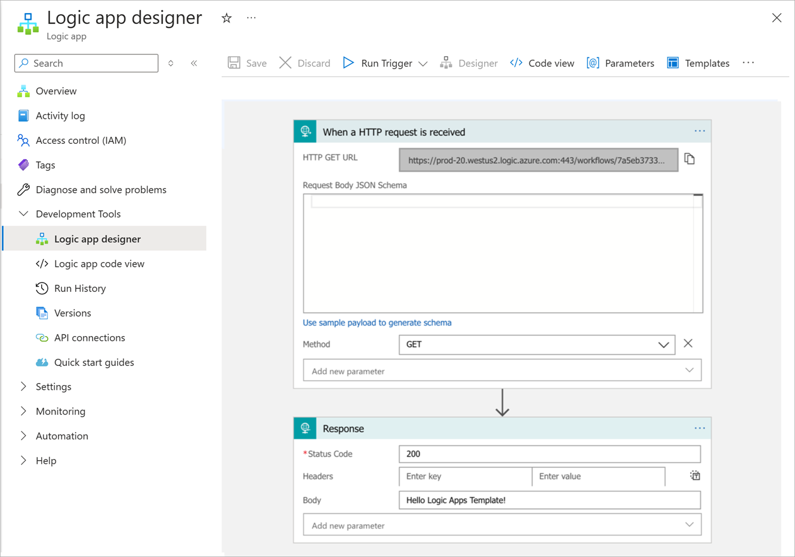

You define an Azure Logic App workflow's structure and workflow using a JSON document. This document contains a JSON description of the elements that make up the logic app workflow and the Workflow Definition Language schema validates it. The easiest way to explain the schema is to examine an existing workflow created using the workflow designer in the Azure portal, then view the logic app's JSON description.

In the sample scenario, you want to provide your consultants with common workflows that they can adapt to the specific needs of the universities with which they work. You want to make it as easy as possible to customize and deploy each workflow, so you decide to take a look at the code behind the workflow, namely the workflow definition JSON.

## Workflow designer

The workflow designer allows you to create and debug the workflow for a logic app workflow graphically. The designer also lets developers look under the hood of a workflow to see how it's implemented. The following image shows an example of a simple workflow, which is triggered by sending an HTTP GET request to a specified URL. The result is returned in the HTTP response. In this example, the workflow is sending back a simple *Hello Logic Apps Template!* message.



Now, let's look at the workflow definition language as used by the JSON template.

## Code view

The Code View window shows the JSON document that describes the workflow. In the sample app, the JSON looks like this:

```JSON
{
    "definition": {
        "$schema": "https://schema.management.azure.com/providers/Microsoft.Logic/schemas/2016-06-01/workflowdefinition.json#",
        "actions": {
            "Response": {
                "inputs": {
                    "body": "Hello Azure Logic Apps Template!",
                    "statusCode": 200
                },
                "kind": "Http",
                "runAfter": {},
                "type": "Response"
            }
        },
        "contentVersion": "1.0.0.0",
        "outputs": {},
        "parameters": {},
        "triggers": {
            "manual": {
                "inputs": {
                    "method": "GET",
                    "schema": {}
                },
                "kind": "Http",
                "type": "Request"
            }
        }
    }
}
```

Notice the sections in the `definition` scope that relate to the actions and triggers shown in the designer. You can edit the JSON code in this document to reflect any changes required in the logic app workflow's functionality. You can also add further actions and specify how the logic in the workflow runs from one action to the next.

### Triggers section

The `triggers` section contains the description of the type of trigger and how it can be invoked. In this example, the trigger is a simple HTTP trigger that that runs in response to an HTTP GET request.

```JSON
"triggers": {
    "manual": {
        "inputs": {
            "method": "GET",
            "schema": {}
        },
        "kind": "Http",
        "type": "Request"
    }
}
```

A trigger must include the following elements:

- A unique name inside the workflow. In the previous example, the trigger's default name is `manual`, but you can replace the default name with a more meaningful identifier.

- The trigger type. The type indicates the event that causes the trigger to run. A `Request` trigger runs in response to an HTTP request. Other trigger types available include:

  - `Recurrence` for creating a trigger that runs according to a recurring schedule.

  - `HttpWebhook` for listening to events on an endpoint.

  - `ApiConnection` for responding to events triggered by other Azure services, such as a message arriving on a message queue, an email message, and so on. The *ApiConnection* trigger type is generalized, and you specify further details indicating the type of the service and any connection information required.

- The `inputs` section. This section specifies the data that defines the trigger's behavior. For a Request trigger, the `method` indicates the type of HTTP request that causes the trigger to run. For an `ApiConnection` trigger, the `inputs` section contains information about how to connect to the resource triggering the event (a message queue connection string, for example). If the trigger is a `Request` trigger, the input definition's `schema` section specifies the schema that the payload of the request body should conform to. HTTP GET requests don't have a request body, so the `schema` is empty in the previous example.

The following example shows the definition of another `Request` trigger that starts a workflow and receives HTTP POST requests. A POST request typically provides a request body containing the data to be posted. The request body in this example contains a customer name and address, comprising the street and city.

```JSON
"mypostrequest": {
   "type": "Request",
   "kind": "Http",
   "inputs": {
      "method": "POST",
      "schema": {
         "type": "object",
         "properties": {
            "customerName": {
               "type": "String"
            },
            "customerAddress": { 
               "type": "Object",
               "properties": {
                  "streetAddress": {
                     "type": "string"
                  },
                  "city": {
                     "type": "string"
                  }
               }
            }
         }
      }
   }
}
```

A trigger can also specify conditions. The trigger will only fire if these conditions are met. You define conditions in an optional *conditions* section. For example, you might want to run the `mypostrequest` trigger (shown in the previous example), only if the request body specifies a city of `New York`:

```JSON
"mypostrequest": {
   "type": "Request",
   "kind": "Http",
   "inputs": {
      ...
   }
   "conditions": [
      {
        "expression": "@equals(triggerOutputs()['body']['customerAddress']['city'], 'New York')"
      }
   ]
}
```

### Actions section

A logic app's `actions` section defines the logic and structure of the workflow. The section contains a series of *actions*. An action is a basic building block for constructing workflows. Actions take inputs and produce outputs, which are passed to the next action in the workflow. The following table lists different available action types:

| Action | Description |
|---|---|
| `ApiConnection` | Sends an HTTP request to a specific service. This action type enables you to integrate a logic app workflow with Azure features such as Azure Service Bus, Azure Event Grid, and others. The action requires inputs that include a connection string for accessing the service, and any additional information and parameters required to invoke the service. |
| `Compose` | Combines multiple inputs and expressions into a single output. |
| `Function` | Enables you to call an Azure Function. |
| `HTTP` | Sends an HTTP request to an HTTP endpoint rather than an Azure service. |
| `Join` | Takes an array of data items as input and generates string containing these items separated by a specified delimiter. |
| `Parse` | Parses a JSON document into a set of tokens using a specified schema. |
| `Query` | Filters the items in an input array using a specified condition. |
| `Response` | Creates a response for an HTTP request. |
| `Table` | Generates an HTML table from an array of JSON objects. |
| `Terminate` | Cancels a workflow immediately. |
| `Wait` | Pauses the workflow for a specified interval or until a timeout occurs. |
| `Workflow` | Runs another logic app workflow. |
| `Condition` | A set of action types (`Foreach`, `If`, `Switch`, and `Until`) that enables you to implement programmatic flow of control in a workflow. You can iterate through the items in a collection, make decisions based on the values of input parameters, and loop until some condition is met. |
| `InitializeVariable`,<br>`IncrementVariable`,<br>`DecrementVariable`,<br><nobr>and `SetVariable`</nobr> | Defines, initializes, assigns, and modifies variables that you can pass between action items in a workflow. |
|||

Like a trigger, each action must have a unique name in the workflow. In the following example, the default action name is `Response`, but you can use a valid and more meaningful identifier. An action must have an `inputs` section that specifies the data on which the action works. In the Response action, you can specify the data for an expression to return in the response message, together with an HTTP status code.

In our basic workflow definition, the action generates an HTTP response where the body is a short message.

```JSON
"actions": {
    "Response": {
        "inputs": {
            "body": "Hello Azure Logic Apps Template!",
            "statusCode": 200
        },
        "kind": "Http",
        "runAfter": {},
        "type": "Response"
    }
}
```

The `runAfter` section indicates where the action runs in the workflow sequence. In the previous example, there's only a single action, so it always runs when the trigger fires. If the workflow had multiple actions, you could specify the name of an action and a status for that action in this section. The action runs if the `runAfter` action completes with the specified status. The following code shows an example. The action `mySecondAction` runs after `myFirstAction`, but only if `myFirstAction` finishes with a status of `Succeeded`:

```JSON
"actions": {
    "mySecondAction": {
        "inputs": {
            ...
        },
        "runAfter": {
            "myFirstAction": [
                "Succeeded"
            ]
        },
        "type": ...
    },
    "myFirstAction": {
        "inputs": {
            ...
        },
        "runAfter": {},
        "type": ...
    }
}
```

### Outputs section

Use the `outputs` section to define the data that your workflow can return when it has completed running. You could track a specific status or data for each run of the workflow. You can examine the output from each run of a workflow using the Azure Logic Apps run history, which is available in the Azure portal or the Workflow REST API.

The format of the `outputs` section looks like this:

```JSON
"outputs": {
  "<key-name>": {
    "type": "<key-type>",
    "value": "<key-value>"
  }
}
```

### Workflow expressions

You can use a workflow expression in place of any fixed value, variable, or constant. You can also place an expression anywhere in a JSON string value by prefixing the expression with the *at sign* (@). For example, you can use the `@parameters` function in an expression to retrieve the value of a named parameter (parameters are described in the next section).

```JSON
"customerFullName": "Bill Frost",
"accountName": "@parameters('customerName')"
```

Azure Logic Apps provides built-in functions that you can use to create complex expressions:

- **String functions**: For concatenating or splitting strings, converting characters between upper and lower case, and searching for substrings.
- **Collection functions**: For detecting whether a collection contains items that match a specific pattern, retrieving items from a collection, and combining collections.
- **Logical comparison functions**: For detecting whether operands are the same, different, numerically greater, or numerically less than each other.
- **Conversion functions**: For changing the type or format of data.
- **Math functions**: Such as `add`, `sub`, `div`, and `mul`, plus several others.
- **Date and time functions**: For parsing and processing dates and times.
- **Workflow functions**: For retrieving information about the data passed to a workflow action. For example, the `parameter` function (previously shown) fetches the value of a named parameter, and the `body` function (shown previously) returns the data being generated by an action.
- **JSON and XML manipulation functions**: For parsing and processing JSON and XML documents.

You can define variables in the `inputs` section of an `InitializeVariable` action, and you can manipulate these variables using expressions. Read the value of a variable using the `variables` function. The following example uses an `InitializeVariable` action to create an integer variable named `myIntegerVariable` and initialize it to `99`. This example also shows a `Condition` action with the `If` type. The condition uses an expression to test the `myIntegerVariable` variable value, and if it matches the value `100`, the condition uses an HTTP action to perform a GET request.

```JSON
"actions": {
    "Condition": {
        "actions": {
            "HTTP": {
                "inputs": {
                    "method": "GET",
                    "uri": "http://dummyurl.com"
                },
                "runAfter": {},
                "type": "Http"
            }
        },
        "expression": {
            "equals": [
                "@variables('myIntegerVariable')",
                100
            ]
        }        ,
        "runAfter": {
            "Initialize": [
                "Succeeded"
            ]
        },
        "type": "If"
    },
    "Initialize": {
        "inputs": {
            "variables": [
                {
                    "name": "myIntegerVariable",
                    "type": "Integer",
                    "value": 99
                }
            ]
        },
        "runAfter": {},
        "type": "InitializeVariable"
    }
}
```

### Parameters section

The `parameters` section enables you to parameterize a workflow. At runtime, you can provide values for each of these parameters. You can reference the parameters anywhere in the workflow where you might use a constant or expression.

You can add a parameters definition with a default value. The default value is used if you don't provide a value for the parameter at runtime. The following example shows how to define a parameter named `cityParam`. The parameter is used inside the condition for the `mypostrequest` action. It performs the action only if the request document contains a city that matches the parameter value. The default parameter value is `New York`:

```JSON

    "definition": {
        "$schema": "https://schema.management.azure.com/providers/Microsoft.Logic/schemas/2016-06-01/workflowdefinition.json#",
        "actions": {
            ...
        },
        "contentVersion": "1.0.0.0",
        "outputs": {},
        "parameters": {
            "cityParam": {
                "defaultValue": "New York",
                "type": "String"
            }
        },
        "triggers": {
            "mypostrequest": {
                "conditions": [
                    {
                        "expression": "@equals(triggerOutputs()['body']['customerAddress']['city'], parameters('cityParam'))"
                    }
                ],
                "inputs": {
                    ...
                },
                "kind": "Http",
                "type": "Request"
            }
        }
    }
}
```
