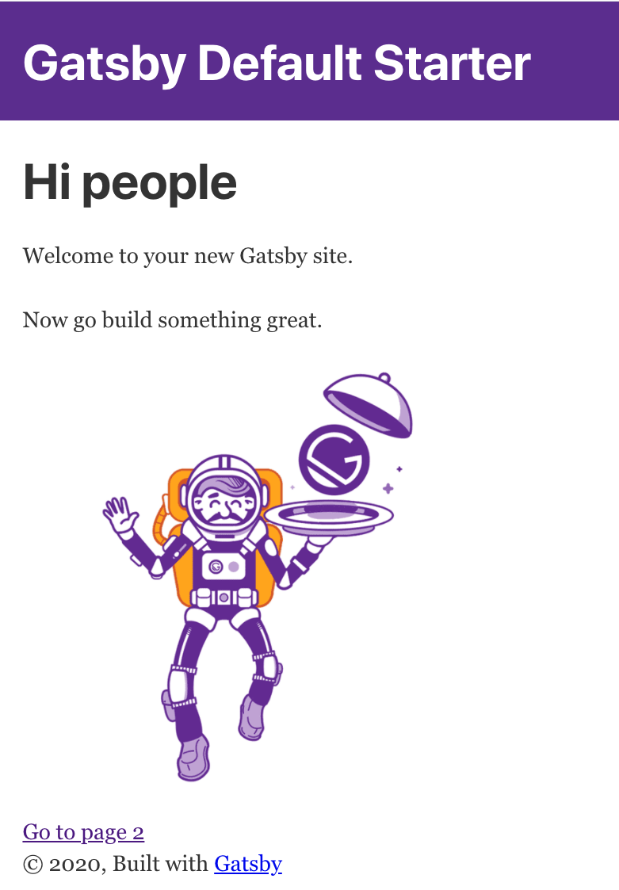

Now you will learn to create a Gatsby application.

## Create and run a Gatsby site

All Gatsby projects are created by the Gatsby CLI. The CLI is able to help you with scaffolding a new Gatsby project, host it and also build the final product which is a static set of files that you can deploy into any static host you wish.

### Create a Gatsby app

Let' create a Gatsby app by typing the following in the terminal:

```bash
gatsby new <your app name>
```

This will create a Gatsby project, a set of directories and files that you can extend and configure.

### Run Gatsby

To start developing with Gatsby, ensure you are in the correct directory. If you named your project `hello-gatsby` then ensure you changed directory to `hello-gatsby` before continuing.

Now run the following command:

```bash
gatsby develop
```

You should see the following output in the terminal:


Now open up a browser and go to url `http://localhost:8000`.



If you see the above, you successfully created your first Gatsby app. Congrats!

## Add a page component

For this exercise we will learn to create a component that we can navigate to, a so called *page component*. We will continue to use the app we created in the last exercise.

Find the `pages/` directory and create a file and name it `about.js`. Give the file the following content:

```jsx
import React from 'react';
import { Link } from 'gatsby';

export default () => (
  <React.Fragment>
    <div>About page</div>
    <Link to="/">Back to home</Link>
  </React.Fragment>
)
```

The code above creates a so-called *presentational* component that is only able to show data. Components in React are created either by a class inheriting from `React.Component` or by simple functions, like the above. A component can be as simple as a function returning a piece of JSX, which the above does.

The `React.Fragment` element is used as there needs to be root element in every component. You can add any valid HTML element as a root element. To avoid polluting your DOM with extra elements you are encouraged to use the `React.Fragment` component.

There's a `Link` component used above. That's a component from the underlying React Router library that will ultimately render as an anchor tag `a`. We can use that component to navigate from this page back the root of our app, note how we set the `to` attribute yo `/`.

Once you pasted in the code above and saved it in the file `about.js` the development server will recompile. If you now visit ,http://localhost:8000/about` you should see the following content rendered:


Congrats, you managed to add a page component, written in React, to your app. Additionally you've learned that any component placed under `/pages` directory can be navigated to.

## Add data to your component

Now that we've managed to create our component `about.js` let's make it more exciting by adding data to it. The way you work with data in Gatsby is powerful. Gatsby can query for data from almost anywhere, from your files, from static data and even data from API endpoints and databases. To query for data, we'll use GraphQL.

We will query for data from the `gatsby-config.js` file. Technically we will be querying the data Graph but the data originated from `gatsby-config.js`. There is a section in `gatsby-config.js` called `siteMetadata` looking like this:

```javascript
siteMetadata: {
  title: `Gatsby Default Starter`,
  description: `Kick off your next, great Gatsby project with this default starter. This barebones starter ships with the main Gatsby configuration files you might need.`,
  author: `@gatsbyjs`,
}
```

We can construct a query given the above, read out the data and, have our `about.js` component render it.

The first thing we want to do is to go to `http://localhost:8000/___graphql` so we can get help creating our query.


In the above image we have the `Explorer` section to the left, we are able to drill down into our Graph until we find the data we need. In the  middle section, we can see how our query is written for us as we do selections on the left. On the right, we see the result of running our query. We run our query by clicking the *play* button in the middle section.

We make a note of our constructed query:

```bash
site {
  siteMetadata {
    author,
    description,
    title
  }
}
```

Let's now open up our `about.js` file and change it to the following code:

```jsx
import React from 'react';
import { Link, graphql } from 'gatsby';

export default ({ data }) => (
  <React.Fragment>
    <h2>{data.site.siteMetadata.title}</h2>
    <div>{data.site.siteMetadata.description}</div>
    <Link to="/">Back to home</Link>
  </React.Fragment>
)

export const query = graphql `
  query {
    site {
      siteMetadata {
        author,
        description,
        title
      }
    }
  }
`
```

We have taken our constructed query and called the fragment function `graphql` using our query as an argument:

```javascript
export const query = graphql `
  query {
    site {
      siteMetadata {
        author,
        description,
        title
      }
    }
  }
`
```

Then we have relied on Gatsby to input the result of the query as input parameter to our component with the following code:

```jsx
export default ({ data }) => (
```

Finally we are rendering out the data in the rendering section of our component, like so:

```jsx
<h2>{data.site.siteMetadata.title}</h2>
<div>{data.site.siteMetadata.description}</div>
```

If you go to the URL `http://localhost:8000/about`, you should see the following:


Congrats, you've managed to add data to your component and you've learned some basic GraphQL querying in the process, using our GraphQL visual tool called *GraphiQL*.

## Build our site

The last step we want to take in this series of exercises is to learn how to build a static site that we can deploy to a host. Gatsby does the heavy lifting for us. All you need to do is to call the following command:

```bash
gatsby build
```

This command will create a so called *production build*. All your files will end up in a sub directory `build/`.

Once the process finish building, you can now go to your `build/` directory and open up the files in browser. I usually use a great tool like `http-server` to do so. You can install it using this command:

```bash
npm install http-server -g
```

To run it first ensure, you are standing in the `/build` directory. Then type:
type:

```bash
npx http-server -p 5000
```

Go to the browser on `http://localhost:5000`.

You should now see the following content rendered:


Congrats, you managed to build your site and you took it from being a Gatsby app to an app containing nothing but HTML, CSS, and JavaScript!
