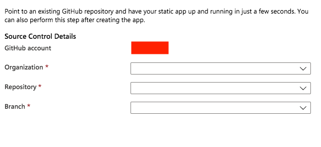
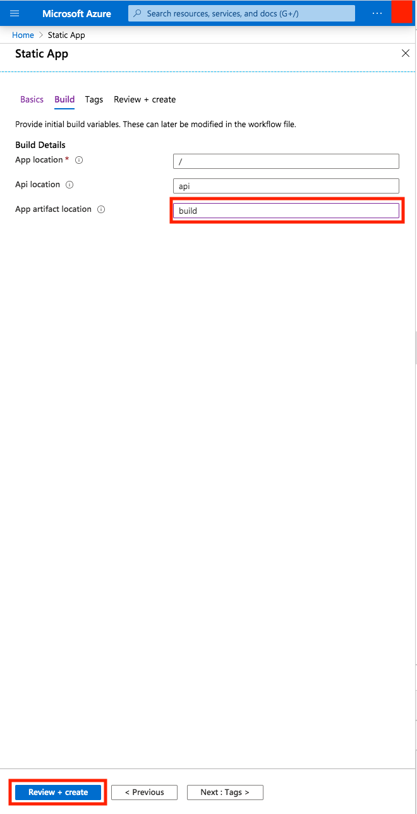

Now it's time for you to learn how to build your app so it's ready to be deployed anywhere. You will also deploy your app to a Cloud service.

## Build your site

When it comes to building your site and making it ready for deployment Gatsby does the heavy lifting for us. All you need to do is to call the following command:

```bash
gatsby build
```

This command will create a so called *production build*. All your files will end up in a sub directory `build/`.

Once the process finish building, you can now go to your `build/` directory and open up the files in browser. You can see how the *production-build* renders by, for example,  using a great tool like
`http-server`. `http-server` is a command-line tool that serves up your files on a specific port so you can see them in a Browser.  

You can run the tool by placing yourself in `build/` directory and type the following command:

```bash
npx http-server -p 5000
```

Go to the browser on `http://localhost:5000`.

You should now see the following content rendered:


Congrats, you managed to build your site and you took it from being a Gatsby app to an app containing nothing but HTML, CSS, and JavaScript!

Going into your `build/` directory now locate your rendered `about` component at `build/about/index.html`. Because of an optimization process, all whitespace have been removed and the page is represented as one long line. However you should be able to locate the rendered title and description and it should look like this:

```html
// excerpt from about/index.html

<h2>Gatsby Default Starter</h2><div>Kick off your next, great Gatsby project with this default starter. This barebones starter ships with the main Gatsby configuration files you might need.</div>
```

## Push your app to a Git repository

To prepare the app for deploy, we will need to take the following steps:

1. Create a Git repository
2. Create a GitHub repository and push to the local Git repository to it

### Create a Git repository

In the console, navigate to root of your project, then run the following commands to initialize a Git repository and commit all of your files to it:"

```bash
git init
```

Create a file .gitignore and give it the following content:

```bash
node_modules
build
```

The above content will ensure that once we commit all our files it will exclude the `build/` and `node_modules` directories. The `build/` directory is something that changes every time we build and the `node_modules/` directory is something that's only need at build time and can be large from all the libraries it contains.

Next step is to add our code under Gits revision control. We do that with first with the following command:

```bash
git add .
```

This will add our files to Gits staging area.

Next, we need to commit so the files go from the staging area to becoming a commit we can push to GitHub. You accomplish that with:

```bash
git commit -m "adding Gatsby project"
```

Above we are giving our commit a commit message with the `-m` flag. Adjust the message to fit your scenario.

### Create a GitHub repo and push the code

1. Go to GitHub and log on. You should now be on a URL like so `https://github.com/<your username>?tab=repositories`

2. Now click the `new` button as indicated below:


3. Now give your repository a suitable name and click `Create repository` as indicated below:


4. Next you, you need to create a connection between your local Git repo and your GitHub repo. You also need to push your Git repo code to GitHub. Type the following commands to accomplish that (Replace the `<user>` part with your GitHub user name):

```bash
git remote add origin https://github.com/<user>/gatsby-app.git
git push -u origin master
```

Congratulations, you are now ready to deploy!

## Deploy your app

Next, you'll create an Azure Static Web App to host the app.


We need to fill in the following information:

- **Subscription**, select the appropriate subscription
- **Resource group**, all things provisioned need to belong to a logical bucket, a resource group. Either create one or select an existing
- **Name**, this field is the name your app will get
- **Region**, this field is what Azure region you want to deploy the app on
- **SKU**, SKU stands for Stock Keeping Unit. It's a pricing tier that indicates how much you will be charged
- **GitHub**, we need to authorize Static apps service as a third-party application to read this information from GitHub. Once authorized, we are able to select the specific GitHub repository we want to use as the template.

Now that we filled in all the needed fields. Click `Sign in with GitHub`. Clicking this button  will show an area below where we you are asked to select values for the following fields:

- **Organization**, select the organization you belong to
- **Repository**, select the specific repository that you want to deploy
- **Branch**, select the branch you want to deploy from



Once you filled in your GiHub data click `Next: Build`. It should take you to a screen looking like this:



The important field to fill in is `App artifact location`. This field needs the location of the folder containing our static assets. In Gatsby's case, a built Gatsby project ends up in the folder `/build`. We don't need to do anything more in this screen as The Static apps service will call the `build` command in our `package.json` that carries out `gatsby build`. Next we click `Review + create` and we should see the following image:


The above image is an overview of all the choices made. If you are happy with all the selections made, then click `Create`. Clicking `Create` will start to provision your Static app. Once done you will come to a portal screen looking like so:


Click the link displayed in the `URL` field and you should see your working app:


You did it! You've managed to deploy a static app to the Cloud.
