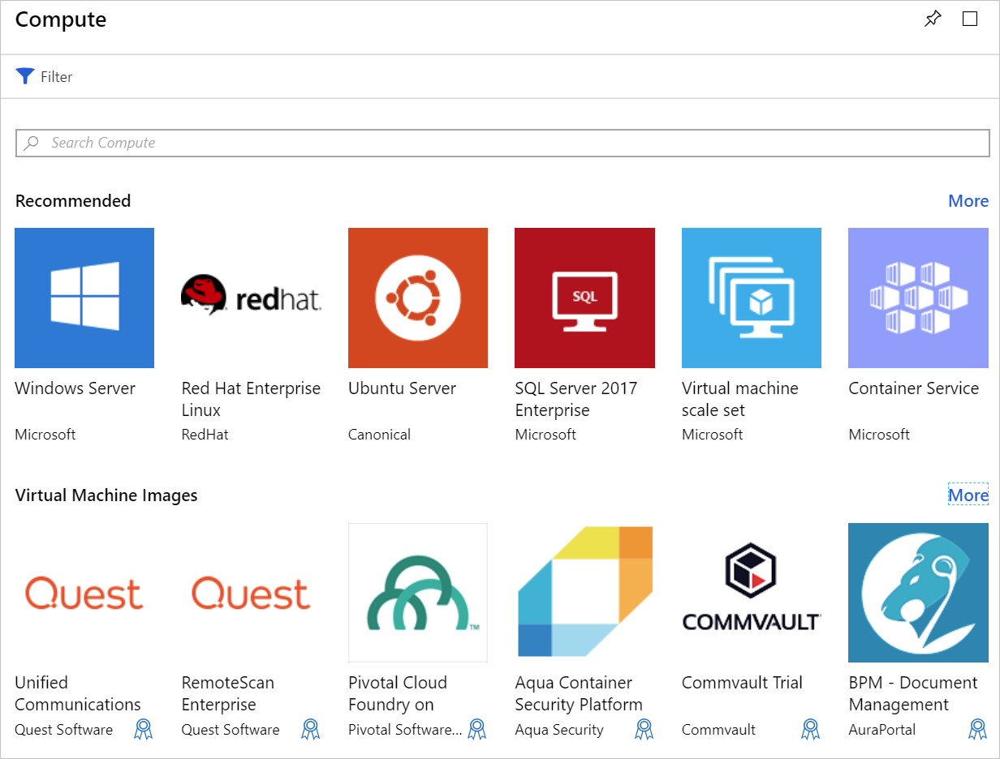

We have an existing website running on a local Ubuntu Linux server. Our goal is to create an Azure virtual machine (VM) using the latest Ubuntu image and then migrate the site to the cloud. In this unit, you will learn about the options you will need to evaluate when creating a virtual machine in Azure.

## Introduction to Azure Virtual Machines

Azure Virtual Machines is an on-demand, scalable cloud-computing resource. They include processors, memory, storage, and networking resources. You can start and stop virtual machines at will and manage them from the Azure portal or with the Azure CLI. You can also use a remote Secure Shell (SSH) to connect directly to the running VM and execute commands as if you were on a local computer.

### Running Linux in Azure

Creating Linux-based VMs in Azure is easy. Microsoft has partnered with prominent Linux vendors to ensure their distributions are optimized for the Azure platform. You can create virtual machines from prebuilt images for a variety of popular Linux distributions, such as SUSE, Red Hat, and Ubuntu, or build your own Linux distribution to run in the cloud.

## Creating an Azure VM

VMs can be defined and deployed on Azure in several ways: the Azure portal, a script (using the Azure CLI or Azure PowerShell), or an Azure Resource Manager template. In all cases, you will need to supply several pieces of information that we'll cover shortly.

The Azure Marketplace also provides preconfigured images that include both an OS and favorite software tools installed for specific scenarios.

## Resources used in a Linux VM

When creating a Linux VM in Azure, you also create resources to host the VM. These resources work together to virtualize a computer and run the Linux operating system. These must exist (and be selected during VM creation), or they will be created with the VM:

- A virtual machine that provides CPU and memory resources
- An Azure Storage account to hold the virtual hard disks
- Virtual disks to hold the OS, applications, and data
- A virtual network (VNet) to connect the VM to other Azure services or your on-premises hardware
- A network interface to communicate with the VNet
- An optional public IP address so you can access the VM

Like other Azure services, you'll need a **Resource Group** to contain the VM (and optionally group these resources for administration). When you create a new VM, you can either use an existing resource group or create a new one.

## Choose the VM image

Selecting an image is one of the first and most important decisions you'll make when creating a VM. An image is a template that's used to create a VM. These templates include an OS and often other software, such as development tools or web hosting environments.

Anything that a computer can have installed can be included in an image. You can create a VM from an image that's preconfigured to precisely the tasks you need, such as hosting a web app on the Apache HTTP Server.

> [!TIP]
> You can also create and upload custom disk images.

## Sizing your VM

Just as a physical machine has a certain amount of memory and CPU power, so does a virtual machine. Azure offers a range of VMs of differing sizes at different price points. The size that you choose will determine the VM's processing power, memory, and maximum storage capacity.

> [!WARNING]
> There are quota limits on each subscription that can impact VM creation. If you run into these quota limits you can [open an online customer support request](https://docs.microsoft.com/azure/azure-supportability/resource-manager-core-quotas-request) to increase your limits.

VM sizes are grouped into categories, starting with the B-series for basic testing and running up to the H-series for massive computing tasks. You should select the size of the VM based on the workload you want to perform. It is possible to change the size of a VM after it's been created, but the VM must be stopped first. So, it's best to size it appropriately from the start if possible.

#### Here are some guidelines based on the scenario you are targeting

| What are you doing? | Consider these sizes
|-------|------------------|
| **General use computing/web**: Testing and development, small to medium databases, or low to medium traffic web servers. | B, Dsv3, Dv3, DSv2, Dv2 |
| **Heavy computational tasks**: Medium traffic web servers, network appliances, batch processes, and application servers. | Fsv2, Fs, F |
| **Large memory usage**: Relational database servers, medium to large caches, and in-memory analytics. | Esv3, Ev3, M, GS, G, DSv2, Dv2 |
| **Data storage and processing**: Big data, SQL, and NoSQL databases that need high disk throughput and I/O. | Ls |
| **Heavy graphics rendering** or video editing, as well as model training and inferencing (ND) with deep learning. | NV, NC, NCv2, NCv3, ND |
| **High-performance computing (HPC)**: Your workloads need the fastest and most powerful CPU virtual machines with optional high-throughput network interfaces. | H |

## Choosing storage options

The next set of decisions revolves around storage. First, you can choose the disk technology. Options include a traditional platter-based hard disk drive (HDD) or a more modern solid-state drive (SSD). Just like the hardware you purchase, SSD storage costs more but provides better performance.

> [!TIP]
> There are two levels of SSD storage available: standard and premium. Choose Standard SSD disks if you have normal workloads but want better performance. Choose Premium SSD disks if you have I/O intensive workloads or mission-critical systems that need to process data very quickly.

### Mapping storage to disks

Azure uses virtual hard disks (VHDs) to represent physical disks for the VM. VHDs replicate the logical format and data of a disk drive but are stored as page blobs in an Azure Storage account. You can choose on a per disk basis what type of storage it should use (SSD or HDD). This allows you to control the performance of each disk, likely based on the I/O you plan to perform on it.

By default, two virtual hard disks (VHDs) will be created for your Linux VM:

1. The **operating system disk**: This is your primary drive, and it has a maximum capacity of 2048 GB. It will be labeled as `/dev/sda` by default.

1. A **temporary disk**: This provides temporary storage for the OS or any apps. On Linux virtual machines, the disk is `/dev/sdb` and is formatted and mounted to `/mnt` by the Azure Linux Agent. It is sized based on the VM size and is used to store the swap file.

> [!WARNING]
> The temporary disk is not persistent. You should only write data to this disk that is not critical to the system.

#### What about data?

You can store data on the primary drive along with the OS, but a better approach is to create dedicated _data disks_. You can create and attach additional disks to the VM. Each disk can hold up to 4095 GB of data, with the maximum amount of storage determined by the VM size you select.

> [!NOTE]
> An interesting capability is to create a VHD image from a real disk. This allows you to easily migrate _existing_ information from an on-premises computer to the cloud.

### Unmanaged vs. managed disks

The final storage choice you'll make is whether to use **unmanaged** or **managed** disks.

With unmanaged disks, you are responsible for the storage accounts that are used to hold the VHDs that correspond to your VM disks. You pay the storage account rates for the amount of space you use. A single storage account has a fixed rate limit of 20,000 I/O operations/sec. This means that a single storage account is capable of supporting 40 standard virtual hard disks at full throttle. If you need to scale out, then you need more than one storage account, which can get complicated.

Managed disks are the newer and recommended disk storage model. They elegantly solve this complexity by putting the burden of managing the storage accounts onto Azure. You specify the disk type (Premium or Standard) and the size of the disk, and Azure creates and manages both the disk _and_ the storage it uses. You don't have to worry about storage account limits, which makes them easier to scale out. They also offer several other benefits:

- **Increased reliability**: Azure ensures that VHDs associated with high-reliability VMs will be placed in different parts of Azure Storage to provide similar levels of resilience.
- **Better security**: Managed disks are real managed resources in the resource group. This means they can use role-based access control to restrict who can work with the VHD data.
- **Snapshot support**: Snapshots can be used to create a read-only copy of a VHD. You have to shut down the owning VM, but creating the snapshot only takes a few seconds. Once it's done, you can power on the VM and use the snapshot to create a duplicate VM to troubleshoot a production issue or roll back the VM to the point in time that the snapshot was taken.
- **Backup support**: Managed disks can be automatically backed up to different regions for disaster recovery with Azure Backup without affecting the service of the VM.

## Network communication

Virtual machines communicate with external resources using a virtual network (VNet). The VNet represents a private network in a single region that your resources communicate on. A virtual network is just like the networks you manage on-premises. You can divide them up with subnets to isolate resources, connect them to other networks (including your on-premises networks), and apply traffic rules to govern inbound and outbound connections.

### Planning your network

When you create a new VM, you will have the option of creating a new virtual network or using an existing VNet in your region.

Having Azure create the network together with the VM is simple, but it's likely not ideal for most scenarios. It's better to plan your network requirements _up front_ for all the components in your architecture and create the VNet structure separately. Then, create the VMs and place them into the already-created VNets. We'll look more at virtual networks later in this module.

Before we create a virtual machine, we need to decide how we'd like to administer the VM. Let's look at our options.