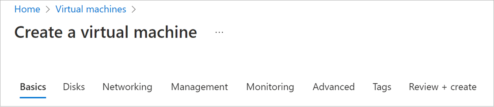
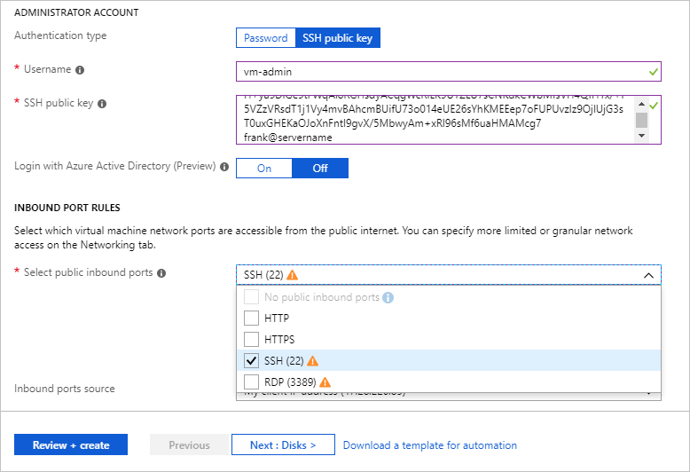
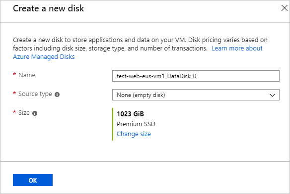
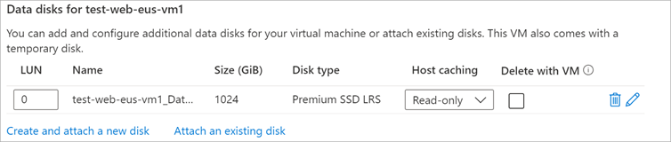

Recall that our goal is to move an existing Linux server running Apache to Azure. We'll start by creating an Ubuntu Linux server.

## Create a new Linux virtual machine

We can create Linux VMs with the Azure portal, the Azure CLI, or Azure PowerShell. The easiest approach when you are starting with Azure is to use the portal because it walks you through the required information and provides hints and helpful messages during the creation:

1. Sign into the [Azure portal](https://portal.azure.com/learn.docs.microsoft.com?azure-portal=true) using the same account you activated the sandbox with.

1. On the Azure portal menu or from the **Home** page, select **Create a resource**.

1. In the search box, enter  **Ubuntu Server**.

1. Select **Nginx on Ubuntu Server 18.04**, from the list.

1. Select the **Create** button to start configuring the VM.

## Configure the VM settings

The VM creation experience in the portal is presented in a wizard format to walk you through all the configuration areas for the VM. Selecting **Next** takes you to the next configurable section. However, you can move between the sections at will with the tabs running across the top that identify each part.

Once you fill in all the required options (identified with red asterisks), you can skip the remainder of the wizard experience and start creating the VM through the **Review + Create** button at the bottom.

We'll start with the **Basics** section. These instructions are for the Sandbox portal. If you are using another Azure portal account, you may need to adapt some details accordingly.

### Configure basic VM settings

1. For **Subscription**, the sandbox subscription should be selected for you by default.

1. For **Resource group**, select **<rgn>[sandbox resource group name]</rgn>**.

1. In the **Instance details** section, enter a name for your web server VM, such as **test-web-eus-vm1**. This indicates the environment (**test**), the role (**web**), location (**East US**), service (**vm**), and instance number (**1**).
It's considered best practice to standardize your resource names, so you can quickly identify their purpose. Linux VM names must be between 1 and 64 characters and be comprised of numbers, letters, and dashes.

1. Select a location.

    <!-- Resource selection -->  
    [!include]

1. Set **Availability options** to **No infrastructure redundancy required**. This option can be used to ensure the VM is highly available by grouping multiple VMs together as a set to deal with planned or unplanned maintenance events or outages. For this exercise we will not need this service.

1. NOW: Ensure that the image is set to **Ubuntu Server 18.04 LTS**. You can open the drop-down list to see all the options available.

1. Leave the **Size** field with the default of **D2s v3** choice, which gives you two vCPUs with 8 GB of RAM.

1. Moving on to the **Administrator account** section, for **Authentication type** select the **SSH public key** option.

1. Enter a **username** you'll use to sign in with SSH. Choose something you can remember or write it down.
1. For **SSH public key source**, select **Use existing public key**.
1. Paste the SSH key from your public key file you created in the previous unit into the **SSH public key** field. It should look similar to the example shown in unit 3 with no additional whitespace or line-feed characters.

1. In the **INBOUND PORT RULES** section, first select **Allow selected ports**. Since this is a Linux VM, we want to be able to access the VM using SSH remotely. Scroll the **Select inbound ports** list if necessary until you find **SSH (22)** and enable it.

    

## Configure disks for the VM

1. Select **Next: Disks >** to move to the **Disks** section.

1. Choose **Premium SSD** for the **OS disk type**.

### Create a data disk

Recall that we will get an OS disk (/dev/sda) and a temporary disk (/dev/sdb). Let's add a data disk as well:

1. Select the **Create and attach a new disk** link in the **Data disks** section.

    

1. You can take all the defaults: **Premium SSD**, the auto-generated name, size of **1024** GiB, and **None (empty disk)** for **Source type**, although notice that source type is where you could use a snapshot or Azure Blob storage to create a VHD.

1. Select **OK** to create the disk and go back to the **Data disks** section.

1. There should now be a new disk in the first row.

    

## Configure the network

1. Select **Next: Networking >** to move to the **Networking** section.

1. In a production environment where we already have other components, you'd want to utilize an _existing_ virtual network. That way, your VM can communicate with the other cloud services in your solution. If there isn't one defined in this location yet, you can create it here and configure the:
    - **Address space**: The overall IPv4 space available to this network.
    - **Subnets**: The first subnet to subdivide the address space - it must fit within the defined address space. Once the VNet is created, you can add additional subnets.

By default, Azure creates a virtual network, network interface, and public IP for your VM. It's not trivial to change the networking options after the VM has been created, so always double-check the network assignments on services you create in Azure. For this exercise, the defaults should work fine.

## Finish configuring the VM and create the image

The rest of the options have reasonable defaults, and there's no need to change any of them. You can explore the other tabs if you like. The individual options have an `(i)` icon next to them that will show a help tip to explain the option. This is a great way to learn about the various options you can use to configure the VM:

1. Select the **Review + create** button at the bottom of the panel.

1. The system will validate your options and give you details about the VM being created.

1. Select **Create** to create and deploy the VM. The Azure dashboard will show the VM that's being deployed. This may take several minutes.

While that's deploying, let's look at what we can do with this VM.
