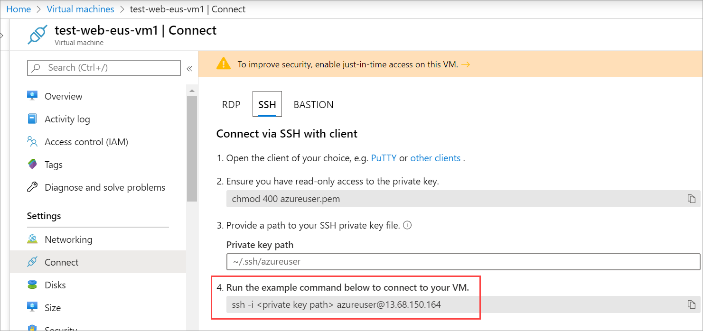

Let's connect to our Linux VM with SSH, and configure Apache, so we have a running web server.

### Get the public IP address of the VM

1. In the [Azure portal](https://portal.azure.com/learn.docs.microsoft.com?azure-portal=true), ensure the **Overview** panel for the virtual machine that you created earlier is open. You can find the VM under **All Resources** if you need to open it. The overview panel allows you to:

    - See if the VM is running
    - Stop or restart the VM
    - Get the public IP address of the VM
    - See the activity of the CPU, disk, and network

1. Select **Connect** > **SSH** at the top of the pane.

1. Under step 4, copy the command to the clipboard.

    

1. We used the default SSH private key file path when we created the SSH key pair. So we don't need to specify the private key path in the command by using the flag `-i` with the private key path. But if you entered a different path when you created the SSH key pair, you'd add that path to the command.

## Connect with SSH

1. Paste the command from your clipboard into the Azure Cloud Shell. Delete the `-i` flag and the private key path placeholder. It should look something like the sample below with a different IP address and username:

    ```bash
    ssh azureuser@13.68.150.164
    ```

1. The first time we connect, SSH will ask us about authenticating against an unknown host. SSH is telling you that you've never connected to this server before. If that's true, then it's perfectly normal, and you can respond with **yes** to save the fingerprint of the server in the known host file:

    ```output
    The authenticity of host '137.117.101.249 (137.117.101.249)' can't be established.
    ECDSA key fingerprint is SHA256:w1h08h4ie1iMq7ibIVSQM/PhcXFV7O7EEhjEqhPYMWY.
    Are you sure you want to continue connecting (yes/no)? yes
    Warning: Permanently added '137.117.101.249' (ECDSA) to the list of known hosts.
    ```
1. Enter the passphrase you used when you created the SSH key pair.
1. In the shell command prompt for Linux, try executing a few Linux commands
    - `ls -la /` to show the root of the disk
    - `ps -l` to show all the running processes
    - `dmesg` to list all the kernel messages
    - `lsblk` to list all the block devices - here you will see your drives

    The more interesting thing to observe in the list of drives is what is _missing_. Notice that our **Data** drive (`sdc`) is present but not mounted into the file system. Azure added a VHD but didn't initialize it.

## Initialize data disks

Any additional drives you create from scratch need to be initialized and formatted. The process for initializing is identical to a physical disk:

1. First, identify the disk. We did that above. You could also use `dmesg | grep SCSI`, which will list all the messages from the kernel for SCSI devices.

1. Once you know the drive (`sdc`) you need to initialize, you can use `fdisk` to do that. You will need to run the command with `sudo` and supply the disk you want to partition. We can use the following command to create a new primary partition:

    ```bash
    (echo n; echo p; echo 1; echo ; echo ; echo w) | sudo fdisk /dev/sdc
    ```

1. Next, we need to write a file system to the partition with the `mkfs` command.

    ```bash
    sudo mkfs -t ext4 /dev/sdc1
    ```

1. Finally, we need to mount the drive to the file system. Let's assume we will have a `data` folder. Let's create the mount point folder and mount the drive.

    ```bash
    sudo mkdir /data && sudo mount /dev/sdc1 /data
    ```

We initialized the disk and mounted it. If you want more details on this process see the **Add and size disks in Azure virtual machines** module. This task is covered in more detail there.

## Install software onto the VM

As you can see, SSH allows you to work with the Linux VM just like a local computer. You can administer this VM as you would any other Linux computer: installing software, configuring roles, adjusting features, and other everyday tasks. Let's focus on installing software for a moment.

You can also install software from the internet when you are connected to the VM via SSH. Azure machines are, by default, internet connected. You can use standard commands to install popular software packages directly from standard repositories. Let's use this approach to install Apache.

### Install the Apache web server

Apache is available within Ubuntu's default software repositories, so we will install it using conventional package management tools:

1. Start by updating the local package index to reflect the latest upstream changes:

    ```bash
    sudo apt-get update
    ```

1. Next, install Apache:

    ```bash
    sudo apt-get install apache2 -y
    ```

1. It should start automatically - we can check the status using `systemctl`:

    ```bash
    sudo systemctl status apache2 --no-pager
    ```

    The `systemctl` command returns something like:

    ```output
    apache2.service - The Apache HTTP Server
       Loaded: loaded (/lib/systemd/system/apache2.service; enabled; vendor preset: enabled)
      Drop-In: /lib/systemd/system/apache2.service.d
               └─apache2-systemd.conf
       Active: active (running) since Mon 2018-09-03 21:00:03 UTC; 1min 34s ago
     Main PID: 11156 (apache2)
        Tasks: 55 (limit: 4915)
       CGroup: /system.slice/apache2.service
               ├─11156 /usr/sbin/apache2 -k start
               ├─11158 /usr/sbin/apache2 -k start
               └─11159 /usr/sbin/apache2 -k start

    test-web-eus-vm1 systemd[1]: Starting The Apache HTTP Server...
    test-web-eus-vm1 apachectl[11129]: AH00558: apache2: Could not reliably determine the server's fully qua
    test-web-eus-vm1 systemd[1]: Started The Apache HTTP Server.
    ```

1. Finally, we can try retrieving the default page through the public IP address. However, even though the web server is running on the VM, you won't get a valid connection or response. Do you know why?

We need to perform one more step to be able to interact with the web server. Our virtual network is blocking the inbound request. We can change that through configuration. Let's look at allowing the inbound request next.
