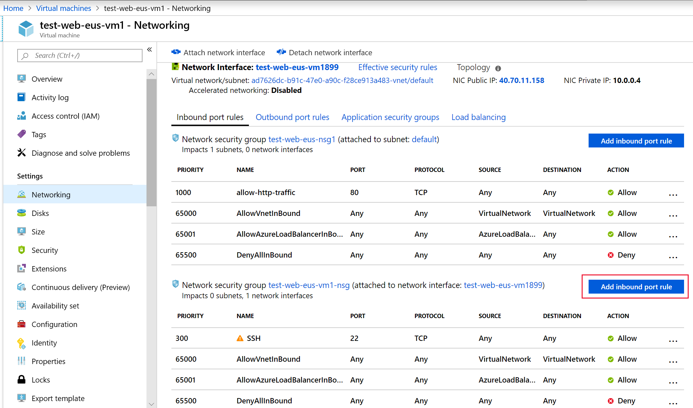
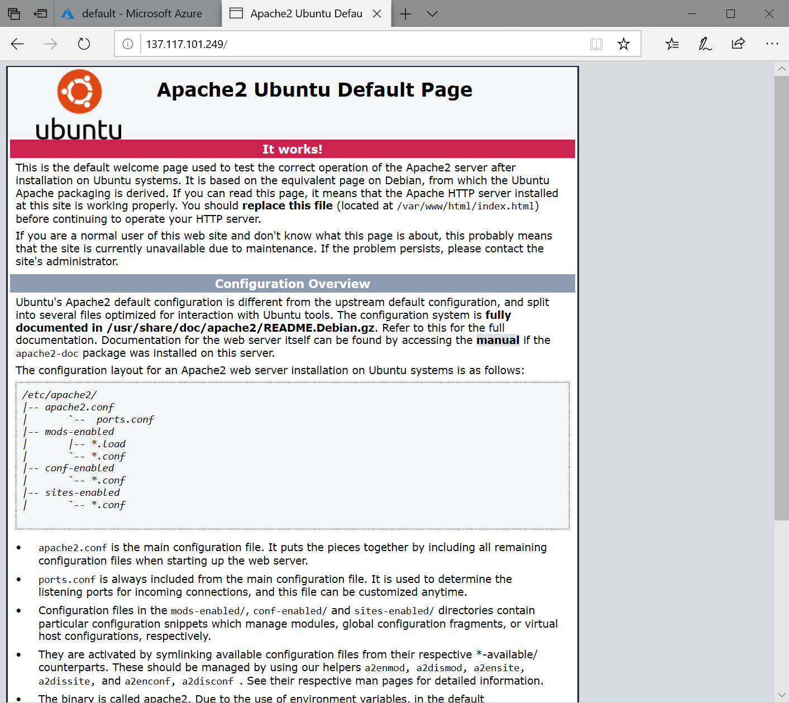

When we created the virtual machine (VM), we selected the inbound port _SSH_ so we could connect to the VM. This created an NSG that's attached to the network interface of the VM. That NSG is blocking HTTP traffic. Let's update this NSG to allow inbound HTTP traffic on port 80.

## Update the NSG on the network interface

Port 80 is open on the NSG applied to the subnet. But port 80 is blocked by the NSG applied to the network interface. Let's fix that so we can connect to the website.

1. Switch back to the **Overview** panel for the virtual machine. You can find the VM under **All Resources**.

1. In the **Settings** section, select the **Networking** item.

1. You should see the NSG rules for the subnet in the top section and the NSG rules for the network interface in the bottom section of the same tab. In the bottom section, for the NSG rules for the network interface, select **Add inbound port rule**.

    

1. Switch to the **Basic** mode.

1. Add the information for our HTTP rule:

    - Set the **Service** to be HTTP. This sets up your port range.
    - Set the **Priority** to **310**.
    - Give the rule a name; use **allow-http-traffic**.
    - Give the rule a description.

1. Click **Add** to create the rule.

## Open the default webpage 

Use the IP address of the server to make an HTTP request. It should now work.

   

## One more thing

Always make sure to lock down ports used for administrative access. An even better approach is to create a VPN to link the virtual network to your private network and only allow RDP or SSH requests from that address range. You can also change the port used by SSH to be something other than the default. Keep in mind that changing ports is not sufficient to stop attacks. It simply makes it a little harder to discover.