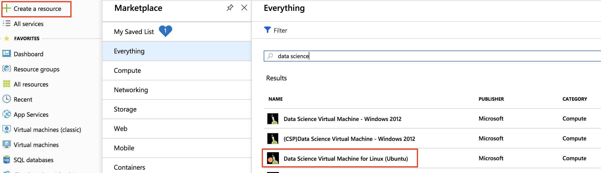
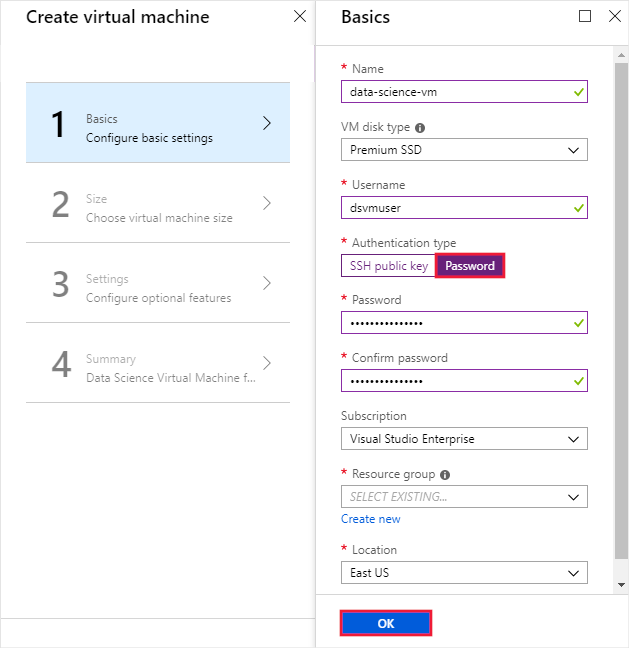
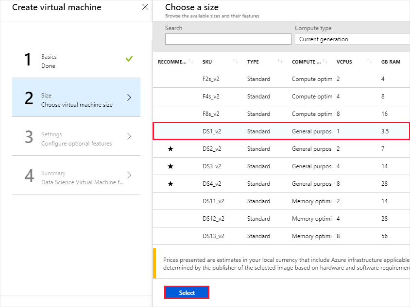
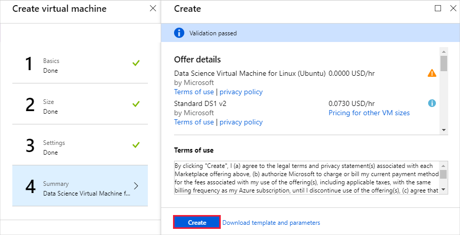
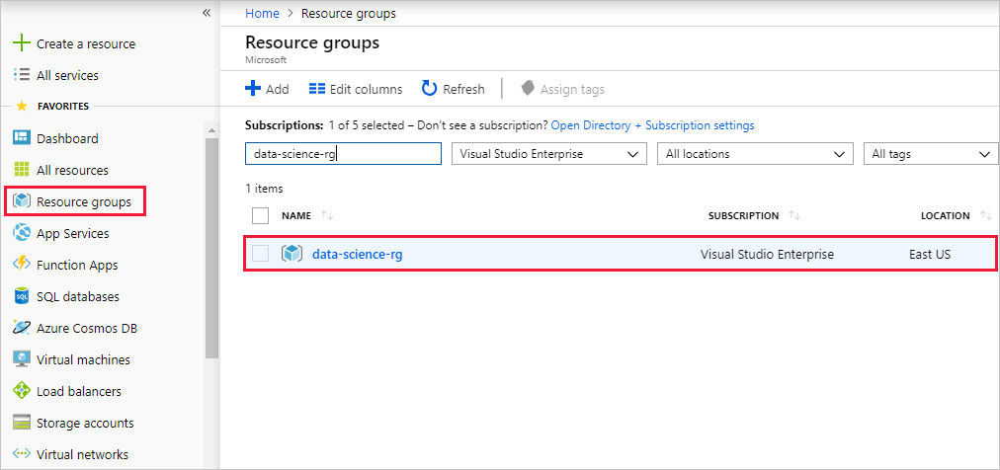
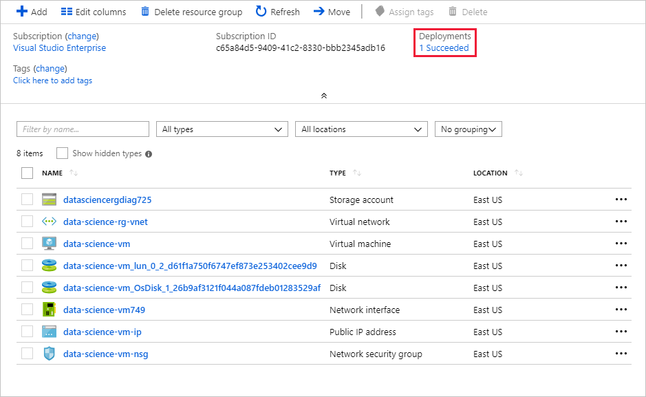

> [!NOTE]
> After launching the VM, the username and password you need to sign in with is located on the **Resources** tab next to the instructions.

### Create an Ubuntu Data Science VM

The Data Science Virtual Machine for Linux is a virtual-machine image that simplifies getting started with data science. Multiple tools are already built, installed, and configured in order to get you up and running quickly. The NVIDIA GPU driver, [NVIDIA CUDA](https://developer.nvidia.com/cuda-downloads) and the [NVIDIA CUDA Deep Neural Network](https://developer.nvidia.com/cudnn) (cuDNN) library are also included, as are [Jupyter](http://jupyter.org/), several sample Jupyter notebooks, and [TensorFlow](https://www.tensorflow.org/). All pre-installed frameworks are GPU-enabled but work on CPUs as well. In this unit, you will create an instance of the Data Science Virtual Machine (DSVM) for Linux on Azure.

1. Sign into the [Azure portal](https://portal.azure.com/learn.docs.microsoft.com?azure-portal=true) using the same account you activated the sandbox with.

2. Click **Create a resource** in the menu on the left side of the portal, and then type "data science" (without quotation marks) into the search box. Select **Data Science Virtual Machine for Linux (Ubuntu)** from the results list.

    

3. Take a moment to review the list of tools included in the VM. Then, click **Create** at the bottom of the blade.

4. Fill in the "Basics" blade as shown below. Provide a password that's at least 12 characters long containing a mix of uppercase letters, lowercase letters, numbers, and special characters. *Be sure to remember the user name and password that you enter, because you will need them later in the module.*

    

5. In the "Choose a size" blade, select **DS1_v2 Standard**, which provides a low-cost way to experiment with Data Science VMs. Then, click the **Select** button at the bottom of the blade.

    

6. In the **Settings** blade, accept the defaults, and click the **OK** button.

7. In the **Create** blade, take a moment to review the options you selected for the VM, and click **Create** to start the VM creation process.

    

8. Click **Resource groups** in the menu on the left side of the portal. Then, click the pre-created resource group.

    

  
9. Wait until "Deploying" changes to "Succeeded", indicating that DSVM and supporting Azure resources have been created. Deployment typically takes five minutes or less. Periodically click **Refresh** at the top of the blade to refresh the deployment status.

    
