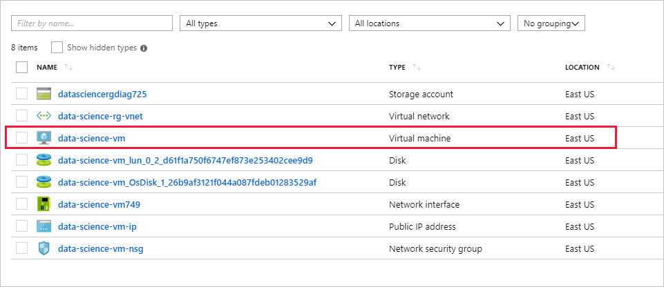
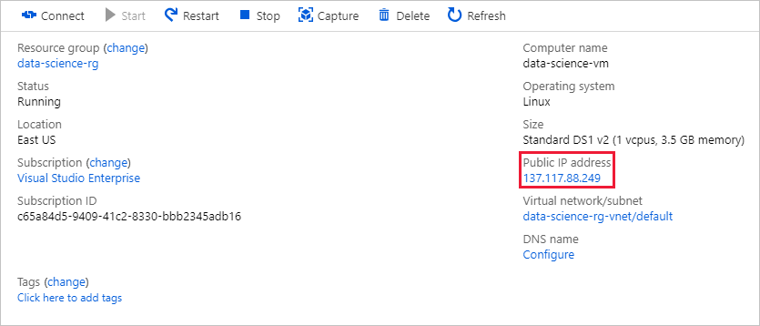
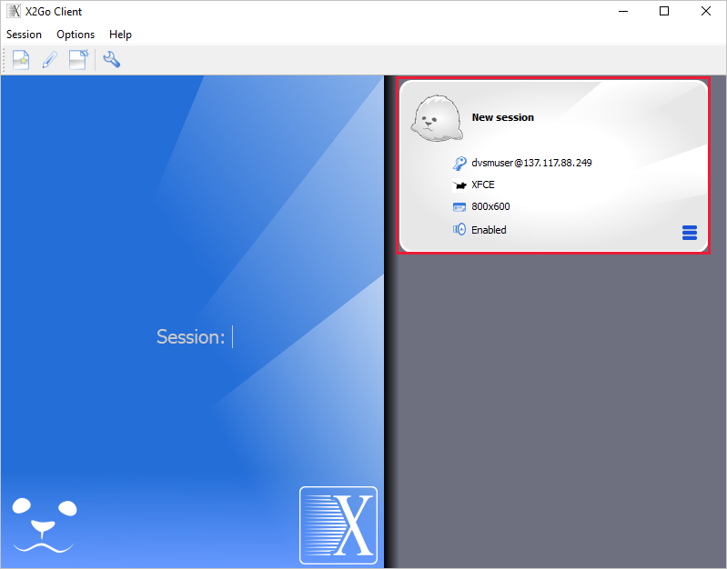
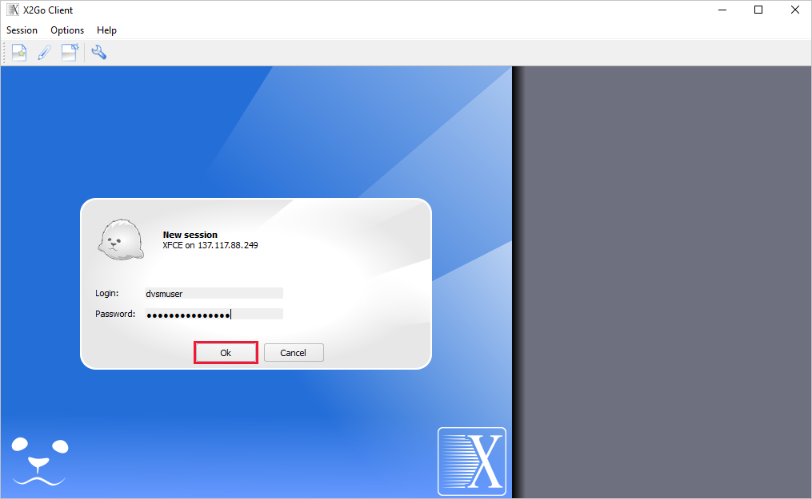

### Connect to the Data Science VM

In this unit, you will connect remotely to the Ubuntu desktop in the VM that you created in the previous exercise. To do so, you need a client that supports [Xfce](https://xfce.org/), which is a lightweight desktop environment for Linux. For background, and for an overview of the various ways you can connect to a Data Science Virtual Machine (DSVM), see [How to access the Data Science Virtual Machine for Linux
](https://docs.microsoft.com/azure/machine-learning/data-science-virtual-machine/dsvm-ubuntu-intro#how-to-access-the-data-science-virtual-machine-for-linux).

1. If you don't already have an Xfce client installed, download the [X2Go client](https://wiki.x2go.org/doku.php/download:start) and install it before continuing with this exercise. X2Go is a free and open-source Xfce solution that works on a variety of operating systems, including Windows and OS X. The instructions in this unit assume you are using X2Go, but you may use any client that supports Xfce.

1. Return to the **data-science-rg** resource group in the Azure portal. Click the **data-science-vm** resource to open it in the portal.

    

1. Hover over the IP address shown for the VM and click the **Copy** button that appears to copy the IP address to the clipboard.

    

1. Start the X2Go client and connect to the Data Science VM using the IP address on the clipboard and the user name you specified in the previous exercise. Connect via port **22** (the standard port used for SSH connections), and specify **XFCE** as the session type. Click the **OK** button to confirm your preferences.

    

1. In the "New session" panel on the right, select the resolution that you wish to use for the remote desktop. Then, click **New session** at the top of the panel.

    

1. Enter the password you specified in the last unit, and then click the **OK** button. If asked if you trust the host key, answer **Yes**. Also, ignore any error messages stating that the SSH daemon could not be started.

    

1. Wait for the remote desktop to appear and confirm that it resembles the one below.

    > If the text and icons on the desktop are too large, terminate the session. Click the icon in the upper-right corner of the "New Session" panel and select **Preferences...** from the menu. Go to the "Input/Output" tab in the "New session" dialog and adjust the display DPI, and then start a new session. Start with 96 DPI and adjust as needed.

    

Now that you are connected, take a moment to explore the shortcuts on the desktop. These are shortcuts to the numerous data-science tools preinstalled in the VM, which include [Jupyter](http://jupyter.org/), [R Studio](https://www.rstudio.com/), and the [Microsoft Azure Storage Explorer](https://azure.microsoft.com/features/storage-explorer/), among others.