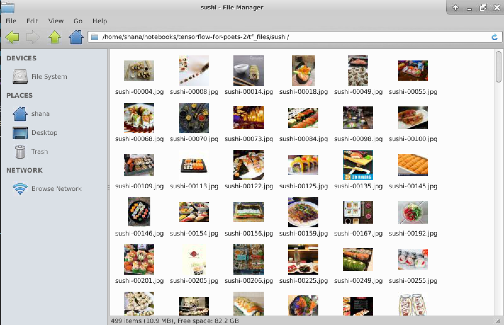

### Train a TensorFlow model

In this unit, you will train an image-classification model built with [TensorFlow](https://www.tensorflow.org/) to recognize images that contain sushi or a sandwich. Rather than create the model from scratch, which would require vast amounts of computing power and tens or hundreds of thousands of images, you will customize a pre-existing model, a practice known as [transfer learning](https://wikipedia.org/wiki/Transfer_learning). Transfer learning allows you to achieve high levels of accuracy with as little as a few minutes of training time on a typical laptop or PC and as few as several dozen images.

In the context of deep learning, transfer learning involves starting with a deep neural network that is pretrained to perform image classification and adding a layer that customizes the network for your problem domain — for example, to classify images into two groups: those that contain sushi, and those that contain a sandwich. More than 20 pretrained TensorFlow image-classification models are available at <https://github.com/tensorflow/models/tree/master/research/slim#pre-trained-models.> The [Inception](https://arxiv.org/abs/1512.00567) and [ResNet](https://towardsdatascience.com/an-overview-of-resnet-and-its-variants-5281e2f56035) models are characterized by higher accuracy and commensurately higher resource requirements, while the MobileNet models trade accuracy for compactness and power efficiency and were developed with mobile devices in mind. All of these models are well known in the deep-learning community and have been used in a number of competitions as well as in real-world applications. You will use one of the MobileNet models as the basis for your neural network in order to strike a reasonable balance between accuracy and training time.

Training the model involves little more than running a Python script that downloads the base model and adds a layer trained with domain-specific images and labels. The script you need is available on GitHub, and the images you will use were assembled from thousands of public-domain food images available from [Kaggle](https://www.kaggle.com).

1. In the Data Science VM, click the Terminal icon at the bottom of the screen to open a terminal window.

    

    _Launching a terminal window_

1. Execute the following command in the terminal window to navigate to the "notebooks" folder:

    ```bash
    cd notebooks
    ```
    This folder is prepopulated with sample Jupyter notebooks curated for the DSVM.

1. Now use the following command to clone the "TensorFlow for Poets" repository from GitHub:

    ```bash
    git clone https://github.com/googlecodelabs/tensorflow-for-poets-2
    ```
   <!--[Azure Cloudshell](../../../includes/azure-cloudshell-copy-paste-tip.md)]-->

    This repo contains scripts for creating transfer-learning models, invoking a trained model in order to classify an image, and more. It is part of [Google Codelabs](https://codelabs.developers.google.com/), which contains a variety of resources and hands-on labs for software developers interested in learning about TensorFlow and other Google tools and APIs.

1. Once cloning is complete, navigate to the folder containing the cloned model:

    ```bash
    cd tensorflow-for-poets-2
    ```

1. Use the following command to download the images that will be used to train the model:

   <!--need to update this URL - where are the rest of Learn resources hosted?-->
    ```bash
    wget 'https://github.com/MicrosoftDocs/mslearn-create-neural-network-with-dsvm/blob/master/tensorflow-sushi-resources.zip?raw=true' -O temp.zip; unzip temp.zip -d tf_files; rm temp.zip
    ```

    This command downloads a zip file containing hundreds of food images — half containing sushi, and half containing sandwiches — and copies them into the subdirectory named "tf_files."

1. Click the File Manager icon at the bottom of the screen to open a File Manager window.

    

    _Launching File Manager_

1. In File Manager, navigate to the "notebooks/tensorflow-for-poets-2/tf_files" folder. Confirm that the folder contains a pair of subdirectories named "sushi" and "sandwich." The former contains several hundred images containing sushi, while the latter contains an equal number of images that contain sandwiches. Browse the images in the "sushi" folder to get a feel for what they look like. Check out the images in the "sandwich" folder as well.

    > In order to train a neural network to determine whether an image contains sushi, you will train it with images that contain sushi as well as images that contain sandwiches.

    

    *Images in the "sushi" folder*

    Also, confirm that the folder contains a text file named **retrained_labels_sushi.txt**. This file identifies the subdirectories containing the training images. It is used by the Python script that trains the model. The script enumerates the files in each subdirectory identified in the text file (the text file's name is a parameter passed to the script) and uses those files to train the network.

1. Open a second terminal window and navigate to the "notebooks/tensorflow-for-poets-2" folder — the same one that is open in the first terminal window. Then, use the following command to launch [TensorBoard](https://www.tensorflow.org/programmers_guide/summaries_and_tensorboard), which is a set of tools used to visualize TensorFlow models and gain insight into the transfer-learning process:

     ```bash
     tensorboard --logdir tf_files/training_summaries
     ```

     > This command will fail if there is already an instance of TensorBoard running. If you are notified that port 6006 is already in use, use a ```pkill -f "tensorboard"``` command to kill the existing process. Then, execute the ```tensorboard``` command again.

1. Switch back to the original terminal window and execute the following commands:

    ```bash
    IMAGE_SIZE=224;
    ARCHITECTURE="mobilenet_0.50_${IMAGE_SIZE}";
    ```

    These commands initialize environment variables specifying the resolution of the training images and the base model that your neural network will build upon. Valid values for IMAGE_SIZE are 128, 160, 192, and 224. Higher values increase the training time, but also increase the accuracy of the classifier.

1. Now execute the following command to start the transfer-learning process — that is, to train the model with the images you downloaded:

    ```bash
    python scripts/retrain.py \
    --bottleneck_dir=tf_files/bottlenecks \
    --how_many_training_steps=500 \
    --model_dir=tf_files/models/ \
    --summaries_dir=tf_files/training_summaries/"${ARCHITECTURE}" \
    --output_graph=tf_files/retrained_graph_sushi.pb \
    --output_labels=tf_files/retrained_labels_sushi.txt \
    --architecture="${ARCHITECTURE}" \
    --image_dir=tf_files \
    --testing_percentage=15 \
    --validation_percentage=15
    ```

    **retrain.py** is one of the scripts in the repo that you downloaded. It is complex, comprising more than 1,000 lines of code and comments. Its job is to download the model specified with the ```--architecture``` switch and add to it a new layer trained with the images found in subdirectories of the directory specified with the ```--image_dir``` switch. Each image is labeled with the name of the subdirectory in which it is located — in this case, either "sushi" or "sandwich" — enabling the modified neural network to classify images input to it as sushi images ("sushi") or sandwich images ("sandwich"). The output from the training session is a TensorFlow model file named **retrained_graph_sushi.pb**. The name and location are specified in the ```--output_graph``` switch.

1. Wait for training to complete; it should take less than five minutes. Then, check the output to determine the accuracy of the model. Your result may vary slightly from the one below because the training process involves a small amount of random estimation.

      

1. Click the browser icon at the bottom of the desktop to open the browser installed in the Data Science VM. Then, navigate to <http://0.0.0.0:6006> to connect to Tensorboard.

    

1. Inspect the graph labeled "accuracy_1." The blue line depicts the accuracy achieved over time as the 500 training steps specified with the ```how_many_training_steps``` switch are executed. This metric is important, because it shows how the accuracy of the model evolves as training progresses. Equally important is the distance between the blue and orange lines, which quantifies the amount of overfitting that occurred and should always be minimized. [Overfitting](https://en.wikipedia.org/wiki/Overfitting) means the model is adept at classifying the images it was trained with, but not as adept at classifying other images presented to it. The results here are acceptable, because there is a difference of less than 10% between the orange line (the "training" accuracy achieved with the training images) and the blue line (the "validation" accuracy achieved when tested with images outside the training set).

    

1. Click **GRAPHS** in the TensorBoard menu and inspect the graph shown there. The primary purpose of this graph is to depict the neural network and the layers that comprise it. In this example, "input_1" is the layer that was trained with food images and added to the network. "MobilenetV1" is the base neural network that you started with. It contains many layers which aren't shown. Had you built a deep neural network from scratch, all of the layers would have been diagrammed here. (If you would like to see the layers that comprise the MobileNet, double-click the "MobilenetV1" block in the diagram.) For more information on the Graphs display and the information surfaced there, refer to [TensorBoard: Graph Visualization](https://www.tensorflow.org/programmers_guide/graph_viz).

    

1. Switch back to File Manager and navigate to the "notebooks/tensorflow-for-poets-2/tf_files" folder. Confirm that it contains a file named **retrained_graph_sushi.pb**. *This file was created during the training process and contains the trained TensorFlow model*. You will use it in the next exercise to invoke the model from the GUI app.

The script that you executed in Step 10 specified 500 training steps, which strikes a balance between accuracy and the time required for training. If you would like, try training the model again with a higher ```how_many_training_steps``` value such as 1000 or 2000. A higher step count generally results in higher accuracy, but at the expense of increased training time. Watch out for overfitting, which, as a reminder, is represented by the difference between the orange and blue lines in TensorBoard's Scalars display.
