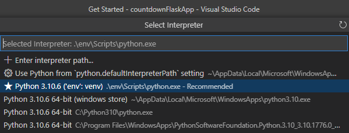
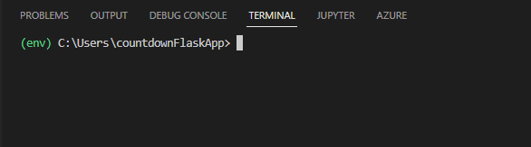
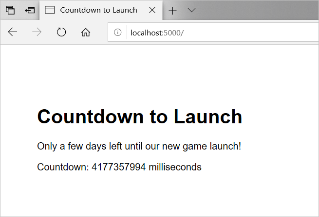

::: zone pivot="nodeexpress"

With Node.js and Express.js, you can create a webapp very quickly.

Suppose you've been asked to start building the website to promote the new video game launch. You've decided to use Node.js to run server-side code and, to make the development as quick as possible, you're going to use the Express.js framework for webapps. You want to create a quick, proof-of-concept webapp that displays a countdown to the launch date.

Here, you'll install the necessary software and then use Visual Studio Code to create and test a website.

> [!NOTE]
> You must have [Visual Studio Code](https://code.visualstudio.com) and [Node.js](https://nodejs.org) installed on your computer before you begin this exercise.

## Create an app folder

You can use Visual Studio Code to run all the commands and edit all the code for your webapp. Here, you'll use its integrated terminal to set up a folder with Express.js installed:

1. Start Visual Studio Code.
1. On the **View** menu, click **Terminal**.
1. To create a new folder, type the following commands:

    ```console
    cd ~
    mkdir countdownExpressApp
    cd countdownExpressApp
    ```

1. On the **File** menu, select **Open folder** and then browse to the **countdownExpressApp** folder.

## Scaffold an Express.js application

You can use the Express Generator tool to create all the components of an Express.js boiler-plate webapp:

1. In the Visual Studio Code Explorer window, notice that the **countdownExpressApp** folder is empty.
1. If the integrated terminal is not visible, on the **View** menu, click **Terminal**.
1. To run the Express Generator, execute this command in the terminal:

    ```console
    npx express-generator
    ```

1. Examine the contents of the Explorer window to see the files the generator has created.

    :::image type="content" source="../media/3-express-generator-files.png" alt-text="Express generated files." loc-scope="vs-code":::

## Calculate the countdown

You now have a functional webapp that Node.js can run. Let's modify its code to display the countdown:

1. In the Visual Studio Code Explorer window, expand **routes**, and then select **index.js**. This JavaScript file defines routes for the app's homepage. We can add our code to calculate the countdown here.
1. Add the following code, immediately after the `const router = express.Router();` line. In the first line of the inserted code, specify your own date around a month in the future, in `MM/DD/YYYY HH:MM` format (this example uses `12/29/2019 10:00`):

    ```JavaScript
    let launchTime = new Date("12/29/2019 10:00").getTime();
    ```

1. Locate this line of code:

    ```JavaScript
    res.render('index', { title: 'Express' });
    ```

1. Replace that single line with the following three lines of code:

    ```JavaScript
    let currentTime = new Date().getTime();
    let numberOfMilliseconds = parseInt(launchTime - currentTime);
    res.render('index', { title: 'Countdown to Launch', countDown: numberOfMilliseconds });
    ```

1. On the **File** menu, select **Save**, then close the **index.js** file.

> [!NOTE]
> For this initial version, you're happy to display the countdown in milliseconds. Later, we'll update the code to display a whole number of days, which is what a user might expect.

## Render the countdown

Now, modify the default homepage for the webapp to display the countdown:

1. In the Visual Studio Code Explorer window, expand **views**, and then select **index.jade**. This file defines a view for the app's homepage. We can add code to display the countdown here.
1. Locate the following line of code:

    ```jade
    p Welcome to #{title}
    ```

1. Replace that line with this code:

    ```jade
    p Only a few days left until our new game launch!
    ```

1. Add this new line of code at the end of the file:

    ```jade
    p Countdown: #{countDown} milliseconds
    ```

1. On the **File** menu, select **Save** and then close the **index.jade** file.

## Run the webapp

Now the app is complete, let's run it on your local computer and see if it shows the countdown:

1. The Express Generator creates a webapp that depends on several other Node.js packages. You must ensure these are installed before you can run the webapp. In the Code integrated terminal, to install the webapp's dependencies, run this command:

    ```console
    npm install
    ```

   > [!NOTE]
   > You may see warnings in the output from this command about vulnerabilities. It's not necessary to fix these vulnerabilities for our purposes right now.

1. To run the webapp on your local computer, run the following command in the terminal:

    ```console
    npm start
    ```

    This command tells `npm` to run the command in the package's `scripts.start` property. The Express Generator sets this property to start Node.js in the /bin/www folder. This starts the webapp locally.

1. Open a web browser and navigate to the address `http://localhost:3000`.

    :::image type="content" source="../media/3-complete-webapp.png" alt-text="Browse the completed webapp." loc-scope="other":::

1. Close the web browser. In the Code integrated terminal, press <kbd>Ctrl+C</kbd> to stop the webapp. If the prompt displays `Terminate batch job (Y/N)?`, type <kbd>Y</kbd> and press <kbd>Enter</kbd>.

::: zone-end

::: zone pivot="pythonflask"

As you'll see, using Python and the py utility to install Flask, you can create a webapp very quickly.

Suppose you've been asked to start building the website to promote the new video game launch. You've decided to use Flask to run server-side code and, to make the development as quick as possible, you're going to use the default Jinja templating engine. You want to create a quick, proof-of-concept webapp that displays a countdown to the launch date.

Here, you'll install the necessary software and then use Visual Studio Code to create and test a website.

> [!NOTE]
> You must have [Visual Studio Code](https://code.visualstudio.com) and [Python](https://www.python.org) installed on your computer before you begin this exercise.

## Create an app folder

You can use Visual Studio Code to run all the commands and edit all the code for your webapp. Here, you'll use its integrated terminal to set up a folder for your project:

1. Start Visual Studio Code.
1. On the **View** menu, click **Terminal**.
1. To create a new folder, type the following commands:

    ```console
    mkdir countdownFlaskApp
    cd countdownFlaskApp
    ```

1. On the **File** menu, select **Open File ...** (or **Open ...** on macOS) and then browse to the **countdownFlaskApp** folder and select the **Open** button.  Visual Studio Code should load the new folder in the Explorer view.

## Create and activate a virtual environment for Flask development

Using a virtual environment avoids installing Flask into a global Python environment and gives you exact control over the libraries used in an application.

1. If the integrated terminal is not visible, on the **View** menu, click **Terminal**.
1. To create a virtual environment named `env`, in Windows type the following command into the terminal:

    ```console
    py -m venv env
    ```
    Or, in macOS, type the following command into the terminal:

    ```console
    python3 -m venv env
    ```

    You will not see a success message or any other feedback.

1. Open the Command Palette using <kbd>Ctrl+Shift+P</kbd> on Windows and Linux (or <kbd>Command+Shift+P</kbd> on macOS) and execute the **Python: Select Interpreter** command.

    Visual Studio Code displays a list of available global environments, including the virtual environment you just created.  You should see the virtual environment named `env` in the list.  Use the arrow keys to select the `env` entry and select <kbd>Enter</kbd> (or <kbd>return</kbd> on macOS).

    

1. Close the integrated terminal.

1. Run **Terminal: Create New Integrated Terminal (Ctrl+Shift+`)** from the Command Palette, which creates a terminal and automatically activates the virtual environment by running its activation script.

    You should now see the command line prompt prefixed with `(env)`.

    

    > [!IMPORTANT]
    > If you do not see the prefix `(env)` on your command prompt you are not working in the virtual environment.

    > [!IMPORTANT]
    > On Windows, if your default terminal type is PowerShell, you may see an error that it cannot run activate.ps1 because running scripts is disabled on the system. The error provides a link for information on how to allow scripts. Otherwise, use **Terminal: Select Default Shell** to set "Command Prompt" or "Git Bash" as your default instead.

    Once you have created and activated the virtual environment, you're ready to install Flask inside of your virtual environment.

## Install Flask into the virtual environment

1. If the integrated terminal is not visible, on the **View** menu, click **Terminal**.
1. To install Flask in the virtual environment, ensure the command line is prefaced with `(env)`, execute this command in the terminal:

    ```console
    pip3 install flask
    ```

    Once the pip3 utility has finished, you should see a success message similar to the following:

    ```output
    Successfully installed Jinja2-2.11.2 MarkupSafe-1.1.1 Werkzeug-1.0.1 click-7.1.1 flask-1.1.2 itsdangerous-1.1.0
    ```

## Add code files

1. In the Visual Studio Code Explorer view, use the **New file** icon to create a new file named `app.py`.  This will be where we write our Python code to create a Flask app, create a function to handle incoming requests, and perform the logic for our app.

1. Use the **New folder** icon to a new folder called `templates`.

1. Select the `templates` folder, the use the **New file** icon to add a new file called `countdown.html`.

## Add logic to calculate the countdown

Now that we have the file structure in place, we can focus on the application logic.

Our aim here is to:

- Add `import` statements to pull in the various packages we'll need to support our web app.
- Create an instance of the Flask object that essentially starts the web app.
- Define a function that will handle the default route.  Since this is a simple app, we'll do all our business logic (i.e., our date time math) and send the number of milliseconds to our Jinja template.

1. In the Visual Studio Code Explorer window, select **app.py** and add the following code:

    ```python
    from flask import Flask
    from flask import render_template
    from datetime import datetime
    ```

    These first lines of code just import the Flask library.  The `render_template` package provides the Jinja templating support.  Finally, we'll need `datetime` package to work with dates and times.

1. Next, create an instance of the Flask object by adding the following code to the **app.py** file:

    ```JavaScript
    app = Flask(__name__)
    ```

1. Finally, create a function that will handle the default route.

    ```JavaScript
    @app.route("/")
    def countdown():

        launchTime = datetime(2020, 6, 1)
        currentTime = datetime.now()
        diff = launchTime - currentTime
        numberOfMilliseconds = int(diff.total_seconds() * 1000)

        return render_template(
            "countdown.html",
            time=numberOfMilliseconds
        )
    ```

    There's quite a bit to unpack in this function.

    Above the function's definition, we use `@app.route()` to adorn the function with the route attribute to tell Flask which URL pattern to route to this function.  In this case, we're only handling the route for the root of the site.

    First, you create two variables, `launchTime` and `currentTime`, to hold the future date and the current date, respectively.

    Next, you create the `diff` variable to hold the difference between the two dates.  This will return the value in microseconds, so you will need to multiply that value by 1000.  Then, to eliminate any fractions of milliseconds, you convert the floating number to an integer using the `int()` function.  You store that value in a new variable named `numberOfMilliseconds`.

    Finally, you call the `render_template()` function passing in the name of the template in the templates folder, and the value you want to inject into the template.  Soon we'll create the template and will use the template replacement code named `time` in the template, so here we set `time` to the value stored in `numberOfMilliseconds`.

    The entire app.py file should match the following code listing:

    ```python
    from flask import Flask
    from flask import render_template
    from datetime import datetime

    app = Flask(__name__)

    @app.route("/")
    def countdown():

        launchTime = datetime(2020, 6, 1)
        currentTime = datetime.now()
        diff = launchTime - currentTime
        numberOfMilliseconds = int(diff.total_seconds() * 1000)

        return render_template(
            "countdown.html",
            time=numberOfMilliseconds
        )
    ```

1. On the **File** menu, select **Save**, then close the **app.py** file.

    > [!NOTE]
    > For this initial version, you're happy to display the countdown in milliseconds. Later, we'll update the code to display a whole number of days, which is what a user might expect.

## Render the countdown

Now, we'll build the template to display the countdown:

1. In the Visual Studio Code Explorer window, expand **templates**, and then select **countdown.html**. This file defines a Jinja template for the app's homepage. We can add code to display the countdown here.

1. Add the following HTML code:

    ```html
    <!DOCTYPE html>
    <html>
        <head>
            <meta charset="utf-8" />
            <title>Countdown to Launch</title>
            <style>
                body {
                    margin-top: 100px;
                    margin-left: 60px;
                    font-family: Arial, Helvetica, sans-serif;
                }
            </style>
        </head>
        <body>
            <h1>Countdown to Launch</h1>
            <p>Only a few days left until our new game launch!</p>
            <p>Countdown: x milliseconds</p>
        </body>
    </html>
    ```

1. Replace the following line:

    ```html
    <p>Countdown: x milliseconds</p>
    ```

    ... with the following line of code:

    ```html
    <p>Countdown: {{ time }} milliseconds</p>
    ```

    Here we use the `{{ }}` replacement syntax, and the replacement code `time` that we referenced in the previous section.  You'll recall, we called `render_template()` and set `time` to the value we set in the variable `numberOfMilliseconds`.  At runtime, Flask will dynamically replace `{{ time }}` with a long numeric value.

1. On the **File** menu, select **Save** and then close the **countdown.html** file.

## Run the webapp

Now the app is complete, let's run it on your local computer and see if it shows the countdown:

1. In the Visual Studio Code Terminal on Windows, run the following command:

    ```command
    py -m flask run
    ```

    In macOS and Linux, run the following command:

    ```command
    python3 -m -flask run
    ```

    In the Terminal, you should see some feedback confirming that the development server is running your app correctly:

    ```console
    * Environment: production
    WARNING: This is a development server. Do not use it in a production deployment.
    Use a production WSGI server instead.
    * Debug mode: off
    * Running on http://127.0.0.1:5000/ (Press CTRL+C to quit)
    ```

1. Open a web browser and navigate to the address `http://localhost:5000`.



1. Close the web browser. In the Visual Studio Code Terminal, in Windows and Linux select <kbd>Ctrl+C</kbd> to quit the development server.  On macOS, select <kbd>Command+C</kbd> to quit the development server.

::: zone-end
