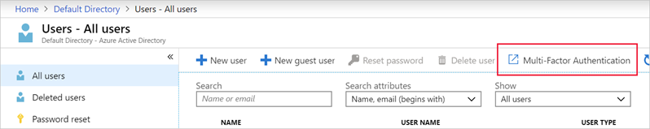
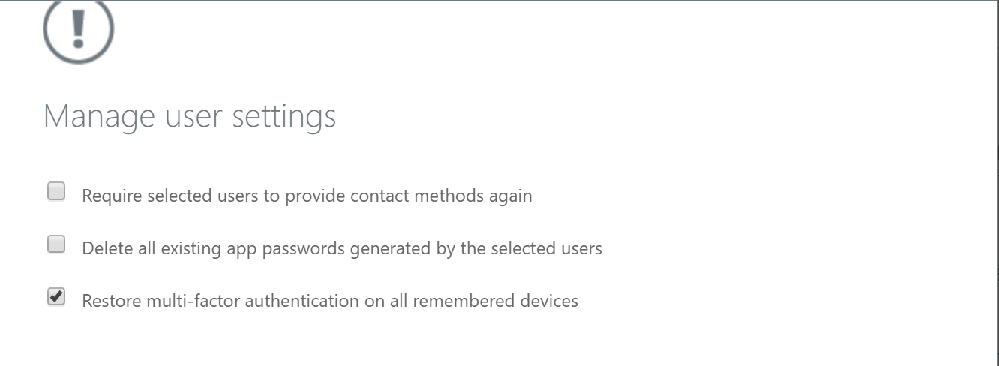
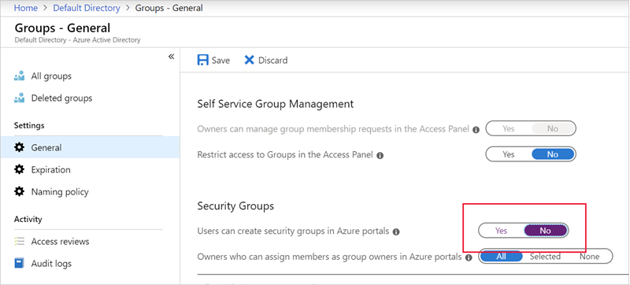

Identity management is key to granting access and to the security enhancement of corporate assets. To secure and control your cloud-based assets, you must manage identity and access for your Azure administrators, application developers, and application users.

## IAM recommendations

Here are the recommendations for identity and access management. Included with each recommendation are the basic steps to follow in the Azure portal. You should perform these steps with your own subscription using your own resources to validate the security for each. Keep in mind that **Level 2** options might restrict some features or activities, so carefully consider which security options you decide to enforce.

> [!IMPORTANT]
> You must be an administrator for the Azure Active Directory to perform some of these checks.

### Restrict access to the Azure AD administration portal - Level 1

All non-administrators should not have access due to the sensitive data and the rules of least privilege.

1. Sign in to the <a href="https://portal.azure.com/learn.docs.microsoft.com" data-linktype="external" target="az-portal">Azure portal </a>.

1. On the Azure portal **Home** page, in the top search box, search for and select *Azure Active Directory*. The **Azure Active Directory Overview** pane appears.

1. In the left menu pane, under **Manage**, select **Users**. The **Users | All users** pane appears.

1. In the left menu pane, select **User settings**. The **Users - User settings** pane appears.

1. Under **Administration portal**, ensure that **Restrict access to Azure AD administration portal** is set to **Yes**. Setting this value to **Yes** prevents all non-administrators from accessing any data in the Azure AD administration portal, but does not restrict access for PowerShell or another client, such as Visual Studio.

    :::image type="content" source="../media/2-restrict-access-ad-portal.png" alt-text="Screenshot of the Azure portal showing the Restrict access to Azure AD administration portal option.":::

### Enable Azure AD Multi-Factor Authentication (MFA) - Level 2

Enable MFA for privileged and non-privileged users.

1. Sign in to the <a href="https://portal.azure.com/learn.docs.microsoft.com" data-linktype="external" target="az-portal">Azure portal </a>.

1. On the Azure portal **Home** page, in the top search box, search for and select *Azure Active Directory*. The **Overview** pane appears for **Azure Active Directory**.

1. In the left menu pane, under **Manage**, select **Users**. The **Users | All users** pane appears.

1. Select **Multi-Factor Authentication**.

1. Ensure that **Multi-Factor Authentication Status** is **Enabled** for all users who are co-Administrators, Owners, or Contributors.

    

### Block remembering MFA on trusted devices - Level 2

Remember that the MFA feature for devices and browsers that are trusted by the user is a free feature for all MFA users. Users can bypass subsequent verifications for a specified number of days, after they've successfully signed in to a device by using MFA.

> [!IMPORTANT]
> If an account or device is compromised, remembering Multi-Factor Authentication for trusted devices can negatively affect security.

1. Sign in to the <a href="https://portal.azure.com/learn.docs.microsoft.com" data-linktype="external" target="az-portal">Azure portal </a>.

1. On the Azure portal **Home** page, in the top search box, search for and select *Azure Active Directory*. The **Overview** pane appears for **Azure Active Directory**.

1. In the left menu pane, under **Manage**, select **Users**. The **Users | All users** pane appears.

1. Select **Multi-Factor Authentication**.

1. Select **users**, and then select **Manage user settings**.

1. Ensure that **Restore multi-factor authentication on all remembered devices** is checked.

    

### About guests - Level 1

Ensure that no guest users exist, or alternatively, if the business requires guest users, ensure to limit their permissions.

1. Sign in to the <a href="https://portal.azure.com/learn.docs.microsoft.com" data-linktype="external" target="az-portal">Azure portal </a>.

1. On the Azure portal **Home** page, in the top search box, search for and select *Azure Active Directory*. The **Overview** pane appears for **Azure Active Directory**.

1. In the left menu pane, under **Manage**, select **Users**. The **Users | All users** pane appears.

1. In the *Search users* search box, enter *guest*, and verify that no guest users exist depending on your requirements (`USER TYPE=Guest`).

    :::image type="content" source="../media/2-guest-users.png" alt-text="Screenshot of the Azure portal showing Azure AD all users listing with a single guest user shown."::::

### Password options

**Notify users on password resets - Level 1**  
**Notify all admins when other admins reset passwords - Level 2**  
**Require two methods to reset passwords - Level 1**

With MFA set, an attacker would require compromising both the identity forms before they could maliciously reset a user's password.

1. Sign in to the <a href="https://portal.azure.com/learn.docs.microsoft.com" data-linktype="external" target="az-portal">Azure portal </a>.

1. On the Azure portal **Home** page, in the top search box, search for and select *Azure Active Directory*. The **Overview** pane appears for **Azure Active Directory**.

1. In the left menu pane, under **Manage**, select **Users**. The **Users | All users** pane appears.

1. In the left menu pane, select **Password reset**. The **Password reset** pane appears.

1. Go to **Authentication methods**.

1. Set the **Number of methods required to reset** to *2*.

    :::image type="content" source="../media/2-require-two-methods.png" alt-text="Screenshot of the Azure portal showing Azure AD password reset authentication methods pane with number of methods required to reset set to 2.":::

### Establish an interval for reconfirming user authentication methods - Level 1

If authentication reconfirmation is set to disabled, registered users will never be prompted to reconfirm their authentication information.

1. Sign in to the <a href="https://portal.azure.com/learn.docs.microsoft.com" data-linktype="external" target="az-portal">Azure portal </a>.

1. On the Azure portal **Home** page, in the top search box, search for and select *Azure Active Directory*. The **Overview** pane appears for **Azure Active Directory**.

1. In the left menu pane, under **Manage**, select **Users**. The **Users | All users** pane appears.

1. In the left menu pane, select **Password reset**. The **Password reset** pane appears.

1. Go to **Registration**.

1. Ensure that **Number of days before users are asked to reconfirm their authentication information** is not set to *0*. The default is 180 days.

    :::image type="content" source="../media/2-days-till-re-confirm.png" alt-text="Screenshot of the Azure portal showing the form for number of days to re-confirm info.":::

### Members and guests can invite - Level 2

This should be set to **No**. Restricting invitations through administrators only ensures that only authorized accounts have access Azure resources.

1. Sign in to the <a href="https://portal.azure.com/learn.docs.microsoft.com" data-linktype="external" target="az-portal">Azure portal </a>.

1. On the Azure portal **Home** page, in the top search box, search for and select *Azure Active Directory*. The **Overview** pane appears for **Azure Active Directory**.

1. In the left menu pane, under **Manage**, select **Users**. The **Users | All users** pane appears.

1. In the left menu pane, select **User settings**. The **Users | User settings** pane appears.

1. Go to **External users**, and select **External collaboration settings**.

1. Ensure that **Members can invite** is set to *No*.

### Users to create and manage security groups - Level 2

When this feature is enabled, all users in AAD are allowed to create new security groups. Security Group creation should be restricted to administrators.

1. Sign in to the <a href="https://portal.azure.com/learn.docs.microsoft.com" data-linktype="external" target="az-portal">Azure portal </a>.

1. On the Azure portal **Home** page, in the top search box, search for and select *Azure Active Directory*. The **Overview** pane appears for **Azure Active Directory**.

1. In the left menu pane, under **Manage**, select **Groups**. The **Groups | All groups** pane appears.

1. Go to **General settings**.

1. Ensure that **Users can create security groups** is set to *No*.

    

### Self-service group management enabled - Level 2

Until your business requires this delegation to various users it is a best practice to disable this feature.

1. Sign in to the <a href="https://portal.azure.com/learn.docs.microsoft.com" data-linktype="external" target="az-portal">Azure portal </a>.

1. On the Azure portal **Home** page, in the top search box, search for and select *Azure Active Directory*. The **Overview** pane appears for **Azure Active Directory**.

1. In the left menu pane, under **Manage**, select **Groups**. The **Groups | All groups** pane appears.

1. Go to **General settings**.

1. Ensure that **Self-service group management enabled** is set to *No*.

    

### Application options - Allow users to register apps - Level 2

Require administrators to register custom applications.

1. Sign in to the <a href="https://portal.azure.com/learn.docs.microsoft.com" data-linktype="external" target="az-portal">Azure portal </a>.

1. On the Azure portal **Home** page, in the top search box, search for and select *Azure Active Directory*. The **Overview** pane appears for **Azure Active Directory**.

1. In the left menu pane, under **Manage**, select **Users**. The **Users | All users** pane appears.

1. In the left menu pane, select **User settings**. The **Users | User settings** pane appears.

1. Ensure that **App registrations** is set to *No*.

    

> [!TIP]
> Remember to select **Save** if you make changes to any of the settings.
