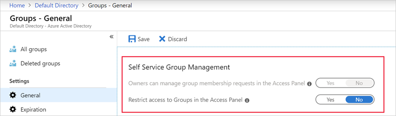
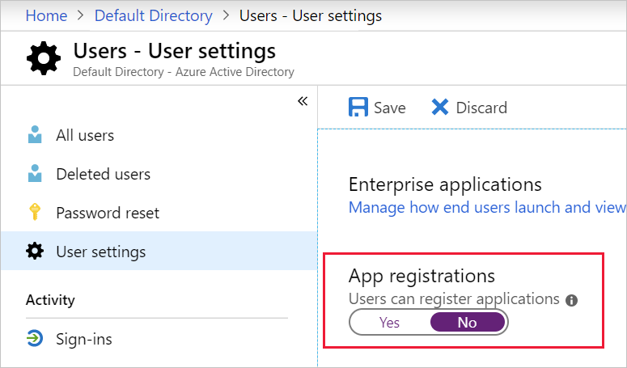

Identity management is key to granting access and to the security enhancement of corporate assets. To secure and control your cloud-based assets, you must manage identity and access for your Azure administrators, application developers, and application users.

## IAM recommendations

Here are the recommendations for identity and access management. Included with each recommendation are the basic steps to follow in the Azure portal. You should perform these steps with your own subscription using your own resources to validate the security for each. Keep in mind that **Level 2** options might restrict some features or activities, so carefully consider which security options you decide to enforce.

> [!IMPORTANT]
> You must be an administrator for the Azure Active Directory (Azure AD) to perform some of these checks.

### Restrict access to the Azure AD administration portal - Level 1

All non-administrators shouldn't have access due to the sensitive data and the rules of least privilege.

1. Sign in to the [Azure portal](https://portal.azure.com).

1. On the Azure portal **Home** page, in the top search box, search for and select *Azure Active Directory*. The **Azure Active Directory Overview** pane displays.

1. In the left menu pane, under **Manage**, select **Users**. The **Users | All users** pane displays.

1. In the left menu pane, select **User settings**. The **Users - User settings** pane displays.

1. Under **Administration portal**, ensure that **Restrict access to Azure AD administration portal** is set to **Yes**. Setting this value to **Yes** prevents all non-administrators from accessing any data in the Azure AD administration portal, but doesn't restrict access for PowerShell or another client, such as Visual Studio.

    :::image type="content" source="../media/2-restrict-access-ad-portal.png" alt-text="Screenshot of the Azure portal that shows the Restrict access to Azure AD administration portal option.":::

### Enable Azure AD Multi-Factor Authentication (MFA) - Level 2

Enable MFA for privileged and non-privileged users.

1. Sign in to the [Azure portal](https://portal.azure.com).

1. On the Azure portal **Home** page, in the top search box, search for and select *Azure Active Directory*. The **Overview** pane displays for **Azure Active Directory**.

1. In the left menu pane, under **Manage**, select **Users**. The **Users | All users** pane displays.

1. Select **Per-user MFA**.

    :::image type="content" source="../media/2-create-an-identity-access-management-iam/azure-ad-multifactor-authentication-option-azure-portal.png" alt-text="Screenshot that shows the multifactor authentication option in the Azure AD pane of the Azure portal.":::

1. Ensure that **Multi-Factor Auth Status** is **Enabled** for all users who are co-Administrators, Owners, or Contributors.

### Block remembering MFA on trusted devices - Level 2

Remember that the MFA feature for devices and browsers that are trusted by the user is a free feature for all MFA users. Users can bypass subsequent verifications for a specified number of days, after they've successfully signed in to a device by using MFA.

> [!IMPORTANT]
> If an account or device is compromised, remembering multifactor authentication for trusted devices can negatively affect security.

1. Sign in to the [Azure portal](https://portal.azure.com).

1. On the Azure portal **Home** page, in the top search box, search for and select *Azure Active Directory*. The **Overview** pane displays for **Azure Active Directory**.

1. In the left menu pane, under **Manage**, select **Users**. The **Users | All users** pane displays.

1. Select **Per-user MFA**.

1. Select a user, and then select **Manage user settings**.

    :::image type="content" source="../media/2-create-an-identity-access-management-iam/azure-ad-multifactor-authentication-window.png" alt-text="Screenshot that shows the Azure AD multifactor authentication users window.":::

1. Select the **Restore multi-factor authentication on all remembered devices** checkbox, and then select **Save**.

    :::image type="content" source="../media/2-create-an-identity-access-management-iam/azure-ad-multifactor-authentication-user-settings.png" alt-text="Screenshot that shows the multifactor authentication manage user settings options.":::

### About guests - Level 1

Ensure that no guest users exist, or alternatively, if the business requires guest users, ensure to limit their permissions.

1. Sign in to the [Azure portal](https://portal.azure.com).

1. On the Azure portal **Home** page, in the top search box, search for and select *Azure Active Directory*. The **Overview** pane displays for **Azure Active Directory**.

1. In the left menu pane, under **Manage**, select **Users**. The **Users | All users** pane displays.

1. Next to the *Search users* search box, select **Add filters**.

1. For *Filters*, select **User type**, for *Value*, select **Guest**, and then select **Apply** to verify that no guest users exist.

    :::image type="content" source="../media/2-create-an-identity-access-management-iam/azure-ad-guest-users-verification.png" alt-text="Screenshot of the Azure portal that shows Azure AD filtering for guest users.":::

### Password options

**Notify users on password resets - Level 1**  
**Notify all admins when other admins reset passwords - Level 2**  
**Require two methods to reset passwords - Level 1**

With multifactor authentication set, an attacker would require compromising both of the identity forms before they could maliciously reset a user's password.

1. Sign in to the [Azure portal](https://portal.azure.com).

1. On the Azure portal **Home** page, in the top search box, search for and select *Azure Active Directory*. The **Overview** pane displays for **Azure Active Directory**.

1. In the left menu pane, under **Manage**, select **Users**. The **Users | All users** pane displays.

1. In the left menu pane, select **Password reset**. The **Password reset** pane displays.

1. Go to **Authentication methods**.

1. Set the **Number of methods required to reset** to *2*.

    :::image type="content" source="../media/2-require-two-methods.png" alt-text="Screenshot of the Azure portal that shows the Azure AD password reset authentication methods pane with number of methods required to reset set to 2.":::

### Establish an interval for reconfirming user authentication methods - Level 1

If authentication reconfirmation is set to disabled, registered users will never be prompted to reconfirm their authentication information.

1. Sign in to the [Azure portal](https://portal.azure.com).

1. On the Azure portal **Home** page, in the top search box, search for and select *Azure Active Directory*. The **Overview** pane displays for **Azure Active Directory**.

1. In the left menu pane, under **Manage**, select **Users**. The **Users | All users** pane displays.

1. In the left menu pane, select **Password reset**. The **Password reset** pane displays.

1. Go to **Registration**.

1. Ensure that **Number of days before users are asked to reconfirm their authentication information** isn't set to *0*. The default is 180 days.

    :::image type="content" source="../media/2-days-till-re-confirm.png" alt-text="Screenshot of the Azure portal that shows the form for number of days to reconfirm info.":::

### Guest invite setting - Level 2

This setting should be set so that only administrators can invite guest users. Restricting invitations through administrators ensures that only authorized accounts have access to Azure resources.

1. Sign in to the [Azure portal](https://portal.azure.com).

1. On the Azure portal **Home** page, in the top search box, search for and select *Azure Active Directory*. The **Overview** pane displays for **Azure Active Directory**.

1. In the left menu pane, under **Manage**, select **Users**. The **Users | All users** pane displays.

1. In the left menu pane, select **User settings**. The **Users | User settings** pane displays.

1. Go to **External users**, and select **Manage external collaboration settings**.

1. Under *Guest invite settings*, ensure that **Only users assigned to specific admin roles can invite guest users** is selected.

### Users to create and manage security groups - Level 2

When this feature is enabled, all users in Azure AD are allowed to create new security groups. Security Group creation should be restricted to administrators.

1. Sign in to the [Azure portal](https://portal.azure.com).

1. On the Azure portal **Home** page, in the top search box, search for and select *Azure Active Directory*. The **Overview** pane displays for **Azure Active Directory**.

1. In the left menu pane, under **Manage**, select **Groups**. The **Groups | All groups** pane displays.

1. Under *Settings*, select **General**.

1. Under *Security Groups*, ensure that *Users can create security groups in Azure portals, API or PowerShell* is set to **No**.

    :::image type="content" source="../media/2-create-an-identity-access-management-iam/azure-ad-security-group-settings.png" alt-text="Screenshot that shows the Groups General settings pane with the 'users can create security groups' option set to No.":::

### Self-service group management enabled - Level 2

Until your business requires this delegation to various users, it's a best practice to disable this feature.

1. Sign in to the [Azure portal](https://portal.azure.com).

1. On the Azure portal **Home** page, in the top search box, search for and select *Azure Active Directory*. The **Overview** pane displays for **Azure Active Directory**.

1. In the left menu pane, under **Manage**, select **Groups**. The **Groups | All groups** pane displays.

1. Go to **General settings**.

1. Ensure that the **Self-service group management** options are set to *No*.

    

### Application options - Allow users to register apps - Level 2

Require administrators to register custom applications.

1. Sign in to the [Azure portal](https://portal.azure.com).

1. On the Azure portal **Home** page, in the top search box, search for and select *Azure Active Directory*. The **Overview** pane displays for **Azure Active Directory**.

1. In the left menu pane, under **Manage**, select **Users**. The **Users | All users** pane displays.

1. In the left menu pane, select **User settings**. The **Users | User settings** pane displays.

1. Ensure that **App registrations** is set to **No**.

    

> [!TIP]
> Remember to select **Save** if you make changes to any of the settings.
