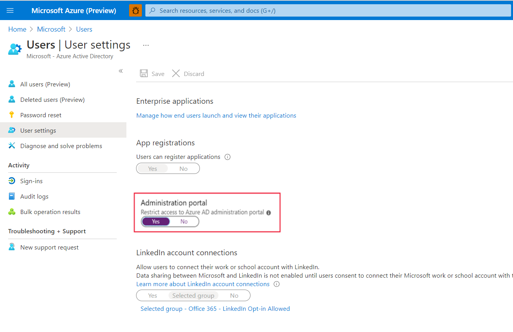
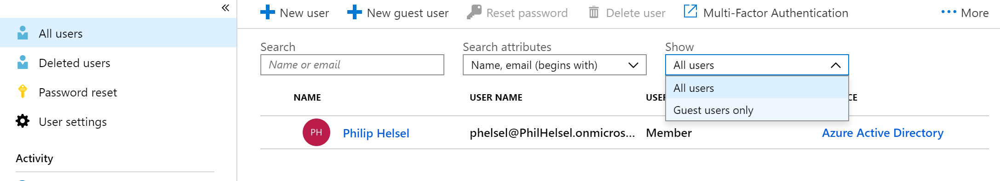
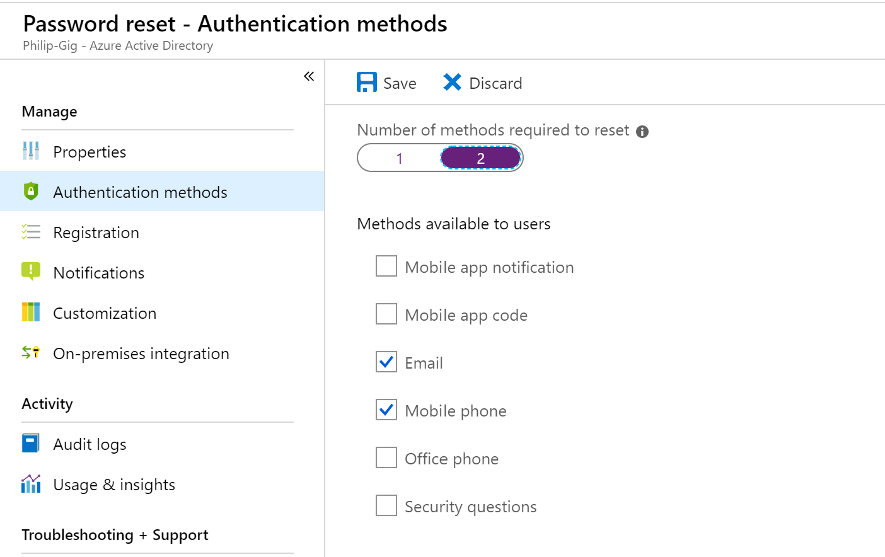
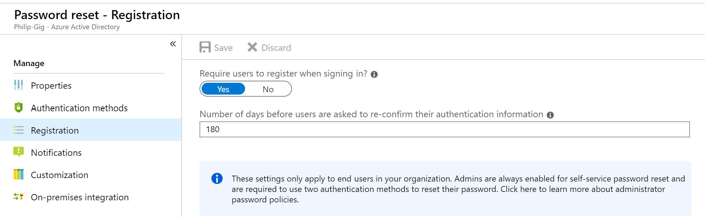
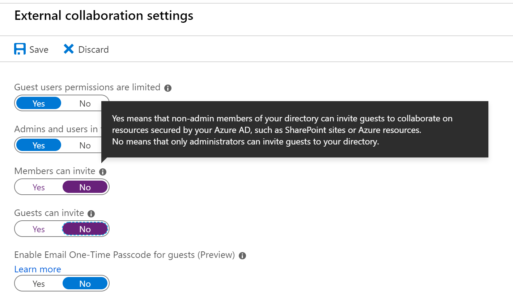

Identity management is key to granting access and to the security enhancement of corporate assets. To secure and control your cloud-based assets you must manage identity and access for your Azure administrators, application developers, and application users.

## IAM recommendations

Here are the recommendations for identity and access management. Included with each recommendation are the basic steps to follow in the Azure portal. You should perform these steps on your own subscription with your own resources to validate the security for each. Keep in mind that **Level 2** options might restrict some features or activity, so carefully consider which security options you decide to enforce.

> [!IMPORTANT]
> You must be an administrator for the Azure Active Directory to perform some of these checks.

### Restrict access to the Azure AD administration portal - Level 1

All non-Administrators should not have access due to the sensitive data and the rules of least privilege.

1. Sign in to the Azure portal.
1. On the left, select **Azure Active Directory** > **Users** or **Groups**.
1. Go to **User settings**.
1. Ensure that **Restrict access to Azure AD administration portal** is set to **Yes**. Setting this value to **Yes** restricts all non-administrators from accessing any Azure AD data in the administration portal, but does not restrict such access using PowerShell or another client such as Visual Studio.

    

### Enable Azure Multi-Factor Authentication (MFA) - Level 2

Enable it for privileged and non-privileged users.

1. Sign in to the Azure portal.
1. On the left, select **Azure Active Directory** > **Users** > **All users**.
1. Select **Multi-Factor Authentication**. This will open a new window.
1. Ensure that **Multi-Factor Authentication Status** is **Enabled** for all users who are co-Administrators, Owners, or Contributors

    

### Block remembering MFA on trusted devices - Level 2

Remember Multi-Factor Authentication feature for devices and browsers that are trusted by the user is a free feature for all Multi-Factor Authentication users. Users can bypass subsequent verifications for a specified number of days, after they've successfully signed-in to a device by using Multi-Factor Authentication. **If an account or device is compromised, remembering Multi-Factor Authentication for trusted devices can negatively affect security**.

1. Sign in to the Azure portal.
1. On the left, select **Azure Active Directory** > **Users** > **All users**.
1. Select **Multi-Factor Authentication**.
1. Select **users**, then click **Manage users settings**.
1. Ensure that **Restore multi-factor authentication on all remembered devices** is **Selected**.

    

### About guests - Level 1

Ensure that no guest users exist, or alternatively if the business requires guest users, ensure to limit their permissions.

1. Sign in to the Azure portal.
1. On the left, select **Azure Active Directory** > **Users** > **All users**.
1. Select the **Show** drop down and select **Guest users only**.
1. Verify that there are no guest users listed (`USER TYPE=Guest`).

    

### Password options

**Notify users on password resets - Level 1**  
**Notify all admins when other admins reset passwords - Level 2**  
**Require two methods to reset passwords - Level 1**

With dual identification set, an attacker would require compromising both the identity forms before they could maliciously reset a user's password.

1. Sign in to the Azure portal.
1. On the left, select **Azure Active Directory** > **Users**.
1. Select **Password reset**.
1. Go to **Authentication methods**.
1. Set the **Number of methods required to reset** to **2**.

    

### Establish an interval for reconfirming user authentication methods - Level 1

If authentication reconfirmation is set to disabled, register users will never be prompted to re-confirm their authentication information.

1. Sign in to the Azure portal.
1. On the left, select **Azure Active Directory** > **Users**.
1. Go to **Password reset**.
1. Go to **Registration**
1. Ensure that **Number of days before users are asked to re-confirm their authentication information** is not set to **0**. The default is 180 days.

    

### Members and guests can invite - Level 2

This should be set to **No**. Restricting invitations through administrators only ensures that only authorized accounts have access Azure resources.

1. Sign in to the Azure portal.
1. On the left, select **Azure Active Directory** > **Users**.
1. Go to **User settings**.
1. Go to **External users**, click **Manage external collaboration settings**.
1. Ensure that **Members can invite** is set to **No**.

    

### Users to create and manage security groups - Level 2

When this feature is enabled, all users in AAD are allowed to create new security groups. Security Group creation should be restricted to administrators.

1. Sign in to the Azure portal.
1. On the left, select **Azure Active Directory** > **Groups**
1. Go to **General settings**.
1. Ensure that **Users can create security groups** is set to **No**.

    

### Self-service group management enabled - Level 2

Until your business requires this delegation to various users, it is a best practice to disable this feature.

1. Sign in to the Azure portal.
1. On the left, select **Azure Active Directory** > **Groups**
1. Go to **General settings**.
1. Ensure that **Self-service group management enabled** is set to **No**.

    

### Application options - Allow users to register apps - Level 2**

Require administrators to register custom applications.

1. Sign in to the Azure portal.
1. On the left, select **Azure Active Directory** > **Users**
1. Go to **User settings**.
1. Ensure that **User can register applications** is set to **No**.

    

> [!TIP]
> Remember to select **Save** if you make changes to any of the settings.
