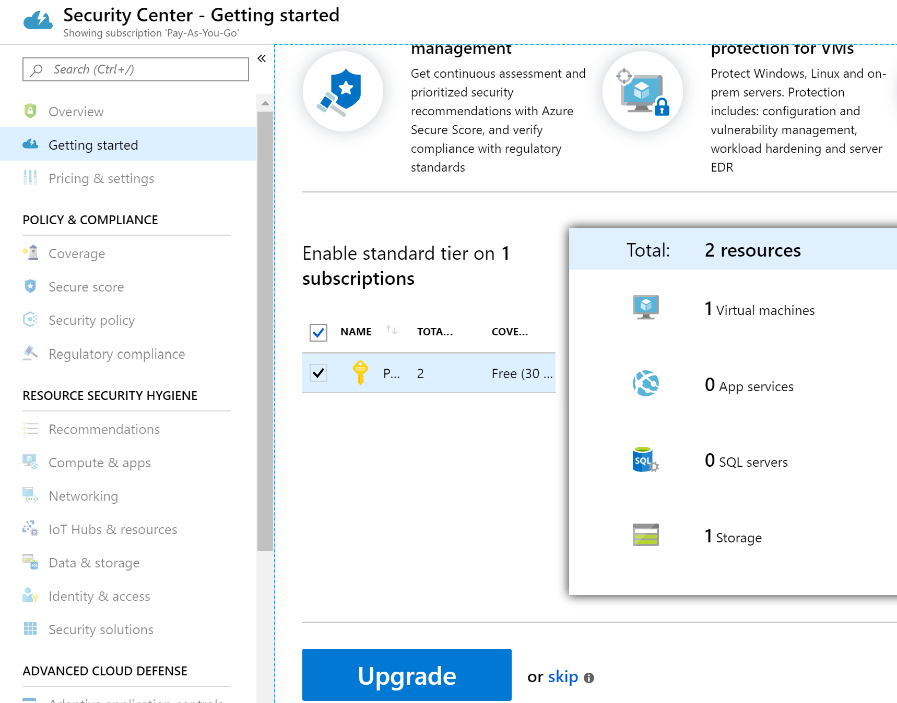
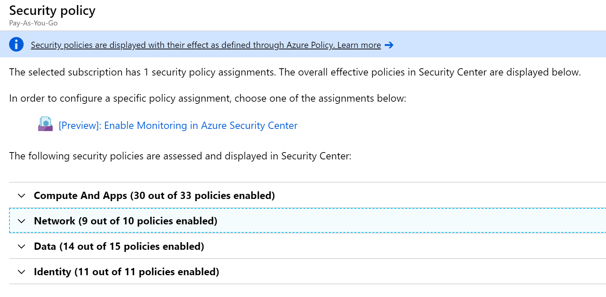
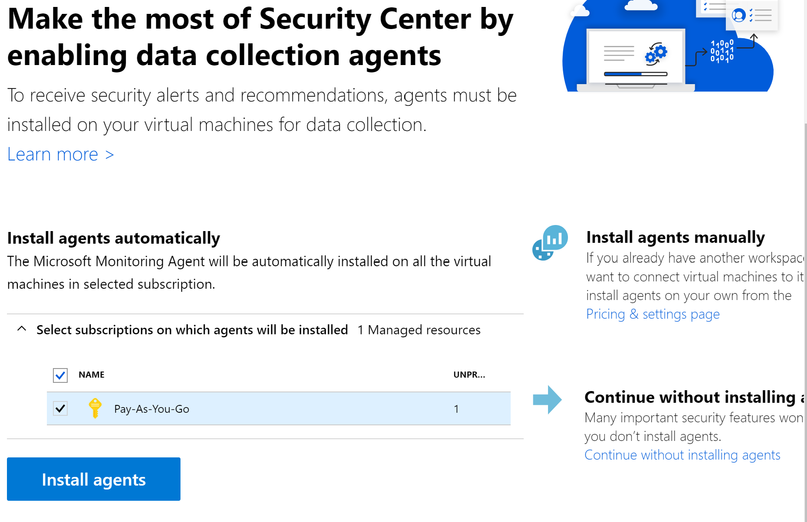
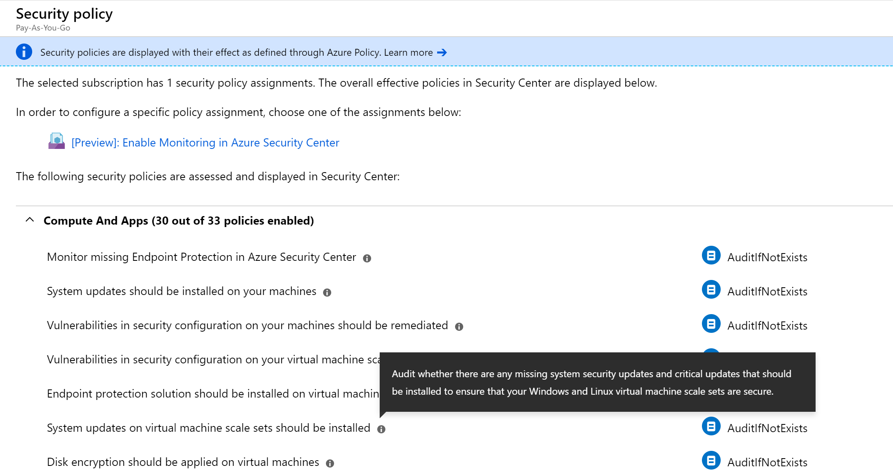
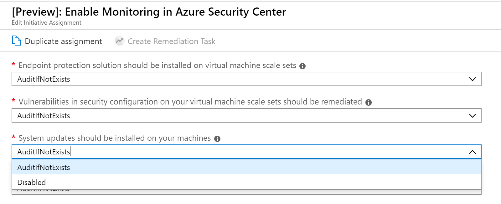
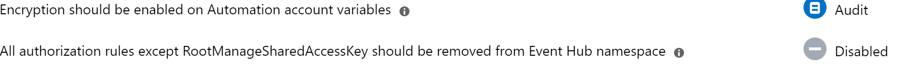
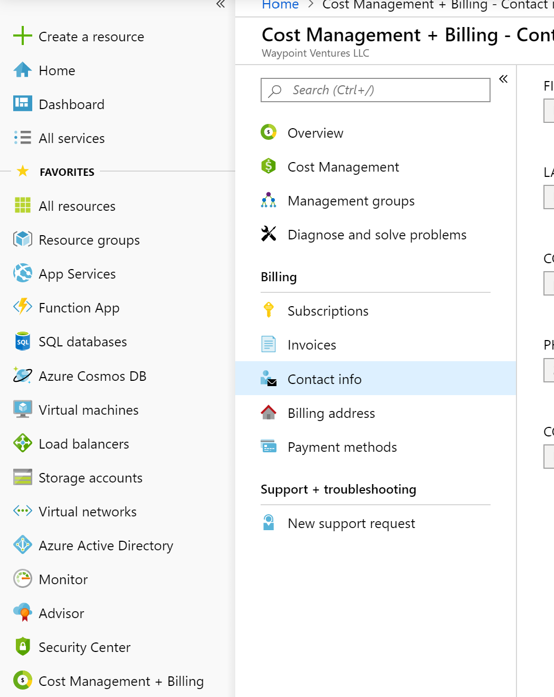

Azure Security Center provides unified security management and advanced threat protection for workloads running in Azure, on-premises, and in other clouds. The following Security Center recommendations, if followed, will set various security policies on an Azure subscription.

These policies define the set of controls that are recommended for your resources with an Azure subscription.

## Azure Security Center recommendations

Here are the recommendations for setting up Azure Security Center. Included with each recommendation are the basic steps to follow in the Azure portal. You should perform these steps with your own subscription using your own resources to validate the security for each. Keep in mind that **Level 2** options might restrict some features or activity, so carefully consider which security options you decide to enforce.

### Enable the Standard pricing tier - Level 2

Azure Security Center is offered in two pricing tiers, **Free** and **Standard**. The Standard tier extends the capabilities of the Free tier to workloads running in private and other public clouds, providing unified security management and threat protection across your hybrid cloud workloads. The Standard tier also adds advanced threat detection capabilities, which uses built-in behavioral analytics and machine learning to identify attacks and zero-day exploits, access and application controls to reduce exposure to network attacks and malware, and more. Azure Security Center Standard supports Azure resources including virtual machines (VMs), virtual machine scale sets, App Service, SQL servers, threat detection provided with Microsoft Security Response Center, and Storage accounts.

1. Sign in to the <a href="https://portal.azure.com/learn.docs.microsoft.com" data-linktype="external" target="az-portal">Azure portal </a>.

1. In resource menu, select **Security Center**. The **Security Center** Overview pane appears.

1. Select the subscription that will be upgraded to Standard.

1. Select **Pricing tier**.

1. Select **Standard** to upgrade.

1. Select **Save**.

    > [!NOTE]
    > If you're still in a free tier, the portal might lock on the **Getting started** option, shown in the following screenshot. You can enable the Standard tier from this pane as well.

    

### Azure Security Center built-in security polices

The policies are grouped into four functional groups as follows.

   

The enabled policies define the Azure Security Center recommendations. Currently, *Enable Monitoring in Azure Security Center* is in **Preview** so the listed policies are subject to change.

### Enable the automatic provision of a monitoring agent - Level 1

When automatic provisioning is enabled, Security Center installs the Microsoft Monitoring Agent on all supported Azure VMs and any new ones that are created. **Automatic provisioning is strongly recommended**.

1. Sign in to the <a href="https://portal.azure.com/learn.docs.microsoft.com" data-linktype="external" target="az-portal">Azure portal </a>.

1. In the **Security Center** Overview menu, under **Management**, select **Security policy**. The **Security Center** Security Policy pane appears.

1. In the list of management groups and subscription, select the subscription on which agents will be installed.

1. Select **Install agents**.

    

### Enable System Updates - Level 1

Azure Security Center monitors daily Windows and Linux VMs and computers for missing operating system updates. Security Center retrieves a list of available security and critical updates from *Windows Update* or *Windows Server Update Services (WSUS)*, depending on which service is configured on a Windows computer. Security Center also checks for the latest updates in Linux systems. If your VM or computer is missing a system update, Security Center will recommend that you apply system updates.

1. Sign in to the <a href="https://portal.azure.com/learn.docs.microsoft.com" data-linktype="external" target="az-portal">Azure portal </a>.

1. On the **Security Center Overview** pane, in the left menu pane, under **Management**, select **Security policy**. The **Security policy** pane appears for the **Security Center**.

1. Under **Policy Management**, select a subscription or management group from the list.

1. Check that **System updates should be installed on your machines** is one of the policies.

1. Select the **Enable Monitoring in Azure Security Center** link.

    

1. In this example, the Azure Security Center agent has not been deployed to a VM or physical machine so the message **AuditIfNotExists** appears. AuditIfNotExists enables auditing on resources that match the if condition. If the resource is not deployed, **NotExists** appears.

    

    If enabled, **Audit** appears. If deployed but disabled, **Disabled** appears.

    

### Enable Security Configurations - Level 1

Azure Security Center monitors security configurations by applying a set of over 150 recommended rules for hardening the OS, including rules related to firewalls, auditing, password policies, and more. If a machine is found to have a vulnerable configuration, Security Center generates a security recommendation.

1. Sign in to the <a href="https://portal.azure.com/learn.docs.microsoft.com" data-linktype="external" target="az-portal">Azure portal </a>.

1. On the **Security Center Overview** pane, in the left menu pane, under **Management**, select **Security policy**. The **Security policy** pane appears for the **Security Center**.

1. Under **Policy Management**, select a subscription or management group from the list.

1. Check that **Vulnerabilities in security configuration on your virtual machine scale sets should be remediated** is one of the policies.

    > [!NOTE]
    > All of the following policies that have a (\*) in their title are listed in the **Security policies** pane as previously described.

### Enable Endpoint Protection (\*) - Level 1

Endpoint protection is recommended for all VMs.

### Enable Disk Encryption (\*) - Level 1

Azure Security Center recommends that you apply disk encryption if you have Windows or Linux VM disks that are not encrypted using Azure Disk Encryption. Disk Encryption lets you encrypt your Windows and Linux IaaS VM disks. Encryption is recommended for both the OS and data volumes on your VM.

### Enable Network Security Groups (\*) - Level 1

Azure Security Center recommends that you enable a network security group (NSG) if one is not already enabled. NSGs contain a list of Access Control List (ACL) rules that allow or deny network traffic to your VM instances in a virtual network. NSGs can be associated with either subnets or individual VM instances within that subnet. When an NSG is associated with a subnet, the ACL rules apply to all the VM instances in that subnet. In addition, traffic to an individual VM can be restricted further by associating an NSG directly to that VM.

### Enable Web Application Firewall (\*) - Level 1

Azure Security Center may recommend that you add a web application firewall (WAF) from a Microsoft partner to secure your web applications.

### Enable Vulnerability Assessment (\*) - Level 1

The vulnerability assessment in Azure Security Center is part of the Security Center VM recommendations. If Security Center doesn't find a vulnerability assessment solution installed on your VM, it recommends that you install one. A partner agent, after being deployed, starts reporting vulnerability data to the partner's management platform. In turn, the partner's management platform provides vulnerability and health monitoring data back to Security Center.

### Enable Storage Encryption (\*) - Level 1

When this setting is enabled, any new data in Azure Blobs and Files will be encrypted.

### Enable JIT Network Access (\*) - Level 1

Just-in-time (JIT) VM access can be used to lock down inbound traffic to your Azure VMs, reducing exposure to attacks while providing easy access to connect to VMs when needed.

### Enable Adaptive Application Controls (\*) - Level 1

Adaptive application control is an intelligent, automated end-to-end approved application listing solution from Azure Security Center. It helps you control which applications can run on your Azure and non-Azure VMs (Windows and Linux), which, among other benefits, helps harden your VMs against malware. Security Center uses machine learning to analyze the applications running on your VMs, and helps you apply the specific approval rules using this intelligence. This capability greatly simplifies the process of configuring and maintaining approved application policies.

### Enable SQL Auditing & Threat Detection (\*) - Level 1

Azure Security Center will recommend that you turn on auditing and threat detection for all databases on your Azure SQL servers if auditing is not already enabled. Auditing and threat detection can help you maintain regulatory compliance, understand database activity, and gain insight into discrepancies and anomalies that could indicate business concerns or suspected security violations.

### Enable SQL Encryption (\*) - Level 1

Azure Security Center will recommend that you enable Transparent Data Encryption (TDE) on SQL databases if TDE is not already enabled. TDE protects your data and helps you meet compliance requirements by encrypting your database, associated backups, and transaction log files at rest, without requiring changes to your application.

### Set Security Contact Email and Phone Number - Level 1

Azure Security Center will recommend that you provide security contact details for your Azure subscription if you haven't already. This information will be used by Microsoft to contact you if the Microsoft Security Response Center (MSRC) discovers that your customer data has been accessed by an unlawful or unauthorized party. MSRC performs select security monitoring of the Azure network and infrastructure and receives threat intelligence and abuse complaints from third parties.

1. Sign in to the <a href="https://portal.azure.com/learn.docs.microsoft.com" data-linktype="external" target="az-portal">Azure portal </a>.

1. On the Azure **Home** page, in the top search bar, search for and select *Cost Management + Billing*. The **Billing scopes** pane appears for **Cost Management + Billing**.

1. Enter or validate the contact information that appears.

    

### Enable Send me emails about alerts - Level 1

Azure Security Center will recommend that you provide security contact details for your Azure subscription if you haven't already.

1. Sign in to the <a href="https://portal.azure.com/learn.docs.microsoft.com" data-linktype="external" target="az-portal">Azure portal </a>.

1. On the Azure **Home** page, in the top search bar, search for and select *Security Center*. The **Security Center - Overview** pane appears.

1. In the left menu pane, under **Management**, select **Pricing & settings**. The **Pricing & settings** pane appears for **Security Center**.

1. Select the subscription.

1. Select **Email notifications**.

1. Select **Save**.

    

### Enable Send email also to subscription owners - Level 1

Azure Security Center will recommend that you provide security contact details for your Azure subscription if you haven't already.

- Using the previous **Email notifications** form, additional emails can be added separated by commas.

    > [!TIP]
    > Remember to select **Save** if you make changes to any of the settings.
