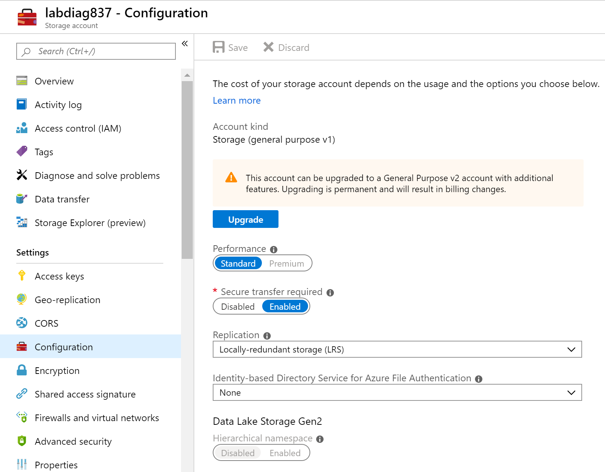
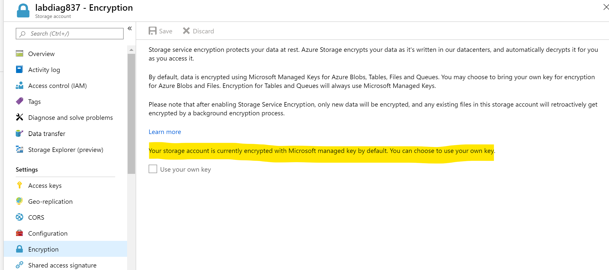
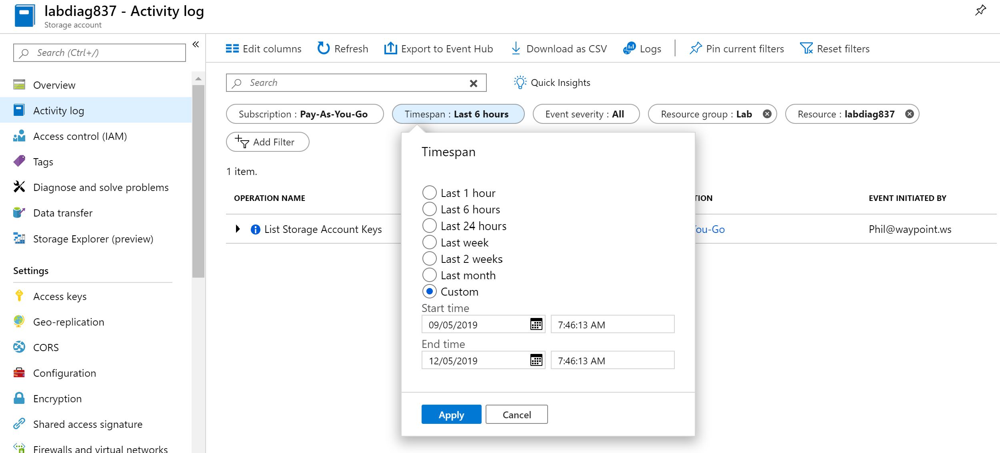
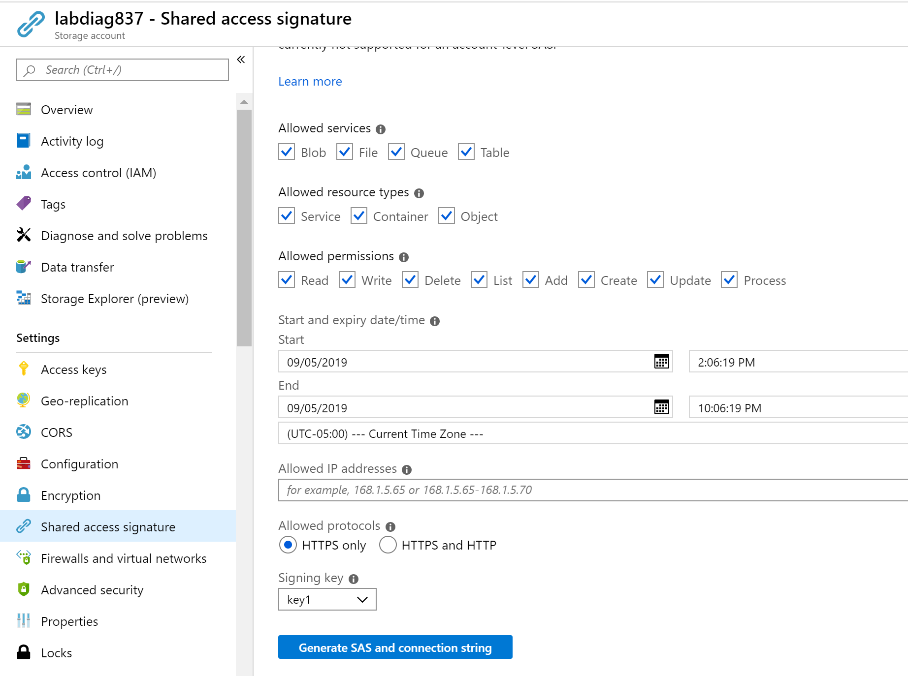
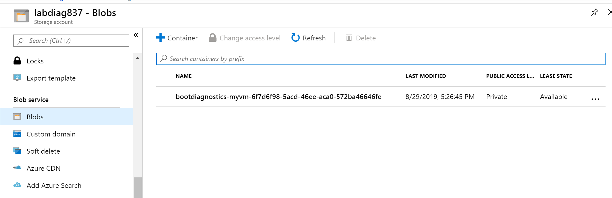

An Azure storage account provides a unique namespace to store and access your Azure Storage data objects.

## Azure Storage account recommendations

Here are the recommendations for setting up Azure Storage accounts. Included with each recommendation are the basic steps to follow in the Azure portal. You should perform these steps on your own subscription with your own resources to validate the security for each. Keep in mind that **Level 2** options might restrict some features or activity, so carefully consider which security options you decide to enforce.

### Require security-enhanced transfers - Level 1

Another step you should take to ensure the security of your Azure Storage data is to encrypt the data between the client and Azure Storage. The first recommendation is to always use the HTTPS protocol, which ensures secure communication over the public Internet. You can enforce the use of HTTPS when calling the REST APIs to access objects in storage accounts by enabling Secure transfer required for the storage account. Connections using HTTP will be refused once this is enabled.

1. Sign in to the Azure portal.

1. Go to **Storage Accounts** under Azure services.

1. Select an existing account.

1. Under Setting, select **Configuration**.

1. Set **Secure Transfer required** to **Enabled**.

    

### Enable binary large object (blob) encryption - Level 1

Azure Blob storage is Microsoft's object storage solution for the cloud. Blob storage is optimized for storing massive amounts of unstructured data. Unstructured data is data that does not adhere to a particular data model or definition, such as text or binary data. Storage service encryption protects your data at rest. Azure Storage encrypts your data as it's written in its datacenters, and automatically decrypts it for you as you access it.

1. Sign in to the Azure portal.

1. Go to **Storage Accounts** under Azure services.

1. Select an existing account.

1. Under Setting, select **Encryption**.

1. Azure Storage encryption is enabled for all new and existing storage accounts and cannot be disabled.

    

### Periodically regenerate access keys - Level 1

When you create a storage account, Azure generates two 512-bit storage access keys, which are used for authentication when the storage account is accessed. Rotating these keys periodically ensures that any inadvertent access or exposure to these keys could be undermined.

1. Sign in to the Azure portal.

1. Go to **Storage Accounts**.

1. Select an existing account.

1. For each storage account, go to **Activity log**.

1. Under the **Timespan** dropdown, select **Custom**, and then select **Start Time** and **End Time** so it creates a 90 day range.

1. Select **Apply**.

    

1. To regenerate storage access keys for a specific storage account if you are not using Azure Key Vault with key rotation:

    ```http
    POST https://management.azure.com/subscriptions/{subscriptionId}/resourceGroups/{resourceGroupName}/providers/Microsoft.Storage/storageAccounts/{accountName}/regenerateKey?api-version=2019-04-01
    ```

### Require Shared Access Signature (SAS) tokens to expire within an hour - Level 1

A shared access signature (SAS) is a URI that grants restricted access rights to Azure Storage resources. You can provide a shared access signature to clients who should not be trusted with your storage account key but to whom you wish to delegate access to certain storage account resources. By distributing a shared access signature URI to these clients, you can grant them access to a resource for a specified period of time, with a specified set of permissions.  
Currently verification of a SAS token expiry times cannot be accomplished. Until Microsoft makes token expiry time as a setting rather than a token creation parameter, this recommendation would require a manual verification.

### Require SAS tokens to be shared only via HTTPS - Level 1

Shared access signature tokens should be allowed only over https protocol.

1. Sign in to the Azure portal.

1. Go to **Storage Accounts**.

1. Select an existing account.

1. For each storage account, go to **Shared Access signature**.

1. Set the **Start and expiry date/time**.

1. Set **Allowed protocols** to **HTTPS only**.

Both SAS features follow.



### Enable Azure Files encryption - Level 1

Azure Disk Encryption is used to encrypt the OS and data disks in IaaS Virtual Machines. Client-side Encryption and SSE are both used to encrypt data in Azure Storage.

1. Sign in to the Azure portal.

1. Go to **Storage Accounts** under Azure services.

1. Select an existing account.

1. Under Setting, select **Encryption**.

1. Azure Storage encryption is enabled for all new and existing storage accounts and cannot be disabled.

    

### Require only private access to blob containers - Level 1

You can enable anonymous, public read access to a container and its blobs in Azure Blob storage. By doing so, you can grant read-only access to these resources without sharing your account key, and without requiring a shared access signature (SAS). By default, a container and any blobs within it may be accessed only by a user that has been given appropriate permissions. To grant anonymous users read access to a container and its blobs, you can set the container public access level. **When you grant public access to a container, then anonymous users can read blobs within a publicly accessible container without authorizing the request**.

1. Sign in to the Azure portal.

1. Go to **Storage Accounts**.

1. For each storage account, go to **Containers** under **BLOB Service**.

1. Ensure that **Public access level** to **Private**.

    

    > [!TIP]
    > Remember to select **Save** if you make changes to any of the settings.
