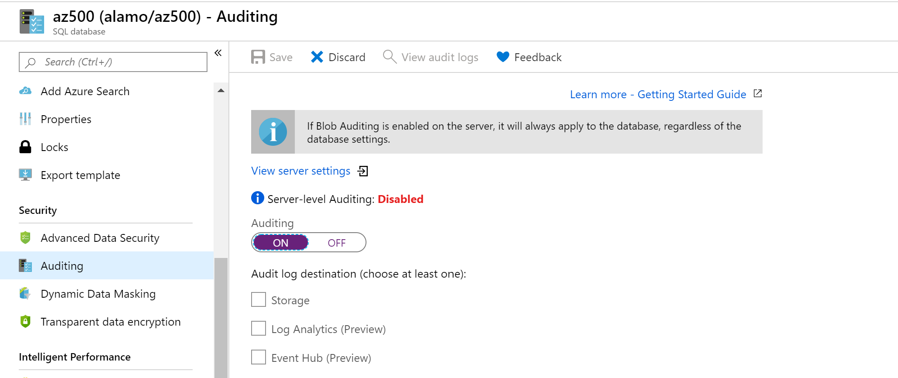
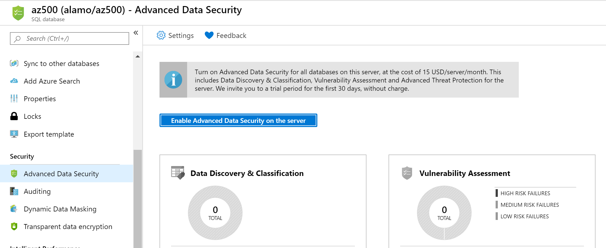
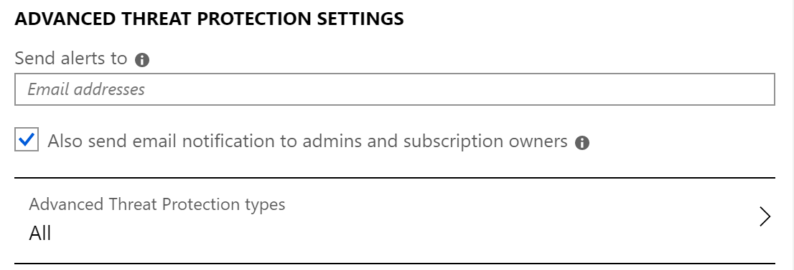
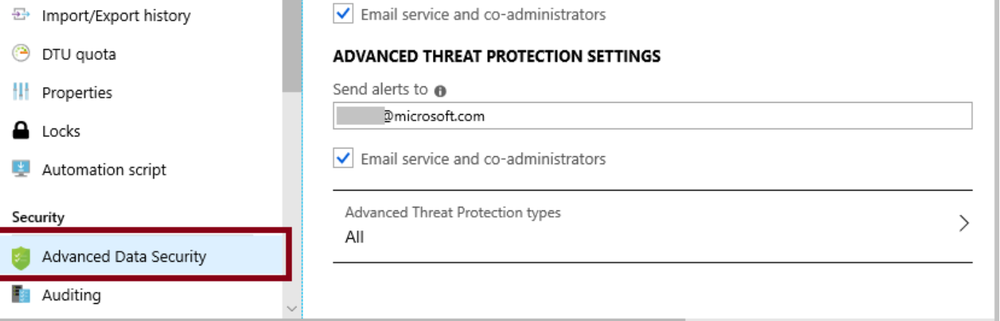
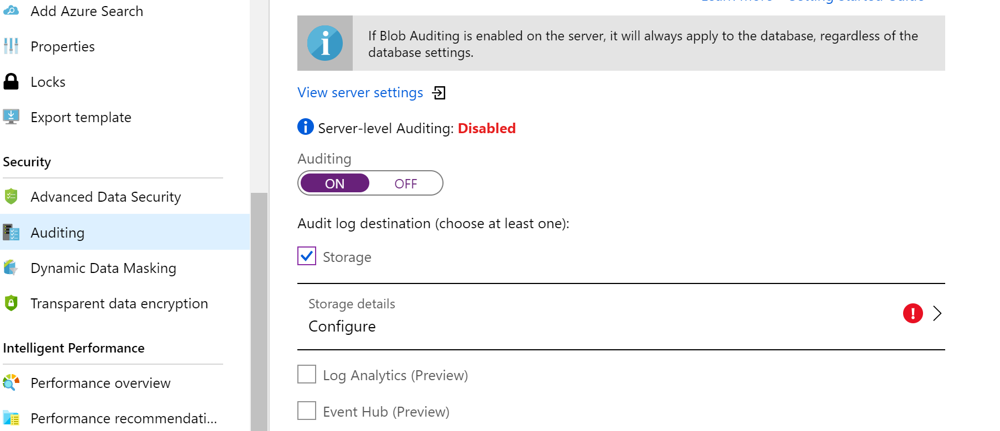
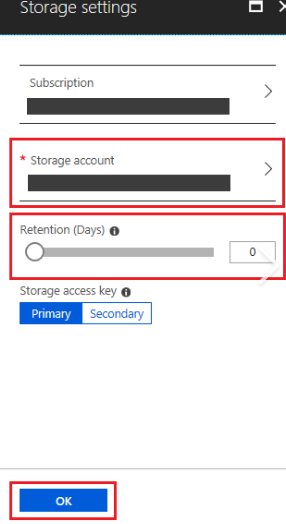
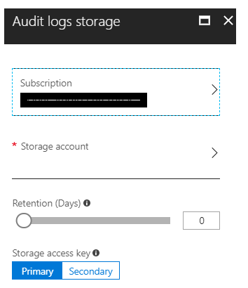

Azure SQL Server is a cloud-based relational database server that supports many of the same features as Microsoft SQL Server. It provides an easy transition from an on-premises database into a cloud-based one with built-in diagnostics, redundancy, security and scalability.

## Azure SQL Server recommendations

Here are the security recommendations to set Azure SQL Server policies. Included with each recommendation are the basic steps to follow in the Azure portal. You should perform these steps on your own subscription with your own resources to validate the security for each. Keep in mind that **Level 2** options might restrict some features or activity, so carefully consider which security options you decide to enforce.

### Enable auditing - Level 1

Auditing for Azure SQL Database and Azure Synapse Analytics tracks database events and writes them to an audit log in your Azure storage account, OMS workspace or Event Hubs. Auditing also:

- Helps you maintain regulatory compliance, understand database activity, and gain insight into discrepancies and anomalies that could indicate business concerns or suspected security violations.
- Enables and facilitates adherence to compliance standards, although it doesn't guarantee compliance.

To turn on Auditing:

1. Sign in to the Azure portal.

1. Go to **SQL databases**.

1. For each DB instance, under **Security**, select **Auditing**.

1. Ensure that Auditing is set to **On**.

    

### Enable a threat detection service - Level 1

Threat detection for single and pooled databases detects anomalous activities indicating unusual and potentially harmful attempts to access or exploit databases. Threat detection can identify Potential SQL injection, Access from unusual location or data center, Access from unfamiliar principal or potentially harmful application, and Brute force SQL credentials. Threat detection is part of the advanced data security (ADS) offering, which is a unified package for advanced SQL security capabilities. Threat detection can be accessed and managed via the central SQL ADS portal.

1. Sign in to the Azure portal.

1. Go to **SQL databases**.

1. For each DB instance, under **Security**, navigate to **Advanced Data Security**.

1. Select **Enable Advanced Data Security on the server**.

    

### Enable all threat detection types - Level 1

Advanced data security (ADS) provides a set of advanced SQL security capabilities, including data discovery & classification, vulnerability assessment, and Advanced Threat Protection (ATP).

Advanced Threat Protection is part of the advanced data security (ADS) offering, which is part of the defense in depth SQL security strategy. Advanced Threat Protection can be accessed and managed via the central SQL ADS portal.

    

### Enable the option to send security alerts - Level 1

You can receive notifications about the detected threats via email notifications or Azure portal.

1. Sign in to the Azure portal.

1. Go to **SQL databases**.

1. For each DB instance, select **Auditing & Threat Detection**.

1. Select **Database settings**.

1. Select **View Advanced Data Security server settings**.

1. Ensure that **Send alerts** is set as appropriate.

    

### Enable the email service and co-administrators - Level 1

Providing the email address to receive alerts ensures that any detection of anomalous activities is reported as soon as possible, making it more likely to mitigate any potential risk sooner.

1. Sign in to the Azure portal.

1. Go to **SQL databases**.

1. For each DB instance, select **Advanced Data Security**.

1. Under **Advanced Threat Protection Setting**, select **Email service and co-administrators**.

    

### Configure audit retention for more than 90 days - Level 1

Audit logs should be preserved for security, discovery, and to meet legal and regulatory compliance.

1. Sign in to the Azure portal.

1. Go to **SQL databases**.

1. For each DB instance, select **Auditing** under the **Security** section.

1. Select you Audit log destination, and then select **Configure**.

    

    The **Storage settings** pane appears.

1. Ensure **Retention (days)** is **greater than 90 days**.

1. Select **OK**.

    

### Configure threat detection retention for more than 90 days - Level 1

A retention of zero days means logs are kept forever. Otherwise, the value can be any number of days between 1 and 2147483647. You should consider keeping the logs for at least 90 days to be able to go backwards to spot thread patterns.

1. Sign in to the Azure portal.

1. Go to **SQL databases**.

1. For each DB instance, select **Auditing** under the **Security** section.

1. Select you Audit log destination, and then select **Configure**.

1. Select **Storage Details**.

1. Ensure **Retention (days)** is **greater than 90 days**.

1. Select **OK**.

1. Select **Save**.

    

    > [!TIP]
    > Remember to select **Save** if you make changes to any of the settings.
