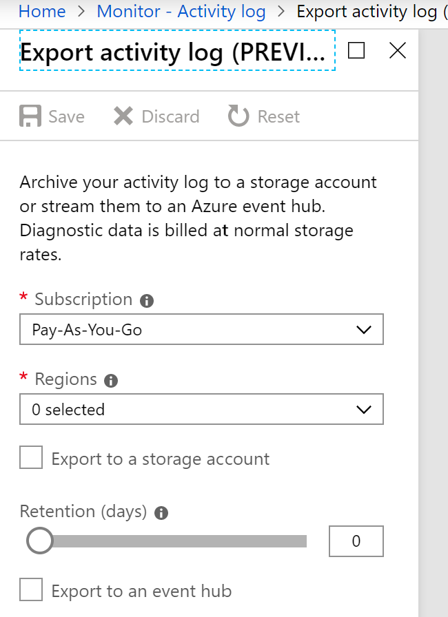
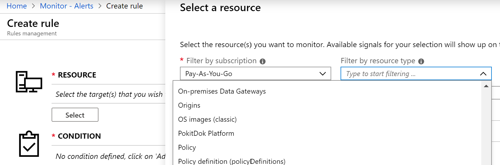
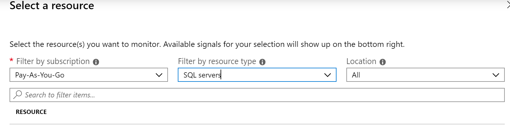

Logging and monitoring are a critical requirement when trying to identify, detect, and mitigate security threats. Having a proper logging policy can ensure you can determine when a security violation has occurred, but also potentially identify the culprit responsible. Azure Activity logs provide data about both external access to a resources and diagnostic logs, which provide information about the operation of that specific resource.

    > [!NOTE]
    > An Azure activity log is a subscription log that provides insight into subscription-level events that have occurred in Azure. Using the activity log, you can determine the what, the who, and the when for any write operations taken on the resources in your subscription.

## Logging policy recommendations

Here are the security recommendations you should follow to set logging and monitoring policies on your Azure subscriptions. Included with each recommendation are the basic steps to follow in the Azure portal. You should perform these steps on your own subscription with your own resources to validate the security for each. Keep in mind that **Level 2** options might restrict some features or activity, so carefully consider which security options you decide to enforce.

### Ensure that a log profile exists - Level 1

The Azure Activity Log provides insight into subscription-level events that have occurred in Azure. This includes a range of data, from Azure Resource Manager operational data to updates on Service Health events. The Activity Log was previously known as Audit Logs or Operational Logs, since the Administrative category reports control-plane events for your subscriptions.
There is a single Activity Log for each Azure subscription. It provides data about the operations on a resource from the outside. Diagnostic Logs are emitted by a resource and provide information about the operation of that resource. You must enable diagnostic settings for each resource.

1. Sign in to the Azure portal.

1. Go to **Monitor**, and then select **Activity log**.

1. Ensure that a **Log Profile** is set. If not, select **Export** to Event Hub.

1. Configure the setting.

1. Select **Save**.

    

### Ensure that activity log retention is set to 365 days or more - Level 1

Setting the Retention (days) to 0 retains the data forever.

- Follow the previous steps. Adjust the **Retention days** slider bar.

### Create an activity log alert for "Creating a policy assignment" - Level 1

 Monitoring when a policy is created illustrates who has that privilege. This may help detect a breach or misconfiguration.

1. Sign in to the Azure portal.

1. Go to **Monitor**, and then select **Alerts**.

1. Select **+ New alert rule**.

1. Select **Resource**.

1. Select **Policy** from the **Filter by resource type** dropdown.

1. Select **Done**.

    

### Create an activity log alert for "Creating, updating, or deleting a Network Security Group" - Level 1

By default, no monitoring alerts are created when NSGs are created/updated/deleted. Changing or deleting a security group can allow internal resources to be accessed from improper sources, or for unexpected outbound network traffic.

1. Sign in to the Azure portal.

1. Go to **Monitor**, and then select **Alerts**.

1. Select **+New alert rule**.

1. Select **Resource type**.

1. Select **Network security group** from the **Filter by resource type** dropdown.

1. Select **Done**.

### Create an activity log alerts for "Creating or updating an SQL Server firewall rule" - Level 1

Monitoring for **Create or update SQL Server Firewall Rule** events gives insight into network access changes and may reduce the time it takes to detect suspicious activity.

1. Sign in to the Azure portal.

1. Go to **Monitor**, and then select **Alerts**.

1. Select **+New alert rule**.

1. Select **Resource type**.

1. Select **SQL servers** from the **Filter by resource type** dropdown.

1. Select **Done**.

    

    > [!TIP]
    > Remember to select **Save** if you make changes to any of the settings.
