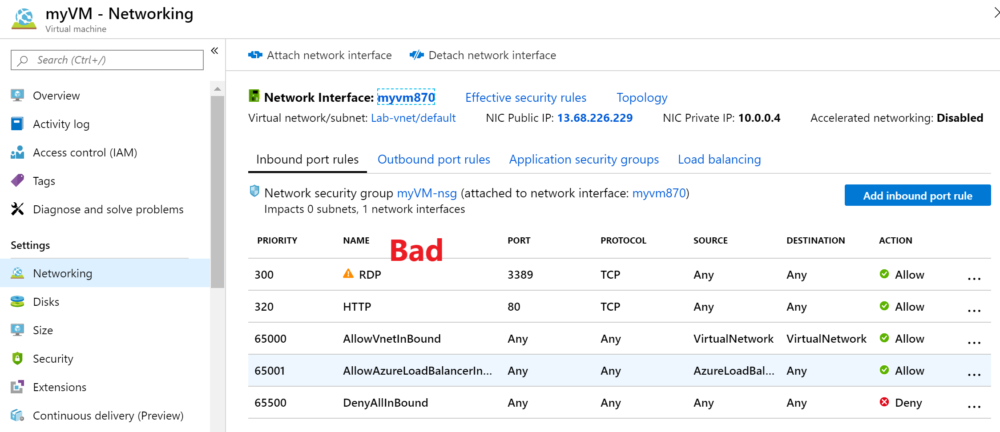
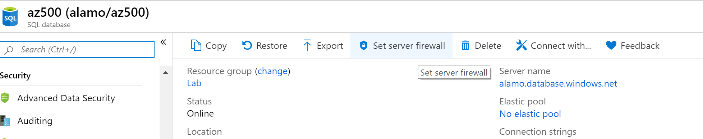
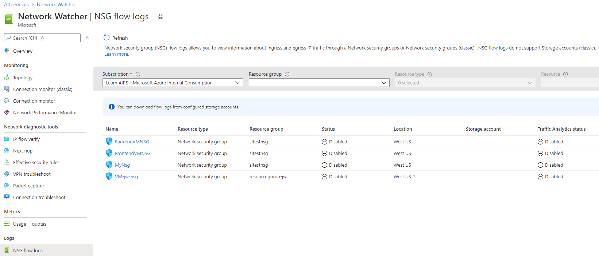

Azure networking services maximize flexibility, availability, resiliency, security, and integrity by design. Network connectivity is possible between resources located in Azure, between on-premises and Azure-hosted resources, and to and from the Internet and Azure.

## Azure networking security recommendations

Here are the security recommendations to set Azure networking policies in your Azure subscriptions. Included with each recommendation are the basic steps to follow in the Azure portal. You should perform these steps on your own subscription with your own resources to validate the security for each. Keep in mind that **Level 2** options might restrict some features or activity, so carefully consider which security options you decide to enforce.

### Restrict RDP and SSH access from the Internet - Level 1

It's possible to reach Azure virtual machines by using **Remote Desktop Protocol (RDP)** and the **Secure Shell (SSH)** protocol. These protocols enable the management VMs from remote locations and are standard in datacenter computing.

The potential security problem with using these protocols over the Internet is that attackers can use brute force techniques to gain access to Azure virtual machines. After the attackers gain access, they can use your VM as a launch point for compromising other machines on your virtual network or even attack networked devices outside Azure.

It's recommended that you disable direct RDP and SSH access to your Azure VMs from the Internet. After direct RDP and SSH access from the Internet is disabled, you have other options that you can use to access these VMs for remote management:

    * Point-to-site VPN
    * Site-to-site VPN
    * Azure ExpressRoute
    * Azure Bastion Host

1. Sign in to the Azure portal.

1. For each VM, open the **Networking** pane.

1. Verify that the **Inbound Port Rules** does not have a rule for RDP, for example: `port=3389, protocol = TCP, Source = Any or Internet`

1. Verify that the **Inbound Port Rules** does not have a rule for SSH, for example: `port=22, protocol = TCP, Source = Any or Internet`

### Restrict SQL Server access from the Internet - Level 1

Firewall systems help prevent unauthorized access to computer resources. If a firewall is turned on but not correctly configured, attempts to connect to SQL Server might be blocked.

To access an instance of the SQL Server through a firewall, you must configure the firewall on the computer that is running SQL Server. Allowing ingress for the IP range `0.0.0.0/0` (Start IP of `0.0.0.0` and End IP of `0.0.0.0`) allows open access to any/all traffic potentially making the SQL Database vulnerable to attacks. Ensure that no SQL Databases allow ingress from the Internet.

1. Sign in to the Azure portal.

1. Go to **SQL databases**.

1. For each SQL server, select **Firewalls and virtual networks** under **Security** in the left nav bar.

1. Ensure that the firewall rules exist, and no rule has a Start IP of `0.0.0.0` and End IP of `0.0.0.0` or other combinations which allows access to wider public IP ranges.

1. Select **Save**.

### Configure the NSG flow log retention period for more than 90 days - Level 2

When you create or update a virtual network in your subscription, Network Watcher will be enabled automatically in your Virtual Network's region. There is no impact to your resources or associated charge for automatically enabling Network Watcher.

Network security group (NSG) flow logs are a feature of Network Watcher that allows you to view information about ingress and egress IP traffic through an NSG. Flow logs are written in JSON format, and show outbound and inbound flows on a per rule basis, the network interface (NIC) the flow applies to, 5-tuple information about the flow (Source/destination IP, source/destination port, and protocol), if the traffic was allowed or denied, and in Version 2, throughput information (Bytes and Packets). Logs can be used to check for anomalies and give insight into suspected breaches.

1. Sign in to the Azure portal.

1. Select **All services**.

1. Select **Networking** in the left nav bar.

1. Select **Network Watcher**.

1. Select **NSG flow logs** under the **Logs** section in the left nav bar.

1. Ensure **Retention (days)** setting is greater than 90 days.

1. Select **Save**.

### Enable Network Watcher - Level 1

Network security group (NSG) flow logs are a feature of Network Watcher that allows you to view information about ingress and egress IP traffic through an NSG.

1. Sign in to the Azure portal.

1. In the portal, select **All services**. In the **Filter box**, enter **Network Watcher**. When Network Watcher appears in the results, select it.

1. Select **Regions** to expand it, and then select your region.

1. Select **Enable Network Watcher**.

> [!TIP]
> Remember to select **Save** if you make changes to any of the settings.
