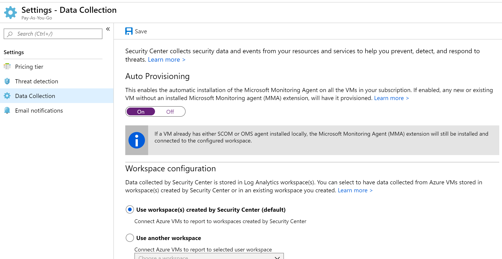
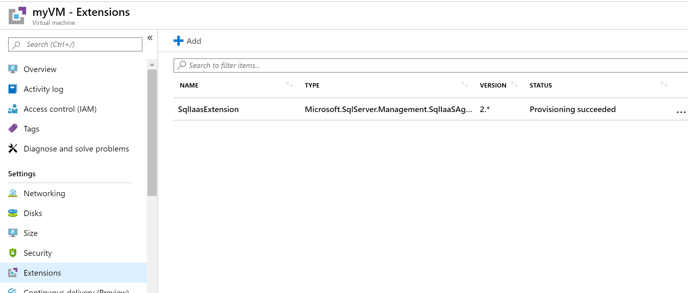
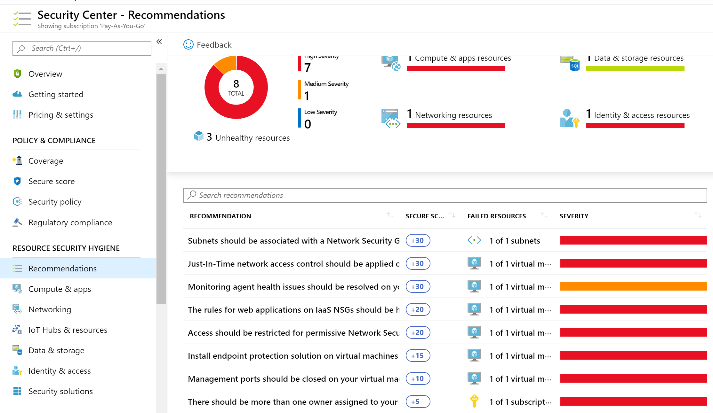

Azure Policy is a service in Azure to create, assign, and manage policies. These policies enforce different rules and effects over your resources, so those resources stay compliant with your corporate standards and service level agreements. Azure Policy meets this need by evaluating your resources for non-compliance with assigned policies. For example, you can have a policy to allow only a certain SKU size of virtual machines (VMs) in your environment. After this policy is implemented, new and existing resources are evaluated for compliance. With the right type of policy, existing resources can be brought into compliance.

## Azure networking security recommendations

See the following security recommendations that you should follow to set VM policies on your Azure subscription. Included with each recommendation are the basic steps to follow in the Azure portal. You should perform these steps with your own subscription using your own resources to validate the security for each. Keep in mind that **Level 2** options might restrict some features or activity, so carefully consider which security options you decide to enforce.

### A VM agent must be installed and enabled for data collection for Microsoft Defender for Cloud - Level 1

Microsoft Defender for Cloud enables you to see which VMs require the VM Agent, and will recommend that you enable the VM Agent on those VMs. The VM Agent is installed by default for VMs that are deployed from the Azure Marketplace. Data is needed to assess the VM security state, provide security recommendations, and alert on host-based threats.

1. Sign in to the Azure portal.

1. On the Azure **home** page, in the top search bar, search for and select *Defender for Cloud*. The **Defender for Cloud | Overview** pane appears.

1. In the left menu pane, under **Management**, select **Pricing & settings**. The **Pricing & settings** pane for Defender for Cloud appears.

1. Select the subscription.

1. In the left menu pane, under **Settings**, select **Data collection**.

1. Slide the **Auto Provisioning** slider to **On**.

1. Select a workspace to use.

1. On the top menu bar, select **Save**.

### Ensure that OS disk are encrypted - Level 1

Azure Disk Encryption helps protect and safeguard your data to meet your organizational security and compliance commitments. It uses the BitLocker feature of Windows and the DM-Crypt feature of Linux to provide volume encryption for the OS and data disks of Azure virtual machines (VMs). It is also integrated with Azure Key Vault to help you control and manage the disk encryption keys and secrets, and ensures that all data on the VM disks are encrypted at rest while in Azure storage. Azure Disk Encryption for Windows and Linux VMs is in General Availability in all Azure public regions and Azure Government regions for Standard VMs and VMs with Azure Premium Storage.

If you use Microsoft Defender for Cloud (recommended), you're alerted if you have VMs that aren't encrypted.

1. Sign in to the Azure portal.

1. On the Azure **home** page, in the top search bar, search for and select *Virtual machines*. The **Virtual machines** pane appears.

1. For each VM, in the middle menu pane, under **Settings**, select **Disks**. The **Disks** pane appears for your VM.

1. Ensure that the **OS disk** has **Encryption** set to **Enabled**.

1. Ensure that each disk under **Data disks** has **Encryption** set to **Enabled**.

### Ensure only approved extensions are installed - Level 1

Azure virtual machine (VM) extensions are small applications that provide post-deployment configuration and automation tasks on Azure VMs. For example, if a virtual machine requires software installation, anti-virus protection, or to run a script inside of it, a VM extension can be used. Azure VM extensions can be run with the Azure CLI, PowerShell, Azure Resource Manager templates, and the Azure portal. Extensions can be bundled with a new VM deployment, or run against any existing system.

1. Sign in to the Azure portal.

1. On the Azure **home** page, in the top search bar, search for and select *Virtual machines*. The **Virtual machines** pane appears.

1. For each VM, in the middle menu pane, under **Settings**, select **Extensions**. The **Extensions** pane appears for your VM.

1. Ensure that the listed extensions are approved for use.

### Ensure that the OS patches for the VMs are applied - Level 1

Microsoft Defender for Cloud monitors daily Windows and Linux VMs and computers for missing operating system updates. Defender for Cloud retrieves a list of available security and critical updates from *Windows Update* or *Windows Server Update Services (WSUS)*, depending on which service is configured on a Windows computer. Defender for Cloud also checks for the latest updates in Linux systems. If your VM or computer is missing a system update, Defender for Cloud will recommend that you apply system updates.

1. Sign in to the Azure portal.

1. On the Azure **home** page, in the top search bar, search for and select *Defender for Cloud*. The **Defender for Cloud | Overview** pane appears.

1. In the left menu pane, under **General**, select **Recommendations**. The **Recommendations** pane for Defender for Cloud appears.

1. Ensure that there are no recommendations for **Apply system updates**.

### Ensure that VMs have an installed and running endpoint protection solution - Level 1

Microsoft Defender for Cloud monitors the status of antimalware protection and reports this under the **Endpoint protection issues** pane. Defender for Cloud highlights issues, such as detected threats and insufficient protection, which can make your VMs and computers vulnerable to antimalware threats. By using the information under Endpoint protection issues, you can identify a plan to address any issues identified.

Use the same process as described in the previous recommendation.

> [!TIP]
> Remember to select **Save** if you make changes to any of the settings.
