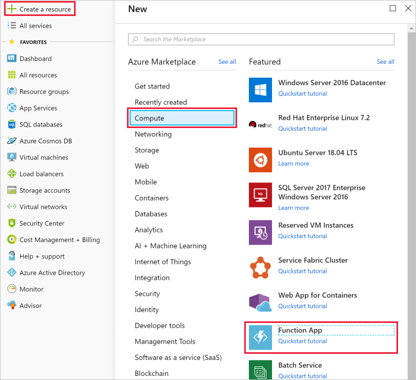

You are now ready to start implementing the temperature service. In the previous unit, you determined that a serverless solution would best fit your needs. Let's start by creating a function app to hold our Azure Function.

[!include]

## What is a function app?

Functions are hosted in an execution context called a **function app**. You define function apps to logically group and structure your functions and a compute resource in Azure. In our elevator example, you would create a function app to host the escalator drive gear temperature service. There are a few decisions that need to be made to create the function app; you need to choose a service plan and select a compatible storage account.

### Choosing a service plan

Function apps may use one of two types of service plans. The first service plan is the **Consumption service plan**. This is the plan that you choose when using the Azure serverless application platform. The Consumption service plan provides automatic scaling and bills you when your functions are running. The Consumption plan comes with a configurable timeout period for the execution of a function. By default, it is 5 minutes, but may be configured to have a timeout as long as 10 minutes.

The second plan is called the **Azure App Service plan**. This plan allows you to avoid timeout periods by having your function run continuously on a VM that you define. When using an App Service plan, you are responsible for managing the app resources the function runs on, so this is technically not a serverless plan. However, it may be a better choice if your functions are used continuously or if your functions require more processing power or execution time than the Consumption plan can provide.

### Storage account requirements

When you create a function app, it must be linked to a storage account. You can select an existing account or create a new one. The function app uses this storage account for internal operations such as logging function executions and managing execution triggers. On the Consumption service plan, this is also where the function code and configuration file are stored.

## Create a function app

Let's create a function app in the Azure portal.

1. Sign into the [Azure portal](https://portal.azure.com/learn.docs.microsoft.com?azure-portal=true) using the same account you activated the sandbox with.

1. Select the **Create a resource** button found on the upper left-hand corner of the Azure portal, and then select **Get started > Serverless Function App** to open the Function App *Create* blade. Alternatively, you can use the **Compute > Function App** option, which will open the same blade.

  

1. Choose a globally unique app name. This will serve as the base URL of your service. For example, you can name it **escalator-functions-xxxxxxx**, where the x's can be replaced with your initials and your birth year. If this isn't globally unique, you can try any other combination. Valid characters are a-z, 0-9 and -.

1. Select the Azure subscription where you would like the function app hosted.

1. Select the existing resource group called "**<rgn>[sandbox resource group name]</rgn>**".

1. Select **Windows** for OS.

1. For **Hosting Plan**, select **Consumption Plan**, which is the serverless hosting option.

1. Select the geographical location closest to you from the list below. In a production system, you would want to select a location near your customers or consumers of the function.

    [!include]

1. For **Runtime Stack**, select JavaScript from the dropdown, which is the language in which we implement the function examples in this exercise.

1. Create a new storage account. Azure will give it a name based on the app name. You can change it if you like, but it must also be unique.

1. Make sure that Azure Application Insights is **On** and select the region closest to you (or your customers).

1. Select **Create**; deployment will take a few minutes. You'll receive a notification once it's complete.

## Verify your Azure function app

1. From the Azure portal left-hand menu, select **Resource groups**. You should then see a resource group named **<rgn>[sandbox resource group name]</rgn>** in the list of available groups.

    ![Screenshot of the Azure portal showing the Resource groups blade with the Resource groups menu item and <rgn>[sandbox resource group name]</rgn> list item highlighted.](../media/3-resource-group.png)

1. Select the resource group **<rgn>[sandbox resource group name]</rgn>**. You should then see a resource list like the following list.

    ![Screenshot of the Azure portal showing all resources within the <rgn>[sandbox resource group name]</rgn> group, including entries for an App Service plan, a Storage account, Application Insights resource, and an App Service.](../media/3-resource-list.png)

The item with the lightning bolt Function icon, listed as an App Service, is your new function app. You can click on it to open the details about the new function - it has a public URL assigned to it, if you open that in a browser, you should get a default web page that indicates your Function App is running.
