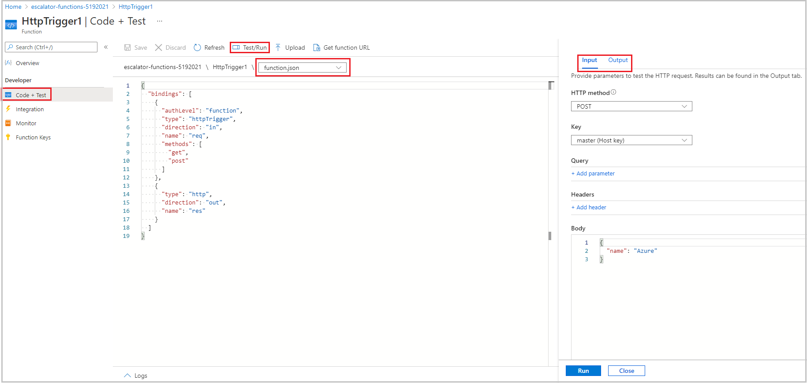

Now that we have a function app created, let's look at how to build, configure, and execute a function.

### Triggers

Functions are event driven, which means they run in response to an event.

The type of event that starts the function is called a **trigger**. You must configure a function with exactly one trigger.

Azure supports triggers for the following services.

| Service                 | Trigger description  |
|-------------------------|---------|
| Blob storage            | Starts a function when a new or updated blob is detected.       |
| Azure Cosmos DB               | Start a function when inserts and updates are detected.      |
| Event Grid              | Starts a function when an event is received from Event Grid.       |
| HTTP                    | Starts a function with an HTTP request.      |
| Microsoft Graph Events  | Starts a function in response to an incoming webhook from the Microsoft Graph. Each instance of this trigger can react to one Microsoft Graph resource type.       |
| Queue storage           | Starts a function when a new item is received on a queue. The queue message is provided as input to the function.      |
| Service Bus             | Starts a function in response to messages from a Service Bus queue.       |
| Timer                   | Starts a function on a schedule.       |

### Bindings

Bindings are a declarative way to connect data and services to your function. Bindings know how to talk to different services, which means you don't have to write code in your function to connect to data sources and manage connections. The platform takes care of that complexity for you as part of the binding code. Each binding has a direction - your code reads data from *input* bindings, and writes data to *output* bindings. Each function can have zero or more bindings to manage the input and output data processed by the function.

A trigger is a special type of input binding that has the additional capability of initiating execution.

Azure provides a [large number of bindings](https://docs.microsoft.com/azure/azure-functions/functions-triggers-bindings#supported-bindings) to connect to different storage and messaging services.

### Define a sample binding

Let's look at an example of configuring a function with an input binding (trigger) and an output binding. Let's say we want to write a new row to Azure Table storage whenever a new message appears in Azure Queue storage. This scenario can be implemented using an Azure Queue storage _trigger_ and an Azure Table storage _output binding_.

The following snippet is the _function.json_ file for this scenario. 

```json
{
  "bindings": [
    {
      "name": "order",
      "type": "queueTrigger",
      "direction": "in",
      "queueName": "myqueue-items",
      "connection": "MY_STORAGE_ACCT_APP_SETTING"
    },
    {
      "name": "$return",
      "type": "table",
      "direction": "out",
      "tableName": "outTable",
      "connection": "MY_TABLE_STORAGE_ACCT_APP_SETTING"
    }
  ]
}
```

Our JSON configuration specifies that our function will be triggered when a message is added to a queue named **myqueue-items**. The return value of our function is then written to the **outTable** table in Azure Table storage. For PowerShell functions, output bindings are explicitly written to with the `Push-OutputBinding` cmdlet.

This example is a simple illustration about how we configure bindings for a function. We could change the output to be an email using a SendGrid binding, or put an event onto a Service Bus to notify some other component in our architecture, or even have multiple output bindings to push data to various services.

> [!TIP]
> To view and edit the contents of _function.json_ in the Azure portal, select the **Advanced** editor option on the **Integrate** tab of your function.

## Create a function in the Azure portal

Azure provides several pre-made function templates for common scenarios:

- Quickstart
- Custom functions

### Quickstart templates

When adding your first function, you are presented with the Quickstart screen where you can choose the trigger for your function. Based on your selections, Azure will generate the function code and configuration with some sample code provided to display the input data received in the log.

### Custom function templates

Selecting Quickstart templates provides easy access to the most common scenarios. However, Azure provides over 30 additional templates you can start with. These can be selected from the template list screen when creating subsequent functions, or you can select them by using the **Custom function** option on the Quickstart screen.

## Navigate to your function and files

When you create a function from a template, several files are created. For example, if you opted to use the Webhook + API Quickstart using JavaScript, the files generated would be a configuration file, **function.json**, and a source code file, **index.js**. The functions you create in a function app appear under the **Functions** menu item in the function app portal.

When you select a function in your function app, a code editor opens and displays the code for your function, as shown in the following screenshot.



As you can see, there's a flyout menu on the right that includes a tab to **View files**. Selecting this tab shows the file structure that makes up your function.

## Test your Azure function

After you've created a function, you'll want to test it. There are a couple of approaches:

- Manual execution
- Testing from within the Azure portal itself.

### Manual execution

You can start a function by manually triggering the configured trigger. For instance, if you are using an HTTP trigger, you can use a tool, such as Postman or cURL, to initiate an HTTP request to your function endpoint URL, which is available from the HTTP trigger definition (**Get function URL**).

### Test in the Azure portal

The portal also provides a convenient way to test your functions. On the right side of the code window, there is a tabbed flyout menu. This menu contains a **Test** item. Expanding the menu, and selecting this tab provides another way to execute your function, and view the result. When you select **Run** in this test window, the results appear in the output window, along with a status code.

## Monitoring dashboard

The ability to monitor your functions is critical during development and in production. The Azure portal provides a monitoring dashboard if you turn on the Application Insights integration. In the function app nav menu, after you expand the function node, you'll see a **Monitor** menu item. This monitor dashboard provides a quick way to view the history of function executions, and displays the timestamp, result code, duration, and operation ID populated by Application Insights.


## Streaming log window

You're also able to add logging statements to your function for debugging in the Azure portal. The called methods for each language are passed a "logging" object, which may be used to log information to the log window located in a tabbed flyout menu located at the bottom of the code window.

The following JavaScript code snippet shows how to log a message using the `context.log` method (the `context` object is passed to the handler).

```javascript
context.log('Enter your logging statement here');
```

We could do the same thing in C# using the `log.Info` method. In this case, the `log` object is passed to the C# method processing the function.

```csharp
log.Info("Enter your logging statement here");
```

In PowerShell, use `Write-Host` to write to the log:

```powershell
Write-Host "Enter your logging statement here"
```

### Errors and warnings window

You can locate the errors and warnings window tab in the same flyout menu as the log window. This window shows compilation errors and warnings within your code.
