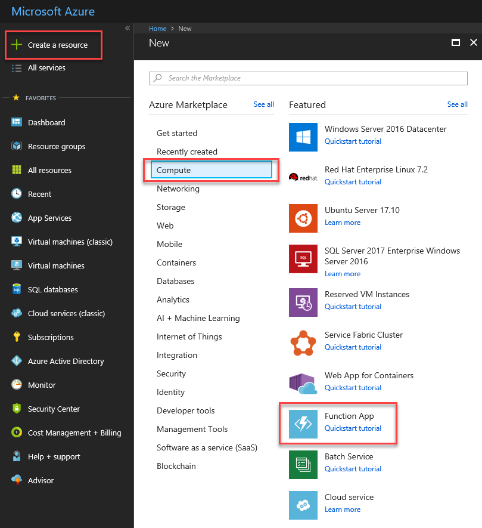
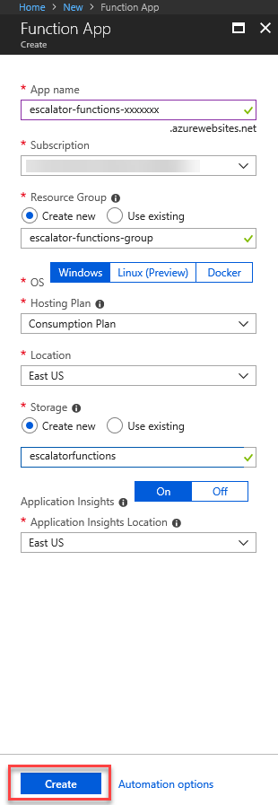
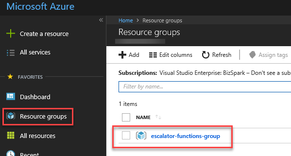
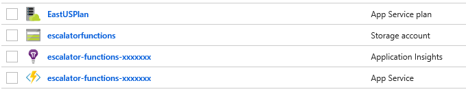

## Motivation

In order to host the temperature service, it must have a Function App to call home. In this unit, you will create a Function App compute resource using the Azure Portal.

## Creating an Azure Function App

To create an Azure Function App, follow the process below - you will find a screenshot of the Function App creation blade at the end of the steps:

1. Sign in to the [Azure portal](https://portal.azure.com) using your Azure Account.
1. Select the **Create a resource** button found on the upper left-hand corner of the Azure portal, then select **Compute > Function App**
  
1. Choose a globally unique App Name, this will serve as the base url of your service. You can name it **escalator-functions-xxxxxxx**, where the x's can be replaced with your initials and your birth year, if this isn't globally unique, you can try any other combination. Valid characters are a-z, 0-9 and -.
1. Select the Azure Subscription where you would like the Function App hosted.
1. Create a new Resource Group called **escalator-functions-group**, this will help with clean-up later on.
1. Select **Windows** for OS
1. For Hosting Plan, select the **Consumption Plan**, so that we can take advantage of the serverless features of Azure.
1. Select the geographical location closest to you
1. Create a new storage account, name it **escalatorfunctions**
1. Ensure Application Insights is On, and select the geographical region closest to you.
1. Select **Create**, deployment will take a few minutes then you will receive a notification once it has been completed.
  

## Verify your Azure Function App

To verify the creation of your Azure Function App, follow the process below:

1. From the Azure Portal left-hand menu, select **Resource groups**, you should then see the **escalator-functions-group** in the list of available groups.
  
1. Select the **escalator-functions-group**, you should then see a resource list similar to the following:
  

## Summary

In this unit you used the Azure portal to create a Function App that will be used to house our escalator drive gear temperature service. In the next unit we will learn more about creating and configuring Azure Functions.