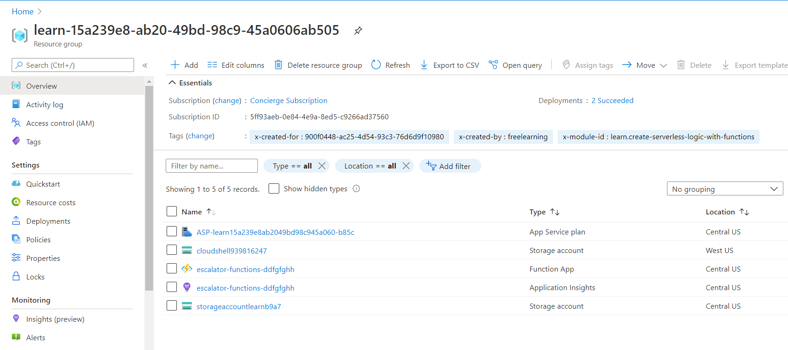
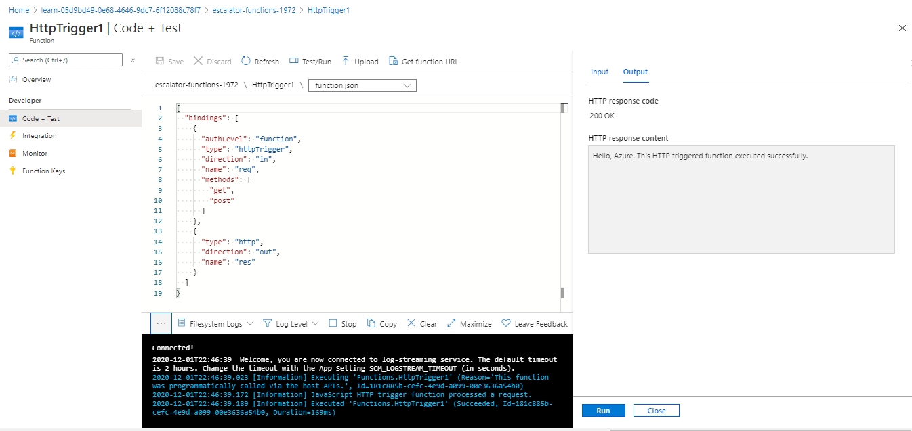
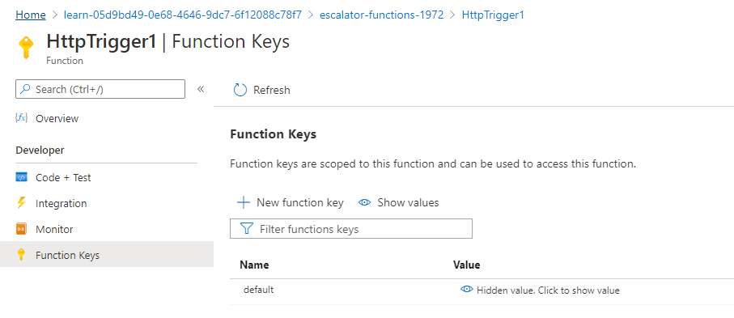
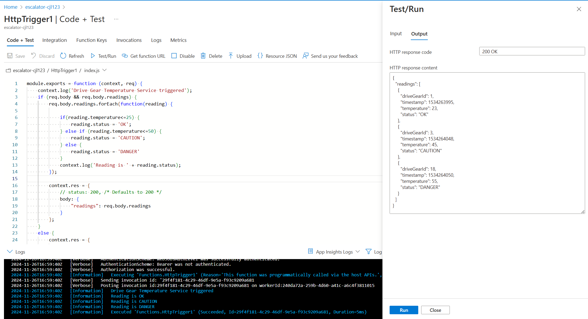
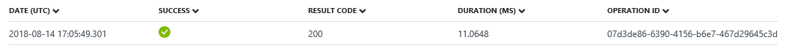

Let's continue with our gear drive example, and add the logic for the temperature service. Specifically, we're going to receive data from an HTTP request.

## Function requirements

First, we need to define some requirements for our logic:

- Temperatures between 0-25 degrees should be flagged as **OK**.
- Temperatures between 26-50 degrees should be flagged as **CAUTION**.
- Temperatures above 50 degrees should be flagged as **DANGER**.

## Add a function to our function app

As we described in the preceding unit, Azure provides templates that help you get started building functions. In this unit, we'll use the `HttpTrigger` template to implement the temperature service.

::: zone pivot="javascript"

1. Sign in to the [Azure portal](https://portal.azure.com/learn.docs.microsoft.com?azure-portal=true).

1. In the left-hand menu, select **All resources**, and then select "**<rgn>[sandbox resource group name]</rgn>**" for the resource group you created in the first exercise.

1. The resources for the group appear. Select the name of the function app that you created in the previous exercise - **escalator-functions-xxxxxxx** (also indicated by the lightning bolt Function icon).

    

1. From the top menu bar, select (**+ Add**). The **Add function** pane appears.

1. In the **Add function** panel, under the **Select a template** section, select **HTTP trigger**, and then select **Add**. Your **HttpTrigger1** function page appears.

1. In the left nav bar, select **Code + Test**. The code editor appears.

1. From the source dropdown, select *index.js*. The default code that the template generated for us appears in the following snippet.

    ```javascript
    module.exports = async function (context, req) {
        context.log('JavaScript HTTP trigger function processed a request.');

        if (req.query.name || (req.body && req.body.name)) {
            context.res = {
                // status: 200, /* Defaults to 200 */
                body: "Hello " + (req.query.name || req.body.name)
            };
        }
        else {
            context.res = {
                status: 400,
                body: "Please pass a name on the query string or in the request body"
            };
        }
    };
    ```

    Our function expects a name to be passed in either through the HTTP request query string, or as part of the request body. The function responds by returning the message **Hello, {name}**, echoing back the name that was sent in the request.

    Again, from the source dropdown, select **function.json** to view the configuration of the function, which should look like the following.

    ```javascript
    {
      "bindings": [
        {
          "authLevel": "function",
          "type": "httpTrigger",
          "direction": "in",
          "name": "req",
          "methods": [
            "get",
            "post"
          ]
        },
        {
          "type": "http",
          "direction": "out",
          "name": "res"
        }
      ],
      "disabled": false
    }
    ```

    This configuration declares that the function runs when it receives an HTTP request. The output binding declares that the response will be sent as an HTTP response.

::: zone-end

::: zone pivot="powershell"

1. Sign in to the [Azure portal](https://portal.azure.com/learn.docs.microsoft.com?azure-portal=true).

1. In the left-hand menu, select **All resources**, and then select "**<rgn>[sandbox resource group name]</rgn>**" for the resource group you created in the first exercise.

1. The resources for the group appear. Select the name of the function app that you created in the previous exercise -  **escalator-functions-xxxxxxx** (also indicated by the lightning bolt Function icon).

    

1. Select **Functions** from the left nav bar, and then select **+ Add** from the top menu bar. The **Add function** panel appears that starts the function creation process.

1. In the **Select a template** section, select **HTTP trigger**.

1. In the **Template details** section, in the **New Function** field, enter *DriveGearTemperatureService*. Leave the **Authorization level** as *Function*, and select **Add** to create the function.

1. When your function creation completes, the code editor opens with the contents of the *run.ps1* code file. The default code that the template generated for us is listed in the following snippet.

    ```powershell
    using namespace System.Net

    # Input bindings are passed in via param block.
    param($Request, $TriggerMetadata)

    # Write to the Azure Functions log stream.
    Write-Host "PowerShell HTTP trigger function processed a request."

    # Interact with query parameters or the body of the request.
    $name = $Request.Query.Name
    if (-not $name) {
        $name = $Request.Body.Name
    }

    if ($name) {
        $status = [HttpStatusCode]::OK
        $body = "Hello $name"
    }
    else {
        $status = [HttpStatusCode]::BadRequest
        $body = "Please pass a name on the query string or in the request body."
    }

    # Associate values to output bindings by calling 'Push-OutputBinding'.
    Push-OutputBinding -Name Response -Value ([HttpResponseContext]@{
        StatusCode = $status
        Body = $body
    })
    ```

    Our function expects a name to be passed in either through the HTTP request query string, or as part of the request body. HTTP functions must generate a response by writing to their output binding, which is accomplished in PowerShell Functions with the `Push-OutputBinding` cmdlet. This function returns the message **Hello $name**, echoing back the name that was sent in the request.

    On the right-hand side of the source view, you'll see two tabs. The **View files** tab lists the code and config file for your function. Select **function.json** to view the configuration of the function, which should look like the following.

    ```json
    {
      "bindings": [
        {
          "authLevel": "function",
          "type": "httpTrigger",
          "direction": "in",
          "name": "Request",
          "methods": [
            "get",
            "post"
          ]
        },
        {
          "type": "http",
          "direction": "out",
          "name": "Response"
        }
      ],
      "disabled": false
    }
    ```

    This configuration declares that the function runs when it receives an HTTP request. The output binding declares that the response will be sent as an HTTP response.

::: zone-end

## Test the function

> [!TIP]
> **cURL** is a command line tool that can be used to send or receive files. It's included with Linux, macOS, and Windows 10, and can be downloaded for most other operating systems. cURL supports numerous protocols like HTTP, HTTPS, FTP, FTPS, SFTP, LDAP, TELNET, SMTP, POP3, and so on. For more information, see the following links:
>
>- <https://en.wikipedia.org/wiki/CURL>
>- <https://curl.haxx.se/docs/>

To test the function, you can send an HTTP request to the function URL using cURL on the command line. To find the endpoint URL of the function, expand the **Log** frame at the bottom of the trigger function page. At the top menu bar, select **Get function URL**, as shown in the following image. Save this link by selecting the *Copy to clipboard* icon at the end of the URL. Store this link to Notepad or a similar app for later use.



### Secure HTTP triggers

HTTP triggers let you use API keys to block unknown callers by requiring the key to be present on each request. When you create a function, you select the _authorization level_. By default, it's set to *Function*, which requires a function-specific API key, but it can also be set to *Admin* to use a global "master" key, or *Anonymous* to indicate that no key is required. You can also change the authorization level through the function properties after creation.

Because we specified *Function* when we created this function, we will need to supply the key when we send the HTTP request. You can send it as a query string parameter named `code`, or as an HTTP header (preferred) named `x-functions-key`.

The function and master keys are found in the **Function Keys** in the left-hand nav bar. By default, they are hidden, and you need to display them.

1. Show the default Function Key, and copy it to the clipboard. Store this key to Notepad or a similar app for later use.

    

1. At the bottom of the screen, scroll to the left to see your function. At the top-right, under the **Essentials** section, copy your **URL** by selecting the *Copy to clipboard* icon at the end of the URL. Store this link to Notepad or a similar app for later use.

1. Next, from the left nav bar, select **Functions**, and then select the **HttpTrigger1**.

1. In the left nav bar, select **Code + Test**, and from the menu bar, select **Test/Run**. A **Test** pane appears.

1. Under the **Input** pane, in the **Body** text box, overwrite the embedded code by pasting the following cURL command.

    ```bash
    curl --header "Content-Type: application/json" --header "x-functions-key: <your-function-key>" --request POST --data "{\"name\": \"Azure Function\"}" https://<your-url-here>/api/DriveGearTemperatureService
    ```

1. Replace the placeholders in the code with the URL for your function and the function key you previously saved to Notepad or a similar app. Make note of these aspects of the cURL command:

    - Used a `POST` request.
    - Added a `Content-Type` header value of type `application/json`.
    - Made sure to replace the URL with your own.
    - Passed the Function Key as the header value `x-functions-key`.

1. Select **Run**.

Under the **Output** pane, for **HTTP response code**, the function responds with the text `"200 OK"`.

> [!CAUTION]
> If you are on Windows, run  `cURL` from the command prompt. PowerShell has a *curl* command, but it's an alias for Invoke-WebRequest, and is not the same as `cURL`.

> [!NOTE]
> You can also test from an individual function's section with the **Test** pane appearing on the side of a selected function. You won't be able to verify the function key system is working, as it is not required here. Add the appropriate header and parameter values in the Test interface, and select **Run** to see the test output.

## Add business logic to the function

Next, let's add the logic to the function that checks temperature readings that it receives, and sets a status for each.

Our function is expecting an array of temperature readings. The following JSON snippet is an example of the request body that we'll send to our function. Each `reading` entry has an ID, timestamp, and temperature.

```json
{
    "readings": [
        {
            "driveGearId": 1,
            "timestamp": 1534263995,
            "temperature": 23
        },
        {
            "driveGearId": 3,
            "timestamp": 1534264048,
            "temperature": 45
        },
        {
            "driveGearId": 18,
            "timestamp": 1534264050,
            "temperature": 55
        }
    ]
}
```

We'll replace the default code in our function with the following code that implements our business logic.

::: zone pivot="javascript"

In the **HttpTrigger1** function page, open the **index.js** file, and replace it with the following code. Make sure to save the file after updating it.

```javascript
module.exports = function (context, req) {
    context.log('Drive Gear Temperature Service triggered');
    if (req.body && req.body.readings) {
        req.body.readings.forEach(function(reading) {

            if(reading.temperature<=25) {
                reading.status = 'OK';
            } else if (reading.temperature<=50) {
                reading.status = 'CAUTION';
            } else {
                reading.status = 'DANGER'
            }
            context.log('Reading is ' + reading.status);
        });

        context.res = {
            // status: 200, /* Defaults to 200 */
            body: {
                "readings": req.body.readings
            }
        };
    }
    else {
        context.res = {
            status: 400,
            body: "Please send an array of readings in the request body"
        };
    }
    context.done();
};
```

The logic we added is straightforward. We iterate over the array of readings and check the temperature field. Depending on the value of that field, we set a status of **OK**, **CAUTION**, or **DANGER**. We then send back the array of readings with a status field added to each entry.

Notice the `Log` statements when you expand **Logs** at the bottom of the page. When the function runs, these statements will add messages in the Logs window.

::: zone-end

::: zone pivot="powershell"

Open the **run.ps1** file, and replace the contents with the following code. Make sure to save the file after updating it.

```powershell
using namespace System.Net

param($Request, $TriggerMetadata)

Write-Host "Drive Gear Temperature Service triggered"

$readings = $Request.Body.Readings
if ($readings) {
    foreach ($reading in $readings) {
        if ($reading.temperature -le 25) {
            $reading.Status = "OK"
        }
        elseif ($reading.temperature -le 50) {
            $reading.Status = "CAUTION"
        }
        else {
            $reading.Status = "DANGER"
        }

        Write-Host "Reading is $($reading.Status)"
    }

    $status = [HttpStatusCode]::OK
    $body = $readings
}
else {
    $status = [HttpStatusCode]::BadRequest
    $body = "Please send an array of readings in the request body"
}

Push-OutputBinding -Name Response -Value ([HttpResponseContext]@{
    StatusCode = $status
    Body = $body
})
```

The logic we added is straightforward. We iterate over the array of readings and check the temperature field. Depending on the value of that field, we set a status of **OK**, **CAUTION**, or **DANGER**. We then send back the array of readings with a status field added to each entry.

Note the calls to the `Write-Host` cmdlet. When the function runs, these statements will add messages in the Logs window.

::: zone-end

## Test our business logic

In this case, we're going to use the **Test** pane in the portal to test our function.

1. In the **Test** pane, paste the sample request into the request **Body** text box.

    ```json
    {
        "readings": [
            {
                "driveGearId": 1,
                "timestamp": 1534263995,
                "temperature": 23
            },
            {
                "driveGearId": 3,
                "timestamp": 1534264048,
                "temperature": 45
            },
            {
                "driveGearId": 18,
                "timestamp": 1534264050,
                "temperature": 55
            }
        ]
    }
    ```

1. Select **Run** and view the response in the **Output** pane. To see log messages, open the **Logs** tab in the bottom flyout of the page. The following image shows an example response in the output pane and messages in the  **Logs** pane.

    

    You can see in the **Output** pane that our status field has been correctly added to each of the readings.

    To see that the request has been logged to Application Insights, go to the Monitor dashboard by selecting **Monitor** under your trigger function in the home Azure portal left nav bar.

    

