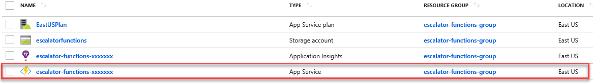
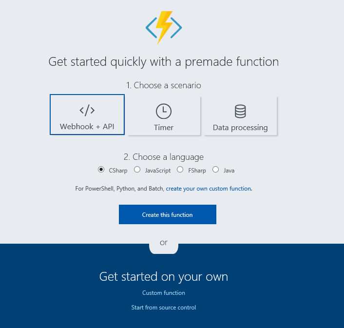
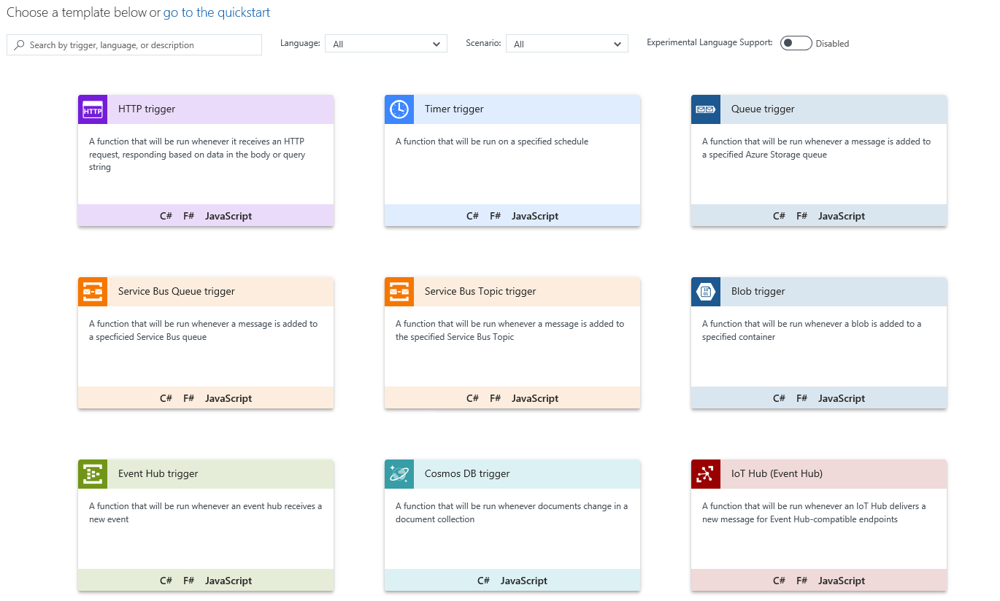
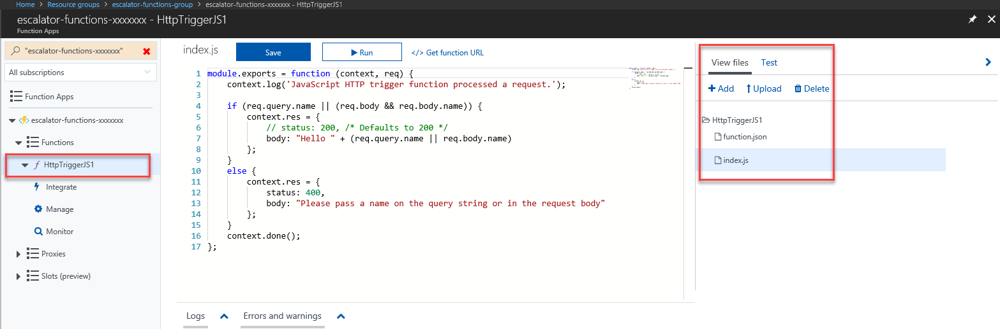
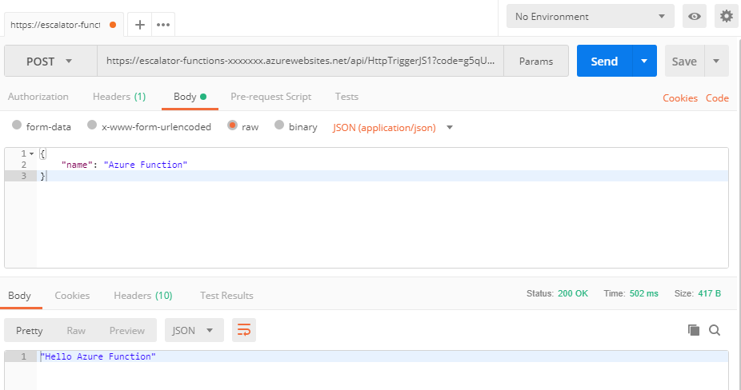
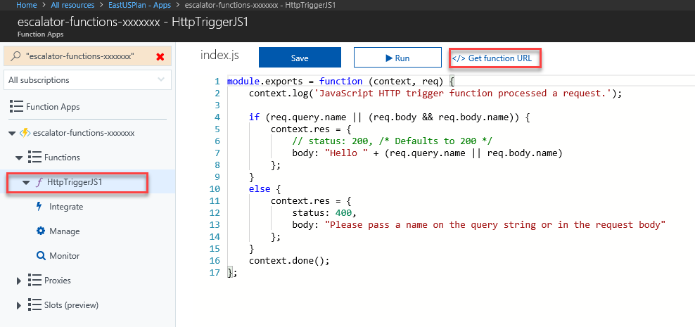
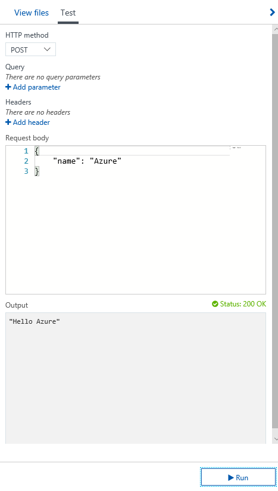
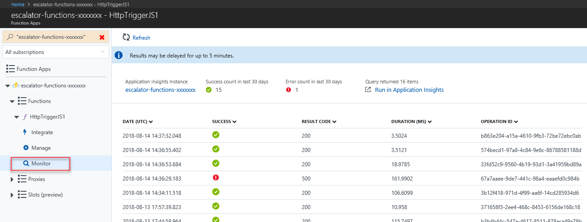
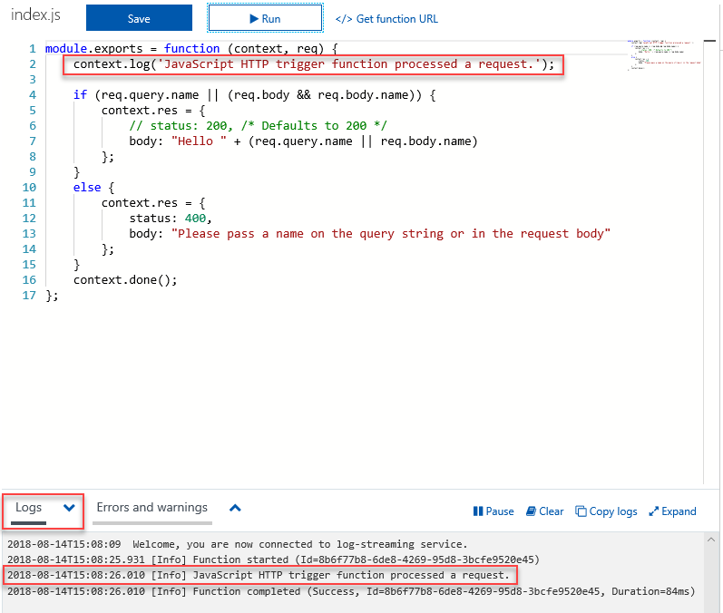
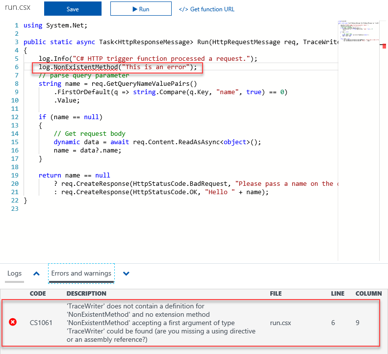

## Motivation

With our Azure Function App created, we are now ready to learn about building, configuring and executing Azure Functions.

## Azure Function Configuration

In previous units, you've already grasped that Azure Functions contain only business logic code - configuration and behavior of the function is defined in a configuration file. Among the settings to be configured in this file are triggers and bindings.

### Triggers

As you already know, Azure Functions are event driven. This means that they run only in response to an event happening, such as receiving an HTTP request or a message being added to a queue. The type of event that initiates the function is called a trigger. Azure Functions require at least one trigger to be configured. Azure supports a wide range of triggers, including:

* HTTPTrigger
* TimerTrigger
* GitHub webhook
* CosmosDBTrigger
* BlobTrigger
* QueueTrigger
* EventHubTrigger
* ServiceBusQueueTrigger
* ServiceBusTopicTrigger

### Bindings

Azure function bindings are a declarative way to connect to data from within your code, and are entirely optional. They can be defined as either input or output bindings, and you can have multiple bindings of each type configured on a function. As an example, suppose you had a QueueTrigger that initiates a function when a blob is added to a queue. Defining an input blob binding would indicate the name and connection of the blob to watch.

Conversely, output bindings are connections to data to where you would like the return value to go. For instance, you can send the return value of the function to Azure table storage.

A full list of available bindings is available in the [Azure Documentation](https://docs.microsoft.com/en-us/azure/azure-functions/functions-triggers-bindings#supported-bindings).

### A sample trigger and binding (function.json)

This is a sample definition of a trigger and binding for a function. You will note that depending on the type of binding you are describing, there is different property values that need to be set. Each binding also has a direction that defines whether it is an input or output binding. Triggers are always input bindings. This sample shows a function that is triggered by a message being added to a queue named **myqueue-items**, it then sends the return value of the function to the **outTable** table in Azure table storage.

```javascript
{
  "bindings": [
    {
      "name": "order",
      "type": "queueTrigger",
      "direction": "in",
      "queueName": "myqueue-items",
      "connection": "MY_STORAGE_ACCT_APP_SETTING"
    },
    {
      "name": "$return",
      "type": "table",
      "direction": "out",
      "tableName": "outTable",
      "connection": "MY_TABLE_STORAGE_ACCT_APP_SETTING"
    }
  ]
}
```

## Premade functions and templates

After learning about Azure function configuration, it may seem a little overwhelming. It may be difficult to know where to start. Luckily, Azure provides a helping hand when learning how to work with Azure Functions. One great feature to get your feet wet with Functions is to generate one using one of the many premade function templates. These premade functions provide sample code, and configuration that you serve as a basis for the temperature service.

### Quickstart Templates

In order to add an Azure Function - you must select a Function App. The Function App can be identified by the lightning bolt within pointy brackets icon.


When adding your first Azure Function, you are presented with the Quickstart screen. This screen allows you to make a selection on your desired trigger type and programming language. Then, based on your selections, Azure will generate the function code and configuration for you.


### Function Templates

The selection of templates is not limited to those available in the Quickstart. You also have the option of choosing from over 30 different templates. You can access the template list screen while creating subsequent functions, or by selecting the **Custom function** option on the Quickstart screen.


## Navigating to your function and files

Upon generation of a Function from a template, a series of files are created. Suppose you opted to use the Webhook + API quickstart using JavaScript. The files generated would be a configuration file, **function.json** and a source code file, **index.js**. When accessing the Function App, you will be presented with a menu tree displaying the Functions that have been created in the app. It is also on this **Functions** menu item, that you are able to add additional Functions to the Function app (a plus + icon will appear when hovering over the menu item).


In the case of this quickstart mentioned above, when you expand **Functions** in the treeview, you will see one function with a default name of **HttpTriggerJS1** (also indicated by the function f icon). Selecting this Function will open up a code window and display the **index.js** source file. On the right hand side of the code window, there is a flyout menu that includes a tab to **View files**, selecting this tab will show you the file structure (mimicked in storage) that makes up your Function.


## Execution options for testing your Azure function

Once you have an Azure function created, you will need to know how to test them. There are a couple of approaches, manual execution and testing from within the Azure portal itself.

### Manual execution of a function

You can initiate the execution of a function by manually triggering the configured trigger. For instance, if you are using an HttpTrigger - you can use a tool such as Postman or cURL to initiate an HTTP request to your function endpoint URL.

You can obtain the endpoint URL by selecting your HTTP Trigger from the left hand navigation, then selecting the **Get function URL** button.


### Testing a function in the Azure Portal

Alternatively, the Azure portal also provides a handy mechanism to test your functions. On the right hand side of the code window, there is a flyout tabbed navigation menu. This menu contains a **Test** item. Expanding the menu and selecting this tab gives you another way to execute your function and view the result. In keeping with the HttpTrigger scenario, you can set the HTTP method, add querystring parameters and HTTP headers to the request. You may also change the request body to test additional scenarios. The Output window shows the result of the function.


## Monitoring an Azure function

During Azure Function development, being able to log messages and determine exception scenarios is critical to ensuring that you are getting your functions production-ready. This is just as important in a production scenario, when you are tracking down the source of a defect. The Azure Portal gives us a user interface that provides a monitoring dashboard as well as a way to review execution logs and exceptions obtained from your Azure Functions.

### Monitoring dashboard

In the Function App navigation menu, once you expand the function node - you will see a **Monitor** menu item. The monitor dashboard provides a quick way to view the history of function executions. This view displays timestamp, result code, duration, operation id as well as if it completed successfully. The data is populated via Application Insights.


### Log window

You are also able to add log statements to your function. These statements will appear in the log window of the function. The log window is located in a tabbed flyout menu located at the bottom of the code window. In the case of a JavaScript-based function, you would add a log statement using the following syntax:

```javascript
  context.log('Enter your logging statement here');
```



### Errors and warnings window

You can locate the errors and warnings window tab in the same flyout menu as the log window. This window will show compilation errors and warnings within your code. As JavaScript is a dynamic and interpreted language, the following image shows a compilation error in a C# function.


## Summary

In this unit, you learned more about Azure Functions. You've learned about Function triggers, bindings and configuration. You also learned about how Azure gives you a helping hand to get started using Functions through the use of templates. Finally, you saw how to test and monitor your functions from the Azure Portal. In the next unit we will use a function template and build our temperature service.

## Resources

* [Azure Function Triggers and Bindings Overview](https://docs.microsoft.com/en-us/azure/azure-functions/functions-triggers-bindings)
* [Azure Storage Bindings](https://docs.microsoft.com/en-us/azure/azure-functions/functions-bindings-storage-blob)
* [Monitoring Azure Functions With Application Insights](https://blogs.msdn.microsoft.com/visualstudioalmrangers/2017/10/10/azure-function-integrating-monitoring-with-application-insights/)