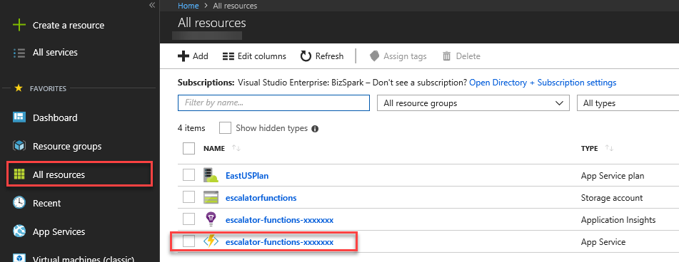
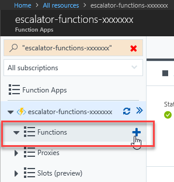
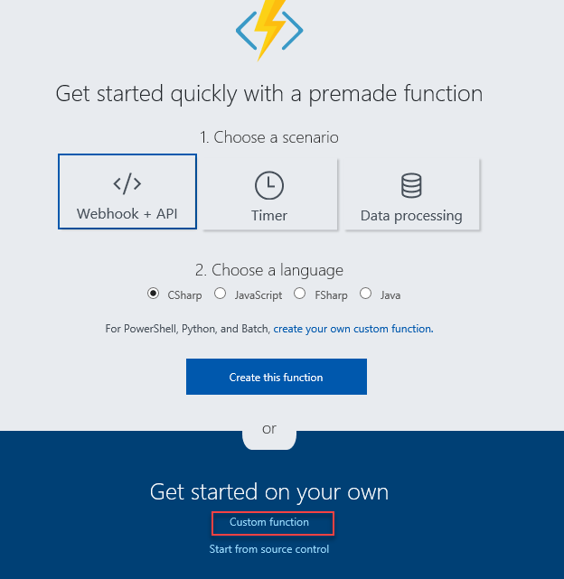
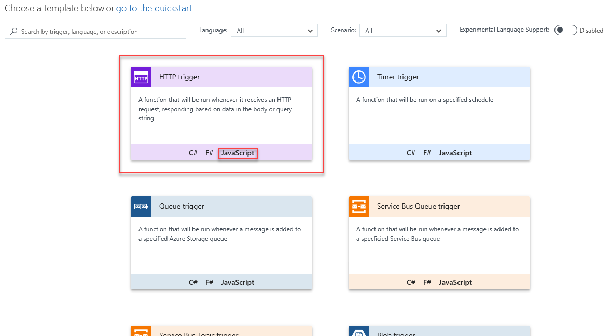
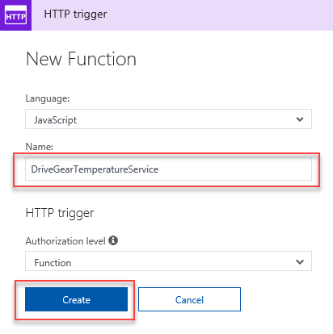
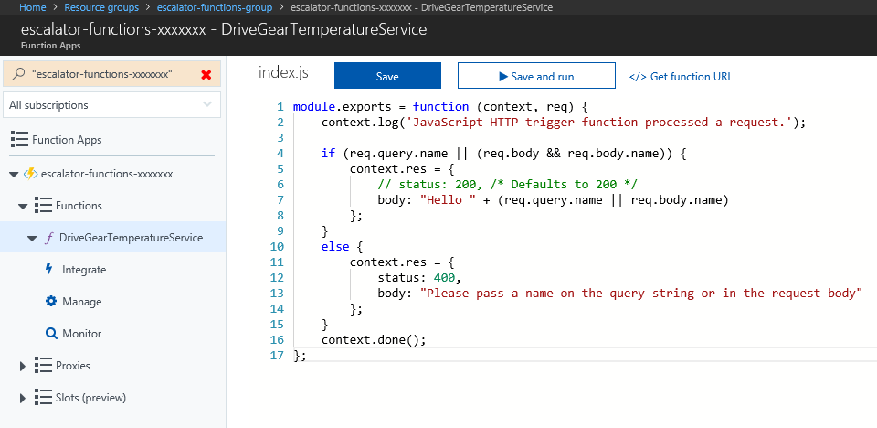
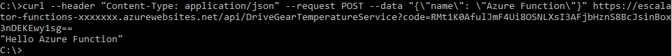

## Motivation

In the previous unit, you've learned the basics of how an Azure Function works - including how to configure triggers and bindings as well as how to execute and monitor a function from the Azure Portal. Since you've already created your Function App in a previous exercise, you can now add and implement the drive gear temperature service.

## Function requirements

Telemetry data is received from customers through a variety of sources, but for now we will solely focus on data coming through an HTTP request. Our requirements state that temperatures ranging from 0-25 should be flagged as **OK**, 26-50 should be flagged as **CAUTION** and everything above 51 should be flagged as **DANGER**. The property that should be added to the temperature reading object should be named **status**.

## Adding a Function to an Azure Function App

As we have already learned, Azure provides a helping hand when learning how to work with Azure Functions. One great feature to get your feet wet with Functions is to generate one using one of many templates. In this exercise, you will be using the HttpTrigger template to implement the temperature service.

1. Sign in to the [Azure portal](https://portal.azure.com) using your Azure Account.
1. Access the resource group you created in the first exercise by choosing **All resources** in the left-hand menu, then selecting **escalator-functions-group**.
1. The resources for the group will then be displayed, access the Funtions App that you created in the previous exercise by selecting the **escalator-functions-xxxxxxx** item (also indicated by the lightning bolt icon).
  
1. A blade will then be displayed that gives you an overview of your Function App. There is also a handy navigation tree on the left that shows any Functions, Proxies or Slots that are defined. In our case, we don't have a Function yet, so this navigation tree will be empty. To create a Function, hover over Function in the navigation tree, then click on the **+** button that appears.
  
1. In the quickstart premade function form, select the  **Custom function** link in the **Get started on your own** section.
  
1. You are now presented with a list of templates. Select the JavaScript implementation of the HTTP Trigger template.
  
1. A blade will appear, allowing you to define what the template will generate. In this case, you are interested in generating a JavaScript function named **DriveGearTemperatureService**. After you have named your function, press the **Create** button.
  
1. After a few moments, you will be presented with the templated source code for your function. The premade function expects a name to be passed in, and it will return **Hello, {name}**.

    ```javascript
    module.exports = function (context, req) {
        context.log('JavaScript HTTP trigger function processed a request.');

        if (req.query.name || (req.body && req.body.name)) {
            context.res = {
                // status: 200, /* Defaults to 200 */
                body: "Hello " + (req.query.name || req.body.name)
            };
        }
        else {
            context.res = {
                status: 400,
                body: "Please pass a name on the query string or in the request body"
            };
        }
        context.done();
    };
    ```

1. On the right-hand side of the source view, you will see two tabs. You are able to view all the files supporting the function in the **View files** tab. You can select **function.json** to view the configuration of the function. Here you can see the httpTrigger defined, as well as the output binding. This configuration describes the function is initiated by an http request, and the output binding describes that the response will be sent as an http response.

    ```javascript
    {
      "disabled": false,
      "bindings": [
        {
          "authLevel": "function",
          "type": "httpTrigger",
          "direction": "in",
          "name": "req"
        },
        {
          "type": "http",
          "direction": "out",
          "name": "res"
        }
      ]
    }
    ```

## Running the Premade Azure Function

To see the templated function in action, you can initiate an http request from cURL from a command prompt. To obtain the endpoint URL, revisit your function code, and select the **Get function URL** link. Copy this link to your clipboard.  Your url should look something similar to the following: https://escalator-functions-xxxxxxx.azurewebsites.net/api/DriveGearTemperatureService?code=RMt1K0AfulJmF4Ui8OSNLXsI3AFjbHznS8BcJsinBox3nDEKEwy1sg==
 

With that URL, you now can run a cURL command to initiate your function (replacing the URL with your own):

```bash
curl --header "Content-Type: application/json" --request POST --data "{\"name\": \"Azure Function\"}" https://escalator-functions-xxxxxxx.azurewebsites.net/api/DriveGearTemperatureService?code=RMt1K0AfulJmF4Ui8OSNLXsI3AFjbHznS8BcJsinBox3nDEKEwy1sg==
```



## Adding business logic to the function

Our function is expecting an array of temperature readings from the customer, this is an example of the request body:

```javascript
{
    "readings": [
        {
            "driveGearId": 1,
            "timestamp": 1534263995,
            "temperature": 23
        },
        {
            "driveGearId": 3,
            "timestamp": 1534264048,
            "temperature": 45
        },
        {
            "driveGearId": 18,
            "timestamp": 1534264050,
            "temperature": 55
        }
    ]
}
```

You will now modify the premade function code to implement the required business logic. Open the index.js file, and replace it with the following listing:

```javascript
module.exports = function (context, req) {
    context.log('Drive Gear Temperature Service triggered');
    if (req.body && req.body.readings) {
        for(var i=0; i<req.body.readings.length; i++){
            var reading = req.body.readings[i];
            if(reading.temperature<=25){
                context.log('Reading is OK');
                reading.status = 'OK';
                continue;
            }
            if(reading.temperature<=50){
                context.log('Reading is CAUTION');
                reading.status = 'CAUTION';
                continue;
            }
            context.log('Reading is DANGER');
            reading.status = 'DANGER'
        }
        context.res = {
            // status: 200, /* Defaults to 200 */
            body: {
                "readings": req.body.readings
            }
        };
    }
    else {
        context.res = {
            status: 400,
            body: "Please send an array of readings in the request body"
        };
    }
    context.done();
};
```

In the above code, you will notice a series of log statements, when the function is run they will appear in the log window.

## Testing your business logic

Open the Test window from the right-hand side flyout menu, and paste the sample request from above into the request body textbox. Press the **Run** button and view the Output. You can also open the log window from the bottom flyout menu to see the logging statements in the log.

You can see from the JSON data in the Output window that our temperature status field has been added to each of the readings correctly. You may also visit the Monitor dashboard to see that the request has been logged to Application Insights.


## Summary

In this unit, you utilized an Azure Function Template to shorten development time. You tested the premade function using an external tool (cURL), then modified the template code to implement the business logic for the escalator drive gear temperature service. You then verified the logic was correct by sending a test payload to the function through the Azure Portal function Test window.