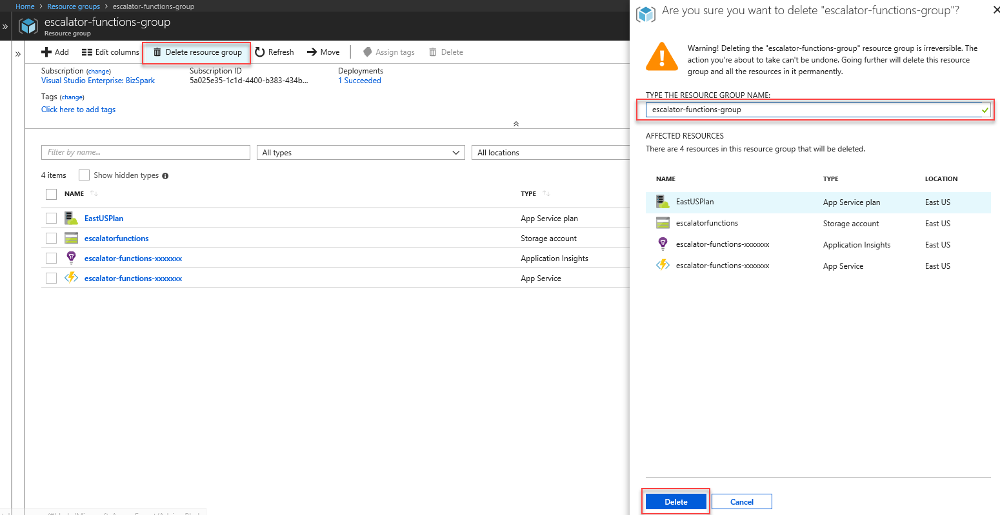

# Unit 7 - Module Summary and Cleanup

## Module Summary
In this module, you've learned how you can leverage Azure Functions to implement business logic services without the need to provision infrastructure to host it. This provides great benefit as you will not have an on-going need to revisit capacity planning, nor have to worry that your server resources have reached capacity. Azure Functions provide a great cost savings as you are not overallocating resources or maintaining host servers.

## Clean Up
1. Sign in to the [Azure portal](https://portal.azure.com) using your Azure Account.
1. Access the resource group you created in the first exercise by choosing **All resources** in the left-hand menu, then selecting **escalator-functions-group**.
1. In the toolbar press the **Delete resource group** button, you will be asked to type in the name of the resource group to be deleted. Press the **Delete** button once complete.  
 