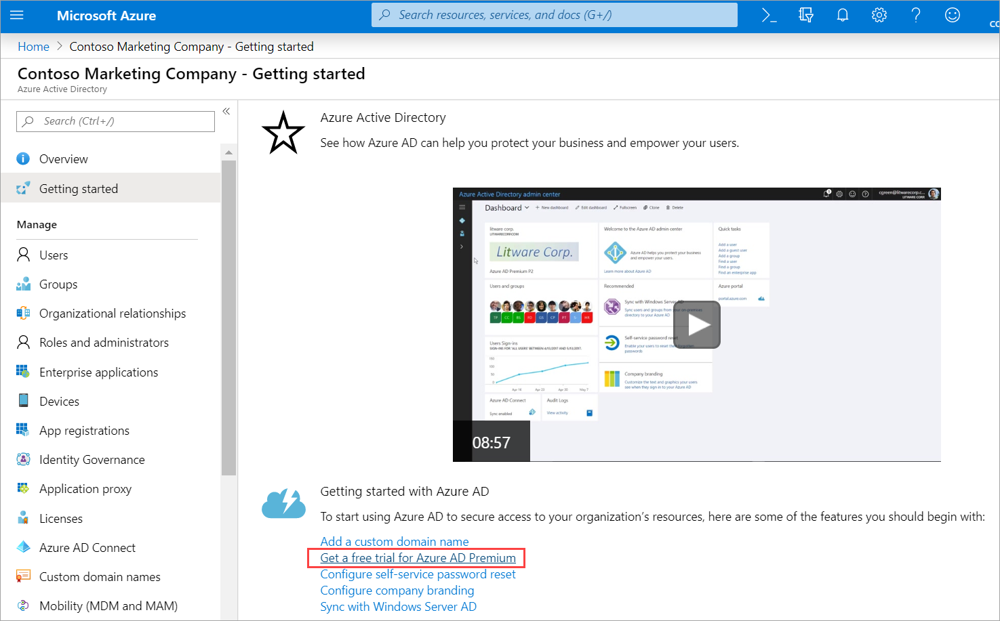

You need to add member user accounts for the new developer team in your organization.

In this exercise, you'll create a new Azure Active Directory (Azure AD) organization to hold all of your user accounts. You'll also create a user account, delete a user account, and learn how to recover a deleted user account.

## Create an Azure Active Directory organization

To hold all of the users you create in this exercise, create a new organization.

1. Sign in to the [Azure portal](https://portal.azure.com?azure-portal=true).

1. On the Azure portal home page, under **Azure services**, select **Create a resource**.

1. In **Create a resource**, in the left menu under **Categories**, select **Identity**. Under **Popular Azure services**, select **Create** under **Azure Active Directory**.

    :::image type="content" source="../media/azure-active-directory-create.png" alt-text="Screenshot that shows the create link for Azure Active Directory under Azure services.":::

1. In **Create a tenant**, on the **Basics** tab, enter the following value for the setting.

    | Setting | Value |
    |---|---|
    | **Tenant type** |
    | Select a tenant type | Azure Active Directory |

1. Select **Next : Configuration**, and enter the following values for each setting.

    | Setting | Value |
    |---|---|
    | **Directory details** |
    | Organization name | Enter *Contoso Marketing Company* |
    | Initial domain name| Enter *contosomarketingXXXX* where you replace XXXX with numbers or letters to make your domain name unique

1. Select **Next : Review + create**.

1. After validation passes, select **Create**. The **Help us prove you're not a robot** pane appears.

1. Enter the appropriate match to the request, and select **Submit**. Wait for the creation of your tenant to be completed.

1. On the **Help us prove you're not a robot** pane, select the **Click here to navigate to your new tenant: Contoso Marketing Company** link.

    :::image type="content" source="../media/3-switch-directory.png" alt-text="Screenshot that shows the link to manage your new organization.":::

    The **Overview** pane for *Contoso Marketing Company* appears.

## Get a free trial for Azure AD Premium

To complete all the exercises in this module, you'll need to activate a free trial for Azure AD Premium.

1. In the left menu pane, under **Manage**, select **Licenses**. The **Overview** pane for *Licenses* appears.

1. On the right side of the pane, under **Quick tasks**, select **Get a free trial**.

    

    The **Activate** pane appears.

1. Under **Azure AD Premium P2**, expand **Free trial**, and then select **Activate**. If you don't have that option, that's ok. You can complete most of the exercises without it. After the premium license activates, the **Overview** pane for *Licenses* reappears.

1. Return to the **Overview** pane for Azure Active Directory for Contoso Marketing Company. On the **Overview** tab, under the **Basic information** section, refresh the browser until you see **Azure AD Premium P2** appear aside **License**. It may take a couple of minutes.

    :::image type="content" source="../media/3-azure-ad-premium-2.png" alt-text="Screenshot that shows Azure AD Premium P2 on the Overview page under Tenant information.":::

   Under **My feed**, you should also see your role listed as the **Global administrator**.

1. Under **Basic information**, copy the **Primary domain** name to use in the next section.

## Add a new user

Now, let's create a user account.

1. In the Azure AD organization you created, in the left menu pane, under **Manage**, select **Users**. The **All users** pane appears.

1. In the top menu bar, select **New user**, then select **Create new user** in the drop-down. The **New user** pane appears for *Contoso Marketing Company*.

1. Enter the following values for each setting.

    **Identity**
    - **User name**: chris@contosomarketingXXXXXX.onmicrosoft.com. The domain name should match the primary domain you copied in the previous section.
    - **Name**: *Chris Green*

    **Password**
    - Select the **copy** icon next to the autogenerated password and paste the password somewhere you can refer to it later.

1. Select **Review + Create**, then select **Create**. The **All users** pane reappears for *Contoso Marketing Company - Azure Active Directory*. The user is now created and registered to your organization.

## Delete a user

You can delete users after they're created.

1. In your **All users** pane for Azure AD organization, from the list, select **Chris Green**.

1. In the top menu bar, select **Delete**. If you don't see that option, select **More**.

1. Select **Delete** again to confirm deletion.

## Recover a deleted user

You can restore deleted users. View the list of the deleted users, and then restore one.

1. In your **All users** pane for Azure AD organization, in the left menu pane, select **Deleted users**. You now see all of the users that were deleted within the last 30 days.

1. Check the box next to **Chris Green** and in the top menu bar, select **Restore users**.

1. To confirm, select **OK**. The **All users** pane reappears.

1. Verify that Chris Green's account is recovered by selecting **All users** in the left menu pane. You should see Chris Green restored as a user.
