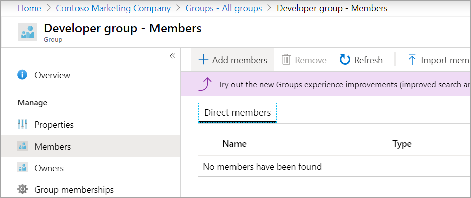

In this exercise, you'll create an Azure Active Directory (Azure AD) group to manage the developer team's access. You'll also add a rule for the group to manage the membership automatically.

> [!NOTE]
> This exercise depends on having completed prior exercises in this module. If you haven't done so, complete [exercise in unit 3](../3-exercise-add-delete-users-azure-ad.yml) before you begin.

## Add a new group

1. Sign in to the [Azure portal](https://portal.azure.com?azure-portal=true).

1. Go to the Azure Active Directory you created earlier in this module.

1. In the left menu pane, under **Manage**, select **Groups**. The **All groups** pane appears for your Azure AD.

1. On the top menu bar, select **New group**. The **New Group** pane appears.

1. Enter the following values for each setting.

    | Setting | Value |
    |-----------|---------|
    | Group type | Security |
    | Group name | Developer group |
    | Group description | Developer team |

1. Select **Create**. The **Groups | All groups** pane appears, including the new group in the list of Groups. You might need to refresh to see your new group.

## Use direct assignment to add a user to this group

You'll now assign members to the Developer group.

1. Select **Developer group**. The **Developer group** pane appears for your group.

1. In the left menu pane, under **Manage**, select **Members**. The **Members** pane appears for your developer group.

1. On the top menu bar, select **Add members**.

   

   The **Add members** pane appears.

1. Search for and select **Chris Green**.

1. Select **Select**. You'll see this user in the *Direct members* list for the Developers group in the **Members** pane. You might need to refresh to see the users.

## Modify the group to use dynamic assignment

You can change the group to use dynamic assignment. Membership then depends on whether a user meets the rules you set for the group.

If you didn't activate the free trial for Azure AD Premium 2, you won't be able to complete this section. That's ok. You can still see how you change the group to use dynamic assignment.

1. In the left menu pane, under **Manage**, select **Properties**. The **Properties** pane appears for your developer group.

1. Change **Membership type** to **Dynamic User**.

1. Under **Dynamic user members**, select the **Add dynamic query** link.

   :::image type="content" source="../media/5-add-dynamic-query.png" alt-text="Screenshot that shows the Add dynamic query link.":::

   The **Dynamic membership rules** pane appears.

1. On the **Configure Rules** tab, select the following values for the rule:

   | Setting  | Value  |
   |---------|---------|
   | Property  | country |
   | Operator  | Equals  |
   | Value     | United States  |

   

   The membership of this group now depends on whether the user is in the United States.

1. Select another field to enable **Save**.

1. On the top menu bar, select **Save**. The **Properties** pane reappears for your developer group.

## Change group back to assigned

You'll need to assign a guest user to the Developer group in the next exercise, so let's change the membership type back to **Assigned**.

1. Change **Membership type** to **Assigned**.

1. On the top menu bar, select **Save**.
