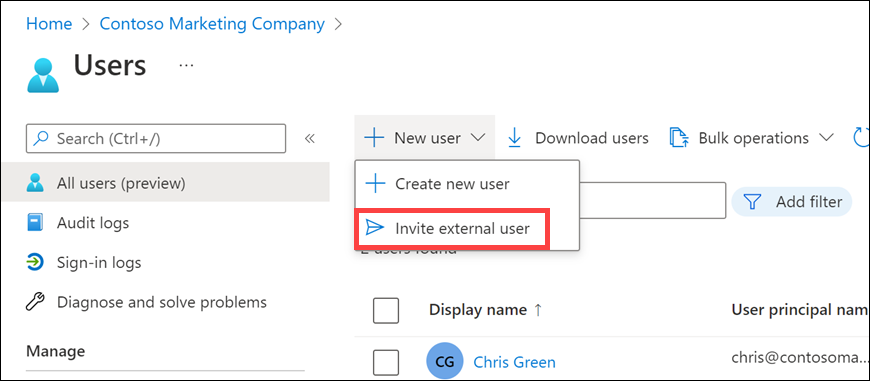
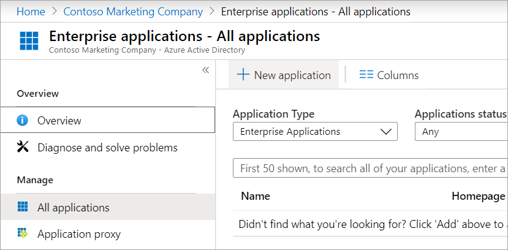
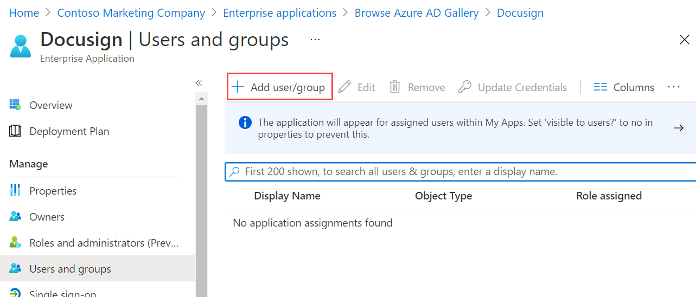
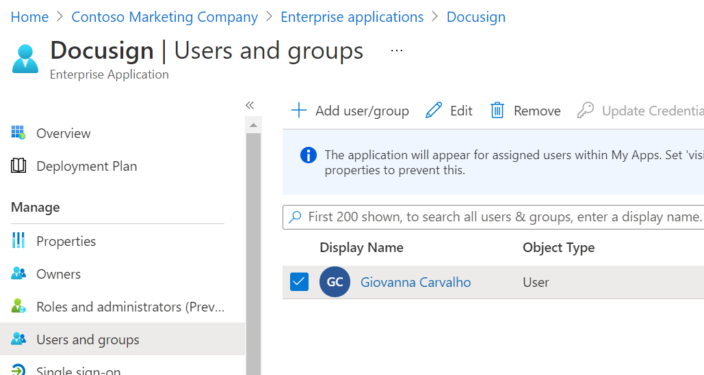
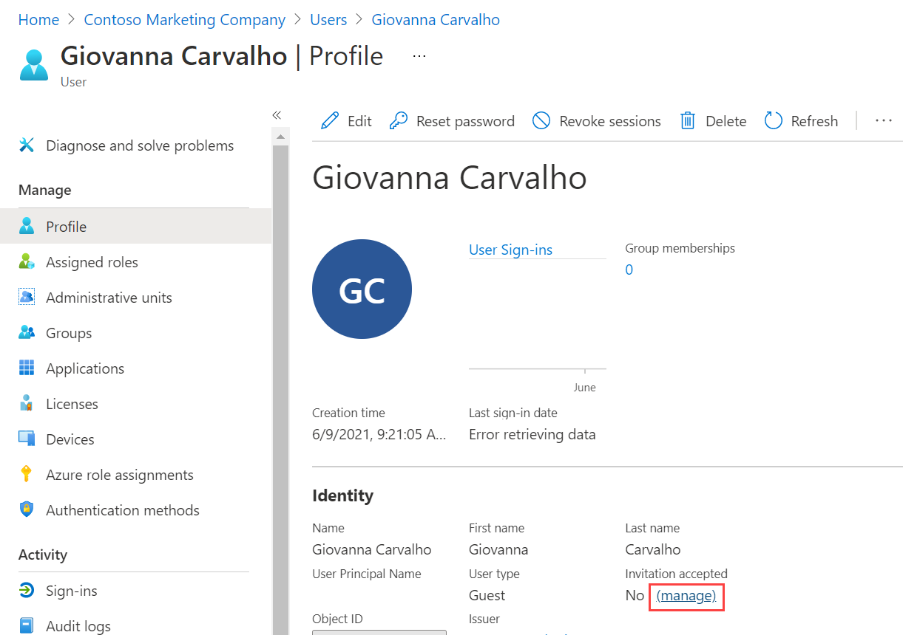

The external and internal developer teams want to work together, so you decide to create guest user access for the external developer team. 

You'll use the Azure portal to invite business-to-business (B2B) collaboration users. You can invite guest users to an Azure Active Directory (Azure AD) organization, group, or application. After you invite a user, their account is added to Azure AD, with a guest user type.

After you add a guest user to the organization, send them a direct link to a shared app. Have the guest user open the redemption URL in the invitation email.

## Add guest users to the organization

1. Sign in to the [Azure portal](<https://portal.azure.com/learn.docs.microsoft.com?azure-portal=true>).

1. Select **Azure Active Directory** > **Users** > **New guest user**.

   
1. **Invite user** should be selected.
1. Enter a name and an email address that you have access to.

1. Select **Invite**. An invitation is sent to the email address you provided for the guest user.

1. Notice that the user now appears in the list of users and has Guest as user type.

## Add guest users to a group

1. In your Azure AD organization, select **Groups** and then select **Developer group** in the list of groups.
1. Select **Members** > **Add members**.
1. Search for the guest account you added to the organization.
1. Select the account, and click **Select**. 
1. You now see the user in the list of members for this group.

## Add guest users to an application

1. In your Azure AD organization, select **Enterprise applications** > **All applications**. 
1. Select **New application**.

   

1. Search for **Twitter** and select **Create**.
1. Select **Users and groups** > **Add user**.

   

1. In **Add Assignment**, select **Users and groups**.
1. Select the guest user you added in the previous exercise, and click **Select**.
1. Select **Assign**. You now see the user in the list for this application.

1. To check that the correct access level is set, select the user in the list.

    

1. Select **Edit**.
1. Click **Select Role** > **Default Access** and **Select** to make sure they have the correct access.

1. When the invitation arrives, the user accepts it and can then access the application.

    

You've now added a guest user to an application.

## Resend invitations to guest users

 If the guest user didn't receive the first email invitation, you can resend an invitation email.

1. In your Azure AD organization, select **Users**.
1. Select the user.
1. Select **Resend invitation**.

   

