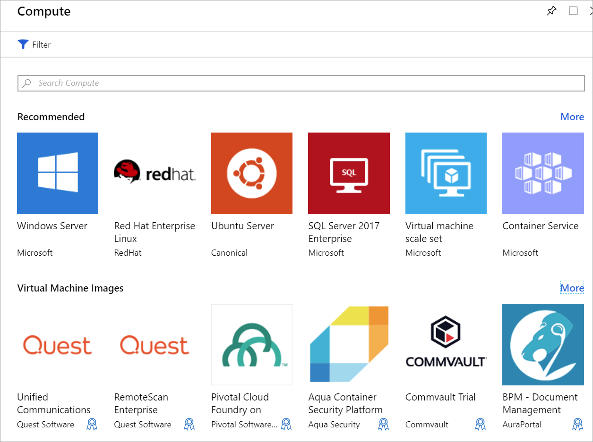

Your company has decided to manage the video data from their traffic cameras in Azure using VMs. In order to run the multiple codecs, we first need to create the VMs. We also need to connect and interact with the VMs. In this unit, you'll learn how to create a VM using the Azure portal. You'll configure the VM for remote access, select a VM image, and choose the proper storage option.

## Introduction to Windows virtual machines in Azure

Azure VMs are an on-demand, scalable cloud-computing resource. They're similar to virtual machines that are hosted in Windows Hyper-V. They include processor, memory, storage, and networking resources. You can start and stop virtual machines at will, just like with Hyper-V, and manage them from the Azure portal or with the Azure CLI. You can also use a Remote Desktop Protocol (RDP) client to connect directly to the Windows desktop user interface (UI) and use the VM as if you were signed in to a local Windows computer.

## Create an Azure VM

You can define and deploy VMs on Azure in several ways: the Azure portal, a script (using the Azure CLI or Azure PowerShell), or through an Azure Resource Manager template. In all cases, you'll need to supply several pieces of information, which we'll cover shortly.

The Azure Marketplace also provides preconfigured images that include both an OS and popular software tools installed for specific scenarios.

## Resources used in a Windows VM

When creating a Windows VM in Azure, you also create resources to host the VM. These resources work together to virtualize a computer and run the Windows operating system. These must either exist (and be selected during VM creation), or they'll be created with the VM.

- A virtual machine that provides CPU and memory resources
- An Azure Storage account to hold the virtual hard disks
- Virtual disks to hold the OS, applications, and data
- A virtual network (VNet) to connect the VM to other Azure services or your own on-premises hardware
- A network interface to communicate with the VNet
- A public IP address so you can access the VM (this is optional)

Like other Azure services, you'll need a **resource group** to contain the VM (and optionally group these resources together for administration). When you create a new VM, you can either use an existing resource group or create a new one.

## Choose the VM image

Selecting an image is one of the first and most important decisions you'll make when creating a VM. An image is a template that's used to create a VM. These templates include an OS and often other software, such as development tools or web-hosting environments.

You can include any application that the computer can support in the VM image. You can create a VM from an image that's preconfigured to exactly match your requirements, such as hosting an ASP.NET Core app.

> [!TIP]
> You can also create and upload your own images. [Check the documentation](/azure/virtual-machines/windows/tutorial-custom-images) for more information.

## Size your VM

Just as a physical machine has a certain amount of memory and CPU power, so does a virtual machine. Azure offers a range of VMs of differing sizes at different price points. The size that you choose will determine the VM's processing power, memory, and max storage capacity.

> [!WARNING]
> There are quota limits on each subscription that can impact VM creation. In the classic deployment model, you can't have more than 20 virtual *cores* across all VMs within a region. You can either split up VMs across regions or file an [online request](/azure/azure-supportability/resource-manager-core-quotas-request) to increase your limits.

VM sizes are grouped into categories, starting with the B-series for basic testing, and running up to the H-series for massive computing tasks. You should select the VM's size based on the workload you want to perform. It's possible to change a VM's size after it's been created, but the VM must be stopped first, so it's best to size it appropriately from the start if possible.

### Here are some guidelines based on the scenario you're targeting:

| What are you doing? | Consider these sizes |
|-------|------------------|
| **General use computing/web**: Testing and development, small to medium databases, or low to medium traffic web servers | B, Dsv3, Dv3, DSv2, Dv2 |
| **Heavy computational tasks**: Medium traffic web servers, network appliances, batch processes, and application servers | Fsv2, Fs, F |
| **Large memory usage**: Relational database servers, medium to large caches, and in-memory analytics. | Esv3, Ev3, M, GS, G, DSv2, Dv2 |
| **Data storage and processing**: Big Data, SQL, and NoSQL databases, which need high disk throughput and IO | Ls |
| **Heavy graphics rendering** or video editing, as well as model training and inferencing (ND) with deep learning | NV, NC, NCv2, NCv3, ND |
| **High-performance computing (HPC)**: If you need the fastest and most powerful CPU virtual machines with optional high-throughput network interfaces | H |

## Choose storage options

The next set of decisions revolves around storage. First, you can choose the disk technology. Options include a traditional platter-based hard disk drive (HDD) or a more modern solid-state drive (SSD). Just like the hardware you purchase, SSD storage costs more, but provides better performance.

> [!TIP]
> There are two levels of SSD storage available: Standard and Premium. Choose Standard SSD disks if you have normal workloads but want better performance. Choose Premium SSD disks if you have I/O intensive workloads or mission-critical systems that need to process data very quickly.

### Map storage to disks

Azure uses virtual hard disks (VHDs) to represent physical disks for the VM. VHDs replicate the logical format and data of a disk drive, but are stored as page blobs in an Azure Storage account. You can choose on a per-disk basis what type of storage it should use (SSD or HDD). This allows you to control each disk's performance, likely based on the I/O you plan to perform on it.

By default, two virtual hard disks (VHDs) will be created for your Windows VM:

1. **The Operating System disk**: This is your primary or C: drive and has a maximum capacity of 2048 GB.

1. **A Temporary disk**: This provides temporary storage for the OS or any apps. It's configured as the D: drive by default and is sized based on the VM size, making it an ideal location for the Windows paging file.

> [!WARNING]
> The temporary disk is not persistent. You should only write data to this disk that you're willing to lose at any time.

#### What about data?

You can store data on the C: drive along with the OS, but a better approach is to create dedicated *data disks*. You can create and attach additional disks to the VM. Each data disk can hold up to 32,767 gibibytes (GiB) of data, with the maximum amount of storage determined by the VM size you select.

> [!NOTE]
> An interesting capability is to create a VHD image from a real disk. This allows you to easily migrate *existing* information from an on-premises computer to the cloud.

### Unmanaged vs. Managed disks

The final storage choice you'll make is whether to use **unmanaged** or **managed** disks.

With unmanaged disks, you're responsible for the storage accounts that are used to hold the VHDs corresponding to your VM disks. You pay the storage account rates for the amount of space you use. A single storage account has a fixed rate limit of 20,000 I/O operations/sec. This means that a single storage account is capable of supporting 40 standard virtual hard disks at full throttle. If you need to scale out, then you need more than one storage account, which can get complicated.

Managed disks are the newer (and recommended) disk-storage model. They elegantly solve the complexity of unmanaged disks by putting the burden of managing the storage accounts onto Azure. You specify the disk type (Premium or Standard) and the disk size, and Azure creates and manages both the disk *and* the storage it uses. You don't have to worry about storage account limits, which makes them easier to scale out. They also offer several other benefits:

- **Increased reliability**: Azure ensures that VHDs associated with high-reliability VMs will be placed in different parts of Azure storage to provide similar levels of resilience.
- **Better security**: Managed disks are truly managed resources in the resource group. This means they can use role-based access control (RBAC) to restrict who can work with the VHD data.
- **Snapshot support**: You can use snapshots to create a read-only copy of a VHD. You have to shut down the owning VM, but creating the snapshot only takes a few seconds. Once it's done, you can power on the VM and use the snapshot to create a duplicate VM to troubleshoot a production issue or roll back the VM to the point in time that the snapshot was taken.
- **Backup support**: You can automatically back up managed disks to different regions for disaster recovery with Azure Backup, all without affecting the service of the VM.

## Network communication

Virtual machines communicate with external resources using a virtual network (VNet). The VNet represents a private network in a single region on which your resources communicate. A virtual network is just like the networks you manage on-premises. You can divide them up with subnets to isolate resources, connect them to other networks (including your on-premises networks), and apply traffic rules to govern inbound and outbound connections.

### Plan your network

When you create a new VM, you'll have the option of creating a new virtual network or using an existing VNet in your region.

Having Azure create the network together with the VM is simple, but it's likely not ideal for most scenarios. It's better to plan your network requirements *up front* for all the components in your architecture and create the VNet structure you'll need separately and then create the VMs and place them into the already-created VNets.

We'll look more at virtual networks a bit later in this module. Let's apply some of this knowledge and create a VM in Azure.
